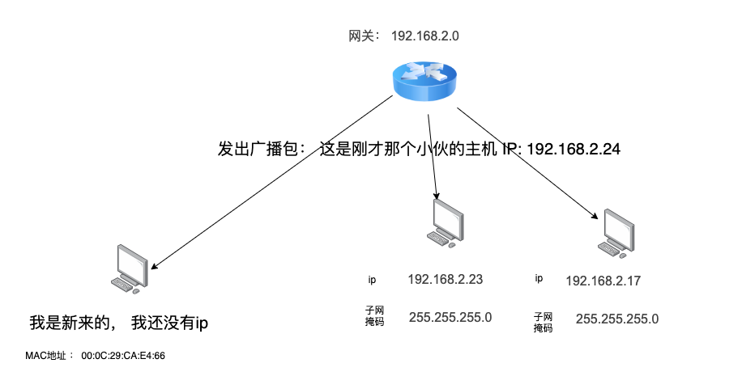

# DHCP协议

对于我们平时上网的电脑的 ip 是如何来的呢？

显然，这里有两种配置方式，一种是**自动获取 ip 地址**，一种是我们**手动设置**，大部分人都是通过自动获取的方式来得到 ip 的

那么问题来了，dhcp工作原理是什么，它是如何自动获得到的呢？

## 手动配置IP

如果是我们自己手动配置IP，我们怎么知道配置成什么IP呢？随便都可以吗？

当然随便配置都可以。

但是OSI 模型的网络层，通信双方需要处于同一子网才能直接交流，我们需要确保我们配置后的计算机处于网关下。

我们怎么配置 ip 才能使得当前计算机处于路由器网关下呢？

我们可以查一下当前路由器的 ip 和 子网掩码。

IP 为 **192.168.2.1** 子网掩码为 **255.255.255.0**

而我们需要做的，就是让当前配置的 计算机ip 和 子网掩码经过计算，与路由器和子网掩码的计算相同

比如我们配置 ip 为 192.168.2.24 , 和子网掩码计算后得到 192.168.2.0， 与路由器ip相同。 说明在同一子网下。

## 通过DHCP配置IP

**动态主机配置协议（Dynamic Host Configuration Protocol）**，简称 DHCP。这个协议可以使我们不用手动配置IP地址，所有连接这个局域网的计算机会根据DHCP协议自动分配一个IP地址。

现在我们知道是， 可以通过 DHCP 服务器来获取 ip 的，那么问题来了，**要给 DHCP 服务器发报文来获取 ip， DHCP 服务器的 ip 是多少？自己客户端的源 ip 又是多少呢？现在什么也不知道，该如何发送报文呢？**

下面来看看 DHCH 工作流程。

### DHCH 工作流程

DHCP服务器：相当于我们一个服务程序，部署在服务器端提供服务的（**一般路由器都集成DHCP服务器**）

**这里的路由器充当着 交换机，网关，DHCP服务器 的身份。**

例如我们第一次刚进实验室，连上wifi, 这个时候我们路由器(DHCP服务器)还没有分配IP给我们的笔记本。

第一步：我们的笔记本（DHCP客户端）要发送一个广播包给当前整个局域网

新来的机器使用 IP 地址 0.0.0.0 向交换机发送了一个广播包，目的 IP 地址为 255.255.255.255。

**相当于新人大声喊**：我是新来的，我的 MAC 地址是这个，我还没有 IP，谁能给租给我个 IP 地址！

>当交换机收到目标 MAC 地址是 ff:ff:ff:ff:ff:ff 的报文时，便知道这是一个广播报文，才会将它转发给局域网中的所有主机，否则只会转发给 MAC 地址对应端口上的主机。

然后DHCP服务器就知道有新的设备接入当前局域网，就会分配一个IP地址给它。

同时，分配的ip范围可以在路由器管理页面设置

第二步：DHCP服务器也广播一个数据包回复给新加入的计算机分配一个IP

**DHCP服务器回复的这个包是广播，那如果同时有两台或多台计算机在接入，他们都能接收到这个包，是不是他们都会抢到这个IP？**

不会的，虽然是广播，但是**客户端接收到还会解析到包里面的BOOTP内容，这里面指明了哪个MAC地址分配了这个IP**，如果其他计算机接收到这个包，但是这里的MAC不是自己的，就不会获取这个IP了

>DHCP 是 BOOTP 的增强版，如果去抓包的话，很可能看到的名称还是 BOOTP 协议

第三步： 笔记本（客户端）发送一个 DHCP Request 广播数据包，表示自己接收这个IP地址

>**其实在第三步之前**，计算机接收到DHCP服务器分配的IP信息以后，**还会在网内发送一个ARP包，查询是否是被占用的IP**，如果已经有计算机使用了该IP，则会拒绝分配，并请示DHCP服务器继续分配IP.

第四步：第四步DHCP服务器广播一个确认客户端使用这个IP的ACK包

**到这里我们的笔记本就拥有了IP地址了，这个IP地址是通过DHCP租用的，有租期**。

如果超过了租期的50%的时间，就会向DHCP服务器请求续租，续租成功后会延长这个IP的使用时间，到期后这个IP会归还给DHCP服务器。

例如在 mac 上， 我们键入`sudo ipconfig getpacket en1`，可以获取有关 DHCP 服务器分配的详细信息

0xa8c0 的十进制值是43200秒，也就是12小时。

## 总结

DHCP四部：

1. DHCP 发现报文（DHCP DISCOVER），找到DHCP服务器，请求IP地址
2. DHCP 提供报文（DHCP OFFER），给出分配的IP等信息
3. DHCP 请求报文（DHCP REQUEST）, 客户端确认接收IP
4. DHCP ACK 报文， 服务端确认租赁