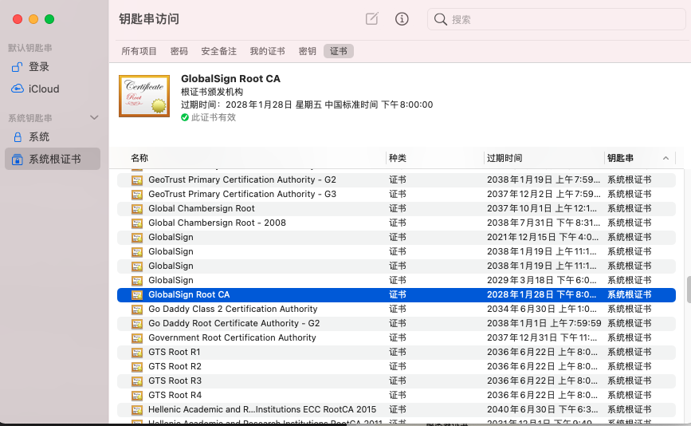
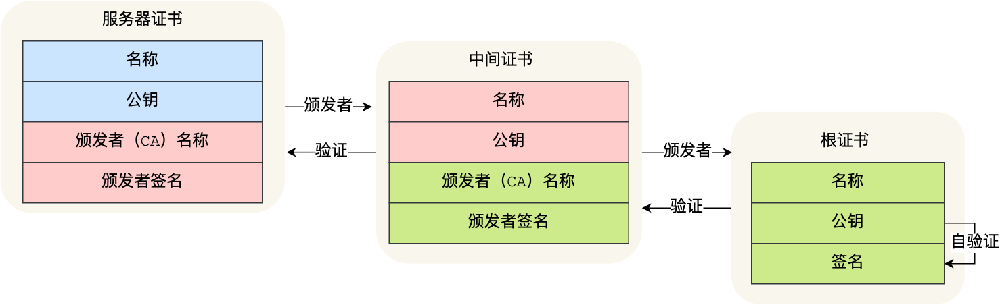
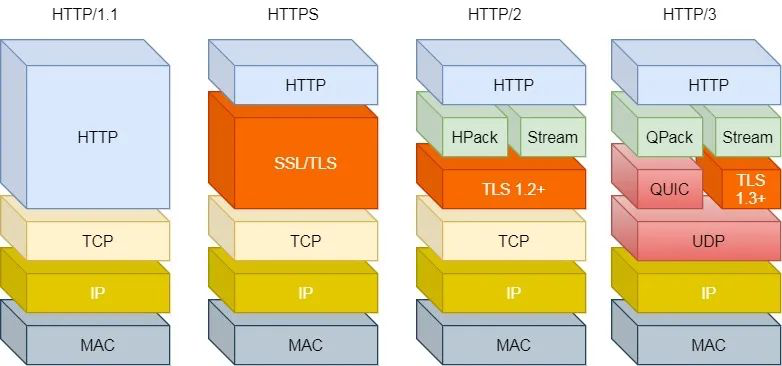

# HTTP篇

## HTTP 常见面试题


### HTTP 与 HTTPS


#### HTTP 与 HTTPS 有哪些区别？

- HTTP 是超文本传输协议，信息是明文传输，存在安全风险的问题。HTTPS 则解决 HTTP 不安全的缺陷，在 TCP 和 HTTP 网络层之间加入了 SSL/TLS 安全协议，使得报文能够加密传输。
- HTTP 连接建立相对简单， TCP 三次握手之后便可进行 HTTP 的报文传输。而 HTTPS 在 TCP 三次握手之后，还需进行 SSL/TLS 的握手过程，才可进入加密报文传输。
- 两者的默认端口不一样，HTTP 默认端口号是 80，HTTPS 默认端口号是 443。
- HTTPS 协议需要向 CA（证书权威机构）申请数字证书，来保证服务器的身份是可信的。


## HTTPS RSA 握手解析


### TLS 握手过程

HTTP 由于是明文传输，所谓的明文，就是说客户端与服务端通信的信息都是肉眼可见的，随意使用一个抓包工具都可以截获通信的内容。

所以安全上存在以下三个风险：

- *窃听风险*，比如通信链路上可以获取通信内容，用户号容易没。
- *篡改风险*，比如强制植入垃圾广告，视觉污染，用户眼容易瞎。
- *冒充风险*，比如冒充淘宝网站，用户钱容易没。

HTTP**S** 在 HTTP 与 TCP 层之间加入了 TLS 协议，来解决上述的风险。


TLS 协议是如何解决 HTTP 的风险的呢？

- *信息加密*： HTTP 交互信息是被加密的，第三方就无法被窃取；
- *校验机制*：校验信息传输过程中是否有被第三方篡改过，如果被篡改过，则会有警告提示；
- *身份证书*：证明淘宝是真的淘宝网；


可见，有了 TLS 协议，能保证 HTTP 通信是安全的了，那么在进行 HTTP 通信前，需要先进行 TLS 握手。TLS 的握手过程，如下图：


上图简要概述了 TLS 的握手过程，其中每一个「框」都是一个记录（*record*），记录是 TLS 收发数据的基本单位，类似于 TCP 里的 segment。多个记录可以组合成一个 TCP 包发送，所以**通常经过「四个消息」就可以完成 TLS 握手，也就是需要 2个 RTT 的时延**，然后就可以在安全的通信环境里发送 HTTP 报文，实现 HTTPS 协议。

所以可以发现，HTTPS 是应用层协议，需要先完成 TCP 连接建立，然后走 TLS 握手过程后，才能建立通信安全的连接。

事实上，不同的密钥交换算法，TLS 的握手过程可能会有一些区别。

这里先简单介绍下密钥交换算法，因为考虑到性能的问题，所以双方在加密应用信息时使用的是对称加密密钥，而对称加密密钥是不能被泄漏的，为了保证对称加密密钥的安全性，所以使用非对称加密的方式来保护对称加密密钥的协商，这个工作就是密钥交换算法负责的。

接下来，我们就以最简单的 `RSA` 密钥交换算法，来看看它的 TLS 握手过程。


###  RSA 握手过程

传统的 TLS 握手基本都是使用 RSA 算法来实现密钥交换的，在将 TLS 证书部署服务端时，证书文件其实就是服务端的公钥，会在 TLS 握手阶段传递给客户端，而服务端的私钥则一直留在服务端，一定要确保私钥不能被窃取。

在 RSA 密钥协商算法中，客户端会生成随机密钥，并使用服务端的公钥加密后再传给服务端。根据非对称加密算法，公钥加密的消息仅能通过私钥解密，这样服务端解密后，双方就得到了相同的密钥，再用它加密应用消息。

我用 Wireshark 工具抓了用 RSA 密钥交换的 TLS 握手过程，你可以从下面看到，一共经历了四次握手：


对应 Wireshark 的抓包，我也画了一幅图，你可以从下图很清晰地看到该过程：


那么，接下来针对每一个 TLS 握手做进一步的介绍。


#### TLS 第一次握手

客户端首先会发一个「**Client Hello**」消息，字面意思我们也能理解到，这是跟服务器「打招呼」。


消息里面有客户端使用的 TLS 版本号、支持的密码套件列表，以及生成的**随机数（Client Random）**，这个随机数会被服务端保留，它是生成对称加密密钥的材料之一。


####  TLS 第二次握手

当服务端收到客户端的「Client Hello」消息后，会确认 TLS 版本号是否支持，和从密码套件列表中选择一个密码套件，以及生成**随机数（Server Random）**。

接着，返回「**Server Hello**」消息，消息里面有服务器确认的 TLS 版本号，也给出了随机数（Server Random），然后从客户端的密码套件列表选择了一个合适的密码套件。


可以看到，服务端选择的密码套件是 “Cipher Suite: TLS_RSA_WITH_AES_128_GCM_SHA256”。

这个密码套件看起来真让人头晕，好一大串，但是其实它是有固定格式和规范的。基本的形式是「**密钥交换算法 + 签名算法 + 对称加密算法 + 摘要算法**」， 一般 WITH 单词前面有两个单词，第一个单词是约定密钥交换的算法，第二个单词是约定证书的验证算法。比如刚才的密码套件的意思就是：

- 由于 WITH 单词只有一个 RSA，则说明握手时密钥交换算法和签名算法都是使用 RSA；
- 握手后的通信使用 AES 对称算法，密钥长度 128 位，分组模式是 GCM；
- 摘要算法 SHA256 用于消息认证和产生随机数；

就前面这两个客户端和服务端相互「打招呼」的过程，客户端和服务端就已确认了 TLS 版本和使用的密码套件，而且你可能发现客户端和服务端都会各自生成一个随机数，并且还会把随机数传递给对方。

那这个随机数有啥用呢？其实这两个随机数是后续作为生成「会话密钥」的条件，所谓的会话密钥就是数据传输时，所使用的对称加密密钥。

然后，服务端为了证明自己的身份，会发送「**Server Certificate**」给客户端，这个消息里含有数字证书。


随后，服务端发了「**Server Hello Done**」消息，目的是告诉客户端，我已经把该给你的东西都给你了，本次打招呼完毕。


####  客户端验证证书

在这里刹个车，客户端拿到了服务端的数字证书后，要怎么校验该数字证书是真实有效的呢？


**数字证书和 CA 机构**

在说校验数字证书是否可信的过程前，我们先来看看数字证书是什么，一个数字证书通常包含了：

- 公钥；
- 持有者信息；
- 证书认证机构（CA）的信息；
- CA 对这份文件的数字签名及使用的算法；
- 证书有效期；
- 还有一些其他额外信息；

那数字证书的作用，是用来认证公钥持有者的身份，以防止第三方进行冒充。说简单些，证书就是用来告诉客户端，该服务端是否是合法的，因为只有证书合法，才代表服务端身份是可信的。

我们用证书来认证公钥持有者的身份（服务端的身份），那证书又是怎么来的？又该怎么认证证书呢？

为了让服务端的公钥被大家信任，服务端的证书都是由 CA （*Certificate Authority*，证书认证机构）签名的，CA 就是网络世界里的公安局、公证中心，具有极高的可信度，所以由它来给各个公钥签名，信任的一方签发的证书，那必然证书也是被信任的。

之所以要签名，是因为签名的作用可以避免中间人在获取证书时对证书内容的篡改。


**数字证书签发和验证流程**

如下图图所示，为数字证书签发和验证流程：


CA 签发证书的过程，如上图左边部分：

- 首先 CA 会把持有者的公钥、用途、颁发者、有效时间等信息打成一个包，然后对这些信息进行 Hash 计算，得到一个 Hash 值；
- 然后 CA 会使用自己的私钥将该 Hash 值加密，生成 Certificate Signature，也就是 CA 对证书做了签名；
- 最后将 Certificate Signature 添加在文件证书上，形成数字证书；

客户端校验服务端的数字证书的过程，如上图右边部分：

- 首先客户端会使用同样的 Hash 算法获取该证书的 Hash 值 H1；
- 通常浏览器和操作系统中集成了 CA 的公钥信息，浏览器收到证书后可以使用 CA 的公钥解密 Certificate Signature 内容，得到一个 Hash 值 H2 ；
- 最后比较 H1 和 H2，如果值相同，则为可信赖的证书，否则则认为证书不可信。


**证书链**

但事实上，证书的验证过程中还存在一个证书信任链的问题，因为我们向 CA 申请的证书一般不是根证书签发的，而是由中间证书签发的，比如百度的证书，从下图你可以看到，证书的层级有三级：


对于这种三级层级关系的证书的验证过程如下：

- 客户端收到 baidu.com 的证书后，发现这个证书的签发者不是根证书，就无法根据本地已有的根证书中的公钥去验证 baidu.com 证书是否可信。于是，客户端根据 baidu.com 证书中的签发者，找到该证书的颁发机构是 “GlobalSign Organization Validation CA - SHA256 - G2”，然后向 CA 请求该中间证书。
- 请求到证书后发现 “GlobalSign Organization Validation CA - SHA256 - G2” 证书是由 “GlobalSign Root CA” 签发的，由于 “GlobalSign Root CA” 没有再上级签发机构，说明它是根证书，也就是自签证书。应用软件会检查此证书有否已预载于根证书清单上，如果有，则可以利用根证书中的公钥去验证 “GlobalSign Organization Validation CA - SHA256 - G2” 证书，如果发现验证通过，就认为该中间证书是可信的。
- “GlobalSign Organization Validation CA - SHA256 - G2” 证书被信任后，可以使用 “GlobalSign Organization Validation CA - SHA256 - G2” 证书中的公钥去验证 baidu.com 证书的可信性，如果验证通过，就可以信任 baidu.com 证书。

在这四个步骤中，最开始客户端只信任根证书 GlobalSign Root CA 证书的，然后 “GlobalSign Root CA” 证书信任 “GlobalSign Organization Validation CA - SHA256 - G2” 证书，而 “GlobalSign Organization Validation CA - SHA256 - G2” 证书又信任 baidu.com 证书，于是客户端也信任 baidu.com 证书。

总括来说，由于用户信任 GlobalSign，所以由 GlobalSign 所担保的 baidu.com 可以被信任，另外由于用户信任操作系统或浏览器的软件商，所以由软件商预载了根证书的 GlobalSign 都可被信任。


操作系统里一般都会内置一些根证书，比如我的 MAC 电脑里内置的根证书有这么多：



这样的一层层地验证就构成了一条信任链路，整个证书信任链验证流程如下图所示：



最后一个问题，为什么需要证书链这么麻烦的流程？Root CA 为什么不直接颁发证书，而是要搞那么多中间层级呢？

这是为了确保根证书的绝对安全性，将根证书隔离地越严格越好，不然根证书如果失守了，那么整个信任链都会有问题。


#### TLS 第三次握手

客户端验证完证书后，认为可信则继续往下走。

接着，客户端就会生成一个新的**随机数 (pre-master)**，用服务器的 RSA 公钥加密该随机数，通过「**Client Key Exchange**」消息传给服务端。


服务端收到后，用 RSA 私钥解密，得到客户端发来的随机数 (pre-master)。

至此，**客户端和服务端双方都共享了三个随机数，分别是 Client Random、Server Random、pre-master**。

于是，双方根据已经得到的三个随机数，生成**会话密钥（Master Secret）**，它是对称密钥，用于对后续的 HTTP 请求/响应的数据加解密。

生成完「会话密钥」后，然后客户端发一个「**Change Cipher Spec**」，告诉服务端开始使用加密方式发送消息。


然后，客户端再发一个「**Encrypted Handshake Message（Finishd）**」消息，把之前所有发送的数据做个**摘要**，再用会话密钥（master secret）加密一下，让服务器做个验证，验证加密通信「是否可用」和「之前握手信息是否有被中途篡改过」。


可以发现，「Change Cipher Spec」之前传输的 TLS 握手数据都是明文，之后都是对称密钥加密的密文。


#### TLS 第四次握手

服务器也是同样的操作，发「**Change Cipher Spec**」和「**Encrypted Handshake Message**」消息，如果双方都验证加密和解密没问题，那么握手正式完成。

最后，就用「会话密钥」加解密 HTTP 请求和响应了。


###  RSA 算法的缺陷

**使用 RSA 密钥协商算法的最大问题是不支持前向保密**。

因为客户端传递随机数（用于生成对称加密密钥的条件之一）给服务端时使用的是公钥加密的，服务端收到后，会用私钥解密得到随机数。所以一旦服务端的私钥泄漏了，过去被第三方截获的所有 TLS 通讯密文都会被破解。

为了解决这个问题，后面就出现了 ECDHE 密钥协商算法，我们现在大多数网站使用的正是 ECDHE 密钥协商算法，关于 ECDHE 握手的过程，将在下一篇揭晓。


## HTTP/2 牛逼在哪？


### HTTP/1.1 协议的性能问题

我们得先要了解下 HTTP/1.1 协议存在的性能问题，因为 HTTP/2 协议就是把这些性能问题逐个攻破了。

现在的站点相比以前变化太多了，比如：

- *消息的大小变大了*，从几 KB 大小的消息，到几 MB 大小的消息；
- *页面资源变多了*，从每个页面不到 10 个的资源，到每页超 100 多个资源；
- *内容形式变多样了*，从单纯到文本内容，到图片、视频、音频等内容；
- *实时性要求变高了*，对页面的实时性要求的应用越来越多；

这些变化带来的最大性能问题就是 **HTTP/1.1 的高延迟**，延迟高必然影响的就是用户体验。主要原因如下几个：

- *延迟难以下降*，虽然现在网络的「带宽」相比以前变多了，但是延迟降到一定幅度后，就很难再下降了，说白了就是到达了延迟的下限；
- *并发连接有限*，谷歌浏览器最大并发连接数是 6 个，而且每一个连接都要经过 TCP 和 TLS 握手耗时，以及 TCP 慢启动过程给流量带来的影响；
- *队头阻塞问题*，同一连接只能在完成一个 HTTP 事务（请求和响应）后，才能处理下一个事务；
- *HTTP 头部巨大且重复*，由于 HTTP 协议是无状态的，每一个请求都得携带 HTTP 头部，特别是对于有携带 Cookie 的头部，而 Cookie 的大小通常很大；
- *不支持服务器推送消息*，因此当客户端需要获取通知时，只能通过定时器不断地拉取消息，这无疑浪费大量了带宽和服务器资源。

为了解决 HTTP/1.1 性能问题，具体的优化手段你可以看这篇文章「[HTTP/1.1 如何优化？ (opens new window)](https://xiaolincoding.com/network/2_http/http_optimize.html)」，这里我举例几个常见的优化手段：

- 将多张小图合并成一张大图供浏览器 JavaScript 来切割使用，这样可以将多个请求合并成一个请求，但是带来了新的问题，当某张小图片更新了，那么需要重新请求大图片，浪费了大量的网络带宽；
- 将图片的二进制数据通过 Base64 编码后，把编码数据嵌入到 HTML 或 CSS 文件中，以此来减少网络请求次数；
- 将多个体积较小的 JavaScript 文件使用 Webpack 等工具打包成一个体积更大的 JavaScript 文件，以一个请求替代了很多个请求，但是带来的问题，当某个 js 文件变化了，需要重新请求同一个包里的所有 js 文件；
- 将同一个页面的资源分散到不同域名，提升并发连接上限，因为浏览器通常对同一域名的 HTTP 连接最大只能是 6 个；

尽管对 HTTP/1.1 协议的优化手段如此之多，但是效果还是不尽人意，因为这些手段都是对 HTTP/1.1 协议的“外部”做优化，**而一些关键的地方是没办法优化的，比如请求-响应模型、头部巨大且重复、并发连接耗时、服务器不能主动推送等，要改变这些必须重新设计 HTTP 协议，于是 HTTP/2 就出来了！**


### 兼容 HTTP/1.1

HTTP/2 出来的目的是为了改善 HTTP 的性能。协议升级有一个很重要的地方，就是要**兼容**老版本的协议，否则新协议推广起来就相当困难，所幸 HTTP/2 做到了兼容 HTTP/1.1。

那么，HTTP/2 是怎么做的呢？

第一点，HTTP/2 没有在 URI 里引入新的协议名，仍然用「http://」表示明文协议，用「https://」表示加密协议，于是只需要浏览器和服务器在背后自动升级协议，这样可以让用户意识不到协议的升级，很好的实现了协议的平滑升级。

第二点，只在应用层做了改变，还是基于 TCP 协议传输，应用层方面为了保持功能上的兼容，HTTP/2 把 HTTP 分解成了「语义」和「语法」两个部分，「语义」层不做改动，与 HTTP/1.1 完全一致，比如请求方法、状态码、头字段等规则保留不变。

但是，HTTP/2 在「语法」层面做了很多改造，基本改变了 HTTP 报文的传输格式。


### 头部压缩

HTTP 协议的报文是由「Header + Body」构成的，对于 Body 部分，HTTP/1.1 协议可以使用头字段 「Content-Encoding」指定 Body 的压缩方式，比如用 gzip 压缩，这样可以节约带宽，但报文中的另外一部分 Header，是没有针对它的优化手段。

HTTP/1.1 报文中 Header 部分存在的问题：

- 含很多固定的字段，比如 Cookie、User Agent、Accept 等，这些字段加起来也高达几百字节甚至上千字节，所以有必要**压缩**；
- 大量的请求和响应的报文里有很多字段值都是重复的，这样会使得大量带宽被这些冗余的数据占用了，所以有必须要**避免重复性**；
- 字段是 ASCII 编码的，虽然易于人类观察，但效率低，所以有必要改成**二进制编码**；

HTTP/2 对 Header 部分做了大改造，把以上的问题都解决了。

HTTP/2 没使用常见的 gzip 压缩方式来压缩头部，而是开发了 **HPACK** 算法，HPACK 算法主要包含三个组成部分：

- 静态字典；
- 动态字典；
- Huffman 编码（压缩算法）；

客户端和服务器两端都会建立和维护「**字典**」，用长度较小的索引号表示重复的字符串，再用 Huffman 编码压缩数据，**可达到 50%~90% 的高压缩率**。


#### 静态表编码

HTTP/2 为高频出现在头部的字符串和字段建立了一张**静态表**，它是写入到 HTTP/2 框架里的，不会变化的，静态表里共有 `61` 组，如下图：


表中的 `Index` 表示索引（Key），`Header Value` 表示索引对应的 Value，`Header Name` 表示字段的名字，比如 Index 为 2 代表 GET，Index 为 8 代表状态码 200。

你可能注意到，表中有的 Index 没有对应的 Header Value，这是因为这些 Value 并不是固定的而是变化的，这些 Value 都会经过 Huffman 编码后，才会发送出去。

这么说有点抽象，我们来看个具体的例子，下面这个 `server` 头部字段，在 HTTP/1.1 的形式如下：

```text
server: nghttpx\r\n
```

算上冒号空格和末尾的`\r\n`，共占用了 17 字节，**而使用了静态表和 Huffman 编码，可以将它压缩成 8 字节，压缩率大概 47%**。

我抓了个 HTTP/2 协议的网络包，你可以从下图看到，高亮部分就是 `server` 头部字段，只用了 8 个字节来表示 `server` 头部数据。


根据 RFC7541 规范，如果头部字段属于静态表范围，并且 Value 是变化，那么它的 HTTP/2 头部前 2 位固定为 `01`，所以整个头部格式如下图：


HTTP/2 头部由于基于**二进制编码**，就不需要冒号空格和末尾的\r\n作为分隔符，于是改用表示字符串长度（Value Length）来分割 Index 和 Value。

接下来，根据这个头部格式来分析上面抓包的 `server` 头部的二进制数据。

首先，从静态表中能查到 `server` 头部字段的 Index 为 54，二进制为 110110，再加上固定 01，头部格式第 1 个字节就是 `01110110`，这正是上面抓包标注的红色部分的二进制数据。

然后，第二个字节的首个比特位表示 Value 是否经过 Huffman 编码，剩余的 7 位表示 Value 的长度，比如这次例子的第二个字节为 `10000110`，首位比特位为 1 就代表 Value 字符串是经过 Huffman 编码的，经过 Huffman 编码的 Value 长度为 6。

最后，字符串 `nghttpx` 经过 Huffman 编码后压缩成了 6 个字节，Huffman 编码的原理是将高频出现的信息用「较短」的编码表示，从而缩减字符串长度。

于是，在统计大量的 HTTP 头部后，HTTP/2 根据出现频率将 ASCII 码编码为了 Huffman 编码表，可以在 RFC7541 文档找到这张**静态 Huffman 表**，我就不把表的全部内容列出来了，我只列出字符串 `nghttpx` 中每个字符对应的 Huffman 编码，如下图：


通过查表后，字符串 `nghttpx` 的 Huffman 编码在下图看到，共 6 个字节，每一个字符的 Huffman 编码，我用相同的颜色将他们对应起来了，最后的 7 位是补位的。


最终，`server` 头部的二进制数据对应的静态头部格式如下：


#### 动态表编码

静态表只包含了 61 种高频出现在头部的字符串，不在静态表范围内的头部字符串就要自行构建**动态表**，它的 Index 从 `62` 起步，会在编码解码的时候随时更新。

比如，第一次发送时头部中的「`User-Agent` 」字段数据有上百个字节，经过 Huffman 编码发送出去后，客户端和服务器双方都会更新自己的动态表，添加一个新的 Index 号 62。**那么在下一次发送的时候，就不用重复发这个字段的数据了，只用发 1 个字节的 Index 号就好了，因为双方都可以根据自己的动态表获取到字段的数据**。

所以，使得动态表生效有一个前提：**必须同一个连接上，重复传输完全相同的 HTTP 头部**。如果消息字段在 1 个连接上只发送了 1 次，或者重复传输时，字段总是略有变化，动态表就无法被充分利用了。

因此，随着在同一 HTTP/2 连接上发送的报文越来越多，客户端和服务器双方的「字典」积累的越来越多，理论上最终每个头部字段都会变成 1 个字节的 Index，这样便避免了大量的冗余数据的传输，大大节约了带宽。

理想很美好，现实很骨感。动态表越大，占用的内存也就越大，如果占用了太多内存，是会影响服务器性能的，因此 Web 服务器都会提供类似 `http2_max_requests` 的配置，用于限制一个连接上能够传输的请求数量，避免动态表无限增大，请求数量到达上限后，就会关闭 HTTP/2 连接来释放内存。

综上，HTTP/2 头部的编码通过「静态表、动态表、Huffman 编码」共同完成的。


### 二进制帧

？


### 并发传输

知道了 HTTP/2 的帧结构后，我们再来看看它是如何实现**并发传输**的。

我们都知道 HTTP/1.1 的实现是基于请求-响应模型的。同一个连接中，HTTP 完成一个事务（请求与响应），才能处理下一个事务，也就是说在发出请求等待响应的过程中，是没办法做其他事情的，如果响应迟迟不来，那么后续的请求是无法发送的，也造成了**队头阻塞**的问题。

而 HTTP/2 就很牛逼了，通过 Stream 这个设计，**多个 Stream 复用一条 TCP 连接，达到并发的效果**，解决了 HTTP/1.1 队头阻塞的问题，提高了 HTTP 传输的吞吐量。

为了理解 HTTP/2 的并发是怎样实现的，我们先来理解 HTTP/2 中的 Stream、Message、Frame 这 3 个概念。


你可以从上图中看到：

- 1 个 TCP 连接包含一个或者多个 Stream，Stream 是 HTTP/2 并发的关键技术；
- Stream 里可以包含 1 个或多个 Message，Message 对应 HTTP/1 中的请求或响应，由 HTTP 头部和包体构成；
- Message 里包含一条或者多个 Frame，Frame 是 HTTP/2 最小单位，以二进制压缩格式存放 HTTP/1 中的内容（头部和包体）；

因此，我们可以得出个结论：多个 Stream 跑在一条 TCP 连接，同一个 HTTP 请求与响应是跑在同一个 Stream 中，HTTP 消息可以由多个 Frame 构成， 一个 Frame 可以由多个 TCP 报文构成。


在 HTTP/2 连接上，**不同 Stream 的帧是可以乱序发送的（因此可以并发不同的 Stream ）**，因为每个帧的头部会携带 Stream ID 信息，所以接收端可以通过 Stream ID 有序组装成 HTTP 消息，而**同一 Stream 内部的帧必须是严格有序的**。

比如下图，服务端**并行交错地**发送了两个响应： Stream 1 和 Stream 3，这两个 Stream 都是跑在一个 TCP 连接上，客户端收到后，会根据相同的 Stream ID 有序组装成 HTTP 消息。


客户端和服务器**双方都可以建立 Stream**，因为服务端可以主动推送资源给客户端， 客户端建立的 Stream 必须是奇数号，而服务器建立的 Stream 必须是偶数号。

比如下图，Stream 1 是客户端向服务端请求的资源，属于客户端建立的 Stream，所以该 Stream 的 ID 是奇数（数字 1）；Stream 2 和 4 都是服务端主动向客户端推送的资源，属于服务端建立的 Stream，所以这两个 Stream 的 ID 是偶数（数字 2 和 4）。


同一个连接中的 Stream ID 是不能复用的，只能顺序递增，所以当 Stream ID 耗尽时，需要发一个控制帧 `GOAWAY`，用来关闭 TCP 连接。

在 Nginx 中，可以通过 `http2_max_concurrent_Streams` 配置来设置 Stream 的上限，默认是 128 个。

HTTP/2 通过 Stream 实现的并发，比 HTTP/1.1 通过 TCP 连接实现并发要牛逼的多，**因为当 HTTP/2 实现 100 个并发 Stream 时，只需要建立一次 TCP 连接，而 HTTP/1.1 需要建立 100 个 TCP 连接，每个 TCP 连接都要经过 TCP 握手、慢启动以及 TLS 握手过程，这些都是很耗时的。**

HTTP/2 还可以对每个 Stream 设置不同**优先级**，帧头中的「标志位」可以设置优先级，比如客户端访问 HTML/CSS 和图片资源时，希望服务器先传递 HTML/CSS，再传图片，那么就可以通过设置 Stream 的优先级来实现，以此提高用户体验。


###  服务器主动推送资源

HTTP/1.1 不支持服务器主动推送资源给客户端，都是由客户端向服务器发起请求后，才能获取到服务器响应的资源。

比如，客户端通过 HTTP/1.1 请求从服务器那获取到了 HTML 文件，而 HTML 可能还需要依赖 CSS 来渲染页面，这时客户端还要再发起获取 CSS 文件的请求，需要两次消息往返，如下图左边部分：


如上图右边部分，在 HTTP/2 中，客户端在访问 HTML 时，服务器可以直接主动推送 CSS 文件，减少了消息传递的次数。

在 Nginx 中，如果你希望客户端访问 /test.html 时，服务器直接推送 /test.css，那么可以这么配置：

```text
location /test.html { 
  http2_push /test.css; 
}
```

那 HTTP/2 的推送是怎么实现的？

客户端发起的请求，必须使用的是奇数号 Stream，服务器主动的推送，使用的是偶数号 Stream。服务器在推送资源时，会通过 `PUSH_PROMISE` 帧传输 HTTP 头部，并通过帧中的 `Promised Stream ID` 字段告知客户端，接下来会在哪个偶数号 Stream 中发送包体。


如上图，在 Stream 1 中通知客户端 CSS 资源即将到来，然后在 Stream 2 中发送 CSS 资源，注意 Stream 1 和 2 是可以**并发**的。


### 总结

HTTP/2 协议其实还有很多内容，比如流控制、流状态、依赖关系等等。

这次主要介绍了关于 HTTP/2 是如何提升性能的几个方向，它相比 HTTP/1 大大提高了传输效率、吞吐能力。

第一点，对于常见的 HTTP 头部通过**静态表和 Huffman 编码**的方式，将体积压缩了近一半，而且针对后续的请求头部，还可以建立**动态表**，将体积压缩近 90%，大大提高了编码效率，同时节约了带宽资源。

不过，动态表并非可以无限增大， 因为动态表是会占用内存的，动态表越大，内存也越大，容易影响服务器总体的并发能力，因此服务器需要限制 HTTP/2 连接时长或者请求次数。

第二点，**HTTP/2 实现了 Stream 并发**，多个 Stream 只需复用 1 个 TCP 连接，节约了 TCP 和 TLS 握手时间，以及减少了 TCP 慢启动阶段对流量的影响。不同的 Stream ID 可以并发，即使乱序发送帧也没问题，比如发送 A 请求帧 1 -> B 请求帧 1 -> A 请求帧 2 -> B 请求帧2，但是同一个 Stream 里的帧必须严格有序。

另外，可以根据资源的渲染顺序来设置 Stream 的**优先级**，从而提高用户体验。

第三点，**服务器支持主动推送资源**，大大提升了消息的传输性能，服务器推送资源时，会先发送 PUSH_PROMISE 帧，告诉客户端接下来在哪个 Stream 发送资源，然后用偶数号 Stream 发送资源给客户端。

HTTP/2 通过 Stream 的并发能力，解决了 HTTP/1 队头阻塞的问题，看似很完美了，但是 HTTP/2 还是存在“队头阻塞”的问题，只不过问题不是在 HTTP 这一层面，而是在 TCP 这一层。

**HTTP/2 是基于 TCP 协议来传输数据的，TCP 是字节流协议，TCP 层必须保证收到的字节数据是完整且连续的，这样内核才会将缓冲区里的数据返回给 HTTP 应用，那么当「前 1 个字节数据」没有到达时，后收到的字节数据只能存放在内核缓冲区里，只有等到这 1 个字节数据到达时，HTTP/2 应用层才能从内核中拿到数据，这就是 HTTP/2 队头阻塞问题。**

有没有什么解决方案呢？既然是 TCP 协议自身的问题，那干脆放弃 TCP 协议，转而使用 UDP 协议作为传输层协议，这个大胆的决定，HTTP/3 协议做了！



参考资料：

1. https://developers.google.com/web/fundamentals/performance/http2
2. https://http2.akamai.com/demo
3. https://tools.ietf.org/html/rfc7541