# 计算机基础

## http

### NET::ERR_CERT_DATE_INVALID

解决 NET::ERR_CERT_DATE_INVALID 错误的 10 种方式

最近远程协助用户解决了浏览器的 `NET::ERR_CERT_DATE_INVALID` 异常，过程中了看到了这篇总结的不错的英文文章，遂翻译了与大家共享。

支持了 HTTPS 的站点(原文为 `安装了 SSL 证书`)会让人用起来更安心。当浏览器提醒 `NET::ERR_CERT_DATE_INVALID` 错误时，则表示证书出现了问题，浏览会通过该提示阻止用户访问该站点。所以我们需要解决这个问题。

通常情况，不管是网站所有者还是用户遇到这个问题都会比较闹心。

好在 `NET::ERR_CERT_DATE_INVALID` 这个问题非常常见，有很多备选的解决方案供我们选择，一一尝试之后，通常都能够解决这一问题。

本文，我们会讲解 `NET::ERR_CERT_DATE_INVALID` 是什么，在不同浏览器中可能的呈现方式是什么样的。然后我们会给出可供尝试的解决方法。最后，再介绍两个特定案例。

下面我们进入正题。

#### 什么是 NET::ERR_CERT_DATE_INVALID 错误？

`NET::ERR_CERT_DATE_INVALID` 错误通常是和 `你的连接不是私密连接`相关联，基本上当我们遇到这个问题时，后者才是我们看到的主要提示。比如 Chrome 浏览器下就会给出该提示，不过也有浏览器的提示不一样，如火狐：

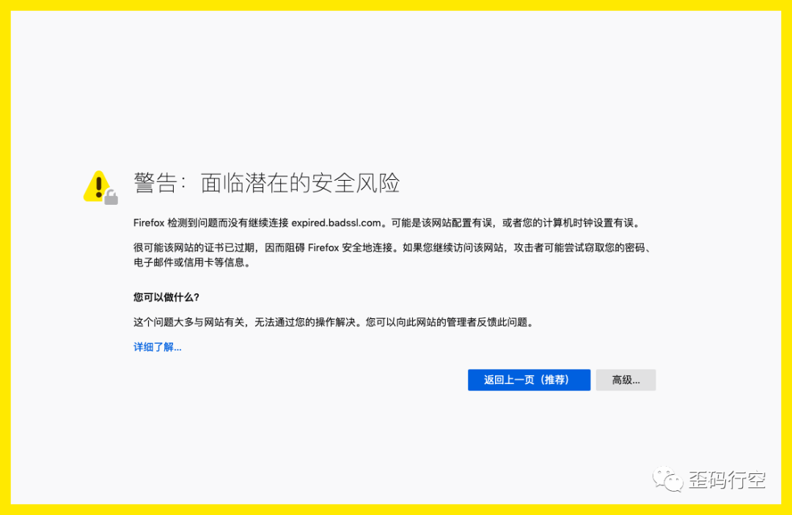

​                                                *Firefox 下 `NET::ERR_CERT_DATE_INVALID` 错误的提示*

大多数情况，这个错误并不能真正阻止我们访问站点，我们可以接受风险并继续访问，不过**并不建议大家这么做**。

虽然 `NET::ERR_CERT_DATE_INVALID` 错误并不罕见，并且可以很容易地修复，不过它表示当前访问的站点可能存在威胁。

通常会有以下几种原因导致这一错误：

- 用户的电脑有问题，比如电脑设置、杀毒软件或者网络连接。
- 访问网站使用的浏览器有问题，可能是设置问题，也可能是浏览器和所使用的 [SSL 证书](https://cloud.tencent.com/product/symantecssl?from=10680)不兼容。
- 也可能证书本身确实有问题，如题设错误中所对应的是证书过期了。

不管是什么原因导致的，这个问题都会影响使用，所以你肯定想要快速的修复它。看到这个错误也会让用户怀疑你的网站是否安全。

NET::ERR_CERT_DATE_INVALID 在不同浏览器下的提示

我们通常会在 Chrome 浏览器下遇到如题中 `NET::ERR_CERT_DATE_INVALID` 样的错误信息。除此之外，其他浏览器也有各自不同的错误提示。并且不同的操作系统看到的提示可能也不相同。

下面我们来看几个错误提示示例。

Google Chrome 浏览器

在 Chrome 中会指出 `你的连接不是私密的`。可以通过点击 `高级(Advanced)`，选择继续访问该站点，但是这样会有风险：

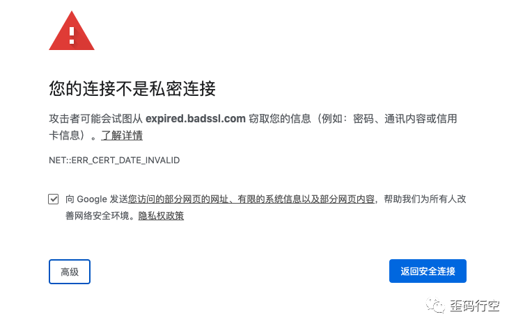

Chrome 下的 `NET::ERR_CERT_DATE_INVALID` 错误

Chrome 下还有其他和 SSL 证书相关的错误提示，如下：

- NET::ERR_CERT_AUTHORITY_INVALID
- NET::ERR_CERT_COMMON_NAME_INVALID
- NET::ERR_CERT_WEAK_SIGNATURE_ALGORITHM
- NTE::ERR_CERTIFICATE_TRANSPARENCY_REQUIRED
- SSL CERTIFICATE ERROR

看到这一类错误时，我们至少要知道可能是和 SSL 证书有关。特定的错误码有利于我们定位具体问题。

Firefox 火狐浏览器

火狐浏览器下遇到安全警告时，会通过明黄色的边框给出提示。和 Chrome 一样，我们也可以忽略该提示，通过点击 `高级`按钮，接受风险并继续访问。

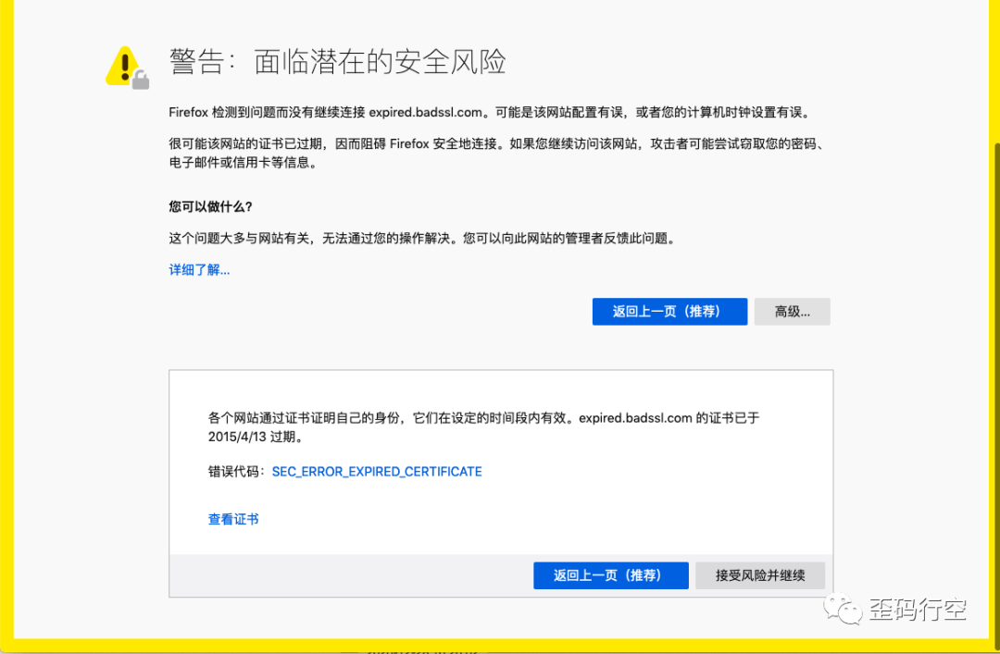

火狐下的 `NET::ERR_CERT_DATE_INVALID` 错误

点击 `高级`也会给出更多错误相关的信息，比如图中的 `SEC_ERROR_EXPIRED_CERTIFICATE`，有可能是下面其他几种：

- SEC_ERROR_UNKNOWN_ISSUER
- SSL_ERROR_RX_MALFORMED_HANDSHAKE
- MOZILLA_PKIX_ERROR_KEY_PINNING_FAILURE
- SEC_ERROR_REUSED_ISSUER_AND_SERIAL

这一警告包含特定的错误码，这样我们能够更快地定位到根本问题所在。

**微软的 Edge 浏览器**

Edge 浏览器的错误基本上 Chrome 中展示的相同。不过，Edge 下的错误提示可能会包括 SSL 证书过期了多久：

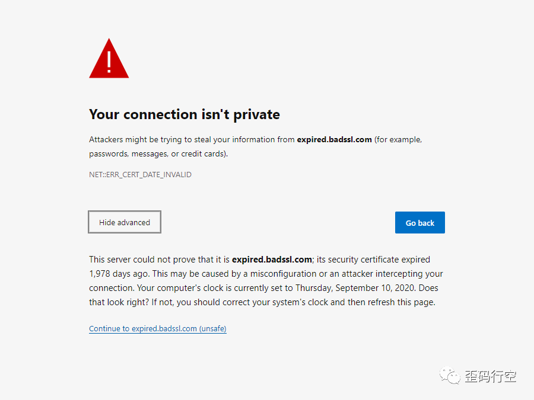

Edge 下的 `NET::ERR_CERT_DATE_INVALID` 错误

除了题设中的错误，还可能会有以下几种提示：

- DLG_FLAGS_SEC_CERTDATE_INVALID
- DLG_FLAGS_INVALID_CA
- DLG_FLAGS_SEC_CERT_CN_INVALID
- NET::ERR_CERT_COMMON_NAME_INVALID
- ERROR CODE: O

同样，Edge 也可以选择继续访问。不过有时候，Edge 浏览器可能强制解决问题，不然无法访问。

> 歪马注：部分需要 Windows 截图的图片没有替换，请大家见谅。

#### **如何修复 NET::ERR_CERT_DATE_INVALID 错误**

前面，我们已经看了 `NET::ERR_CERT_DATE_INVALID` 在不同浏览器下的错误展示。接下来，就让我们着手修复它吧。

这个错误有多种原因，我们一共总结了 10 种可能的原因：

1. 重新加载页面
2. 不用使用公开的 WIFI
3. 检查本地日期和时间
4. 查明证书是否过期
5. 升级操作系统和浏览器
6. 禁用杀毒软件
7. 检查浏览器扩展
8. 清除缓存和 Cookie
9. 清除 SSL 缓存
10. 修改 DNS [服务器](https://cloud.tencent.com/product/cvm?from=10680)

##### **1. 重新加载页面**

我们先从最简单的方式尝试：刷新页面，也可以尝试重启浏览器。

有时网站只是临时出现异常，建议尝试快速修复，而不是进行不必要的故障排除。虽然概率比较低，但有可能网站的所有者刚好正在更新 SSL 证书。

##### **2. 不要使用公开的 WIFI**

如果重新加载页面之后仍然无法访问，可以检查一下网络连接。如果使用的是公开 WIFI，那么确实有可能连接不是私密的。安全起见，断开公开 WIFI 连接。

可以使用手机热点，再次尝试访问站点。如果问题解决了，那么就是 WIFI 的问题。

此外，虚拟专用网络(VPN)可能是到这这一问题的罪魁祸首，如果没有使用，可以尝试使用，看看错误是否仍然存在。如果一开始遇到这个问题时就是使用了 VPN，则可以尝试关闭 VPN。

##### **3. 检查本地日期和时间**

这个方式也很简单。浏览器会使用电脑的本地时间来校验证书是否过期。如果时间设置不对，也可能会导致这个错误。

即使电脑上的时间设置的是自动同步，也可能会存在不同步的问题。

比如，如果刚进行了跨时区旅行，电脑可能还没来得及更新。所以，检查并确保电脑日期和时间是否准确，然后重启浏览器进行尝试，看是否能解决问题。

##### **4. 查明证书是否过期**

当遇到这个错误的时候，也有可能是网站的 SSL 证书确实到期了，这时候就要更新证书了。

在 Chrome 浏览器中可以通过如下方式查看一下：点击右上角的三个点，选择 `更多工具 > 开发者工具`。

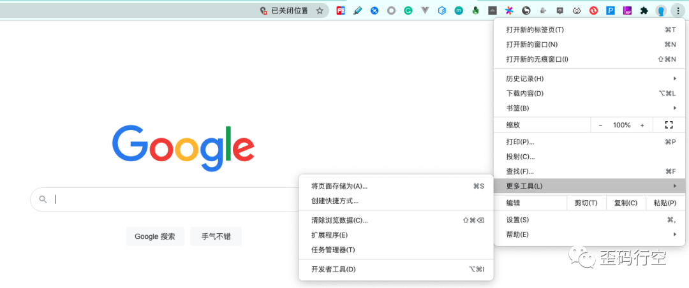

在 Chrome 中查看 SSL 证书状态

切换到 `Security` 标签，从这里可以查看证书是否有效。点击 `View Certificate` 可以查看更多信息，如过期日期：

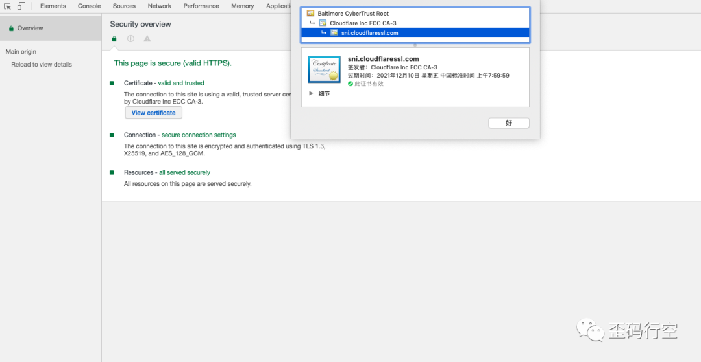

Chrome 中 SSL 证书详情

我们也可以使用 Qualys 检测证书是否有效。直接输入[域名](https://cloud.tencent.com/act/pro/domain-sales?from=10680)，然后提交查询即可。

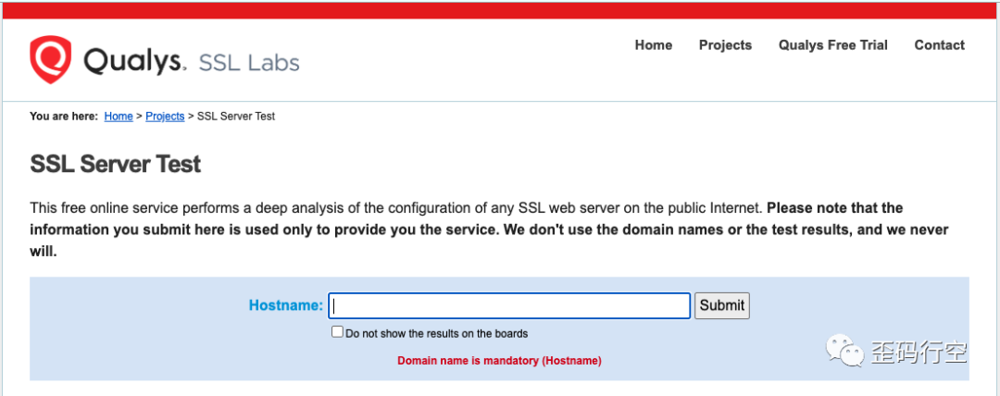

Qualys SSL 服务检测

检测过程会持续几分钟。返回的结果报告包括 SSL 证书配置的全面分析，并给出字母等级。我们需要特别注意 SSL 证书的过期日期。

值得一提的是，这个方法能够检测其他站点的 SSL 证书状态。不过即使证书过期了，我们也没法通知网站所有者。如果是自己的站点证书过期，则需要更新证书。网站服务器提供商可能会帮忙处理这个事情，有可能需要自己通过控制面板亲自更新。

有些服务器提供商不提供更新证书的控制面板，这种情况只能通过命令行进行更新了，这时我们可以使用 Certbot。

首先，我们先要安装并运行 Certbot。它会在免费的 SSL 证书过期之前自动更新：

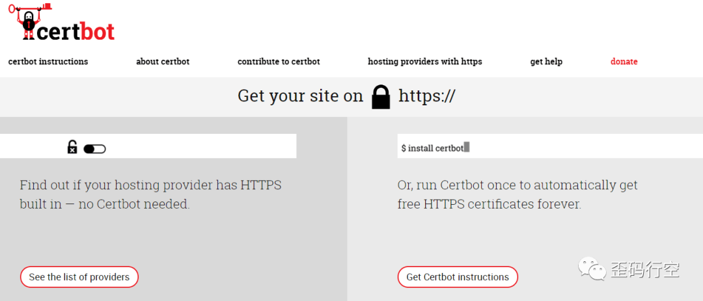

Certbot 自动更新 SSL 证书

不论你通过什么方式更新证书，最好能给自己在日历上建个提醒，这样就能在证书过期之前进行更新了。

##### **5.更新操作系统和浏览器**

一般情况下，我们的操作系统版本最好保持最新版本，因为有些老版本可能已经被废弃了。而且有些 SSL 证书已经不能在旧的操作系统上工作了。

如果你使用的操作是一个比较老的版本，那么随着时间的推移，你遇到 `NET::ERR_CERT_DATE_INVALID` 的次数会越来越多。

旧版本的浏览器也一样。如果很久没更新浏览器了，那么可以试着更新浏览器来解决题设问题。有时候，即使浏览器是最新的，卸载再安装也可能能解决题设问题。

##### **6. 禁用杀毒软件**

有时，杀毒软件的某些配置也可能导致题设问题。所以，发生这一问题时，可以尝试禁用杀毒软件后，再访问网站。记得要强制刷新浏览器。

如果检测出来是杀毒软件的问题，可以先尝试升级杀毒软件。如果无法解决，可以联系杀毒软件的支持团队。

##### **7. 检查浏览器扩展**

Chrome 浏览器的第三方扩展也经常会导致题设问题。这个方式需要花费一定的时间，因为测试会依赖于安装的插件数量。

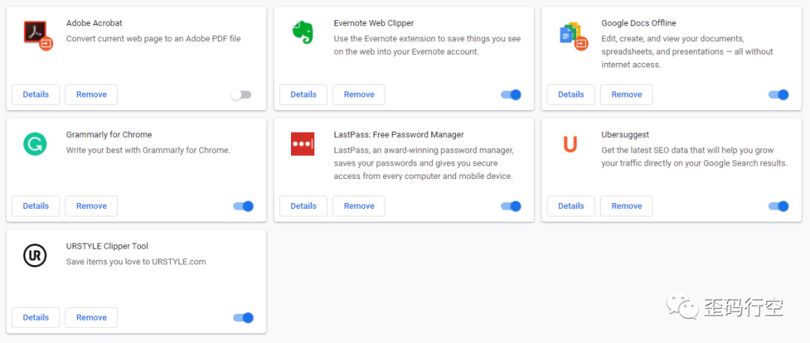

Chrome 扩展程序

挨个禁用插件，然后重新访问站点来测试。如果发现了触发错误的插件，那么移除插件就好了。

##### **8. 清除缓存和 Cookie**

清理缓存也可能需要一些时间来尝试。为了确定清除缓存是否有帮助，您可以先尝试一些方法。

首先，可以尝试隐身模式。如果没有用，可以再换个浏览器试试。如果其他方式有效，那么清除浏览器缓存基本上也能解决该问题。

不同浏览器下清除缓存的方法参考如下链接：

- Chrome 下清除浏览器缓存
- Firefox 下清除浏览器缓存
- Safari 下清除浏览器缓存
- ie 下清除浏览器缓存
- Edge 下清除浏览器缓存
- Opera 下清除浏览器缓存

清除缓存和 Cookie 后，再次尝试重启浏览器并访问页面，查看是否可行。

##### **9. 清除 SSL 缓存**

如果清除了浏览器缓存也没用，那么可以尝试清除 SSL 缓存。SSL 缓存会存储访问过的站点的证书，这样下次访问的时候能够更快。

然而，这也会导致当证书更新了，但是浏览器还是从缓存中读取，没有拿到最新的证书。

在 Windows 上清除 SSL 缓存，需要先打开`控制面板`，选择`Internet 选项`。打开后，在`内容`面板，可以找到 `清除 SSL 状态`的按钮。

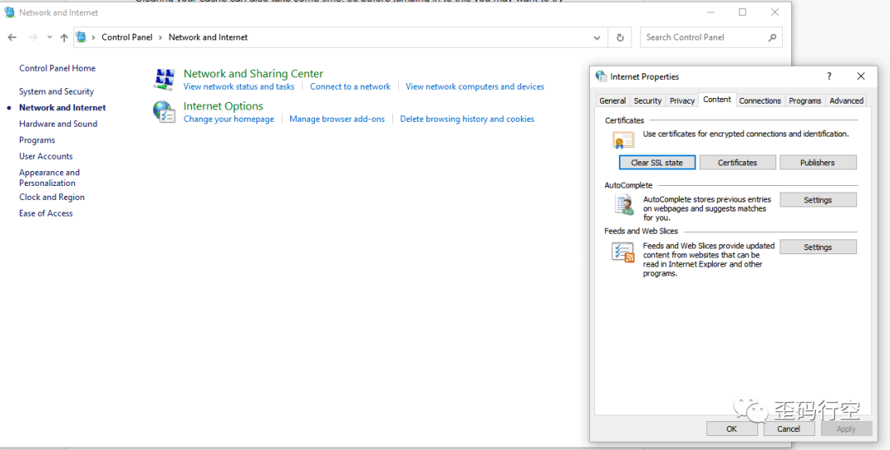

在 Windows 上清除 SSL 缓存

再次重启浏览器并重试，如果还不能解决问题的话，那就只有最后一种方式了。

如果使用的 macOS 的话，需要先删除之前在不安全站点上接受的 SSL 证书。可以先打开`访达`，然后点击`前往 > 使用工具 > 钥匙串访问`。

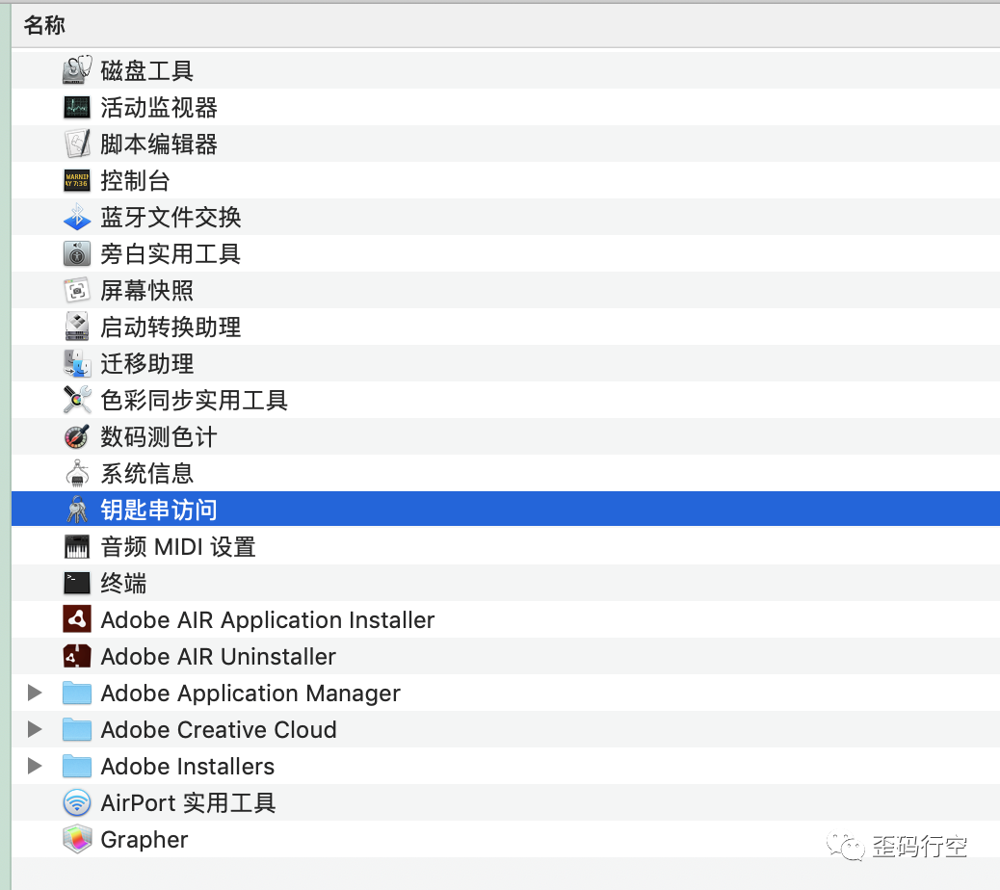

macOS 钥匙串

然后点击`种类`下的`证书`，未信任的证书前面会有红叉标识，然后点击`编辑 > 删除`。

##### **10. 修改域名解析服务器**

你可能会想要根据当前配置参考谷歌开放 DNS来调整自己的DNS 服务器。不过在修改之前，建议保存当前配置，以防需要修改回去。

如果是修改 Windows 的 DNS 服务器，首先先打开`控制面板`。点击`Internet 选项 > 网络与共享中心`，然后点击`更改适配器设置`。在连接信息上右键选择`属性`。

然后，选择`IP V4/V6`，然后点击`属性`按钮。选择`使用指定 DNS 服务器地址`：

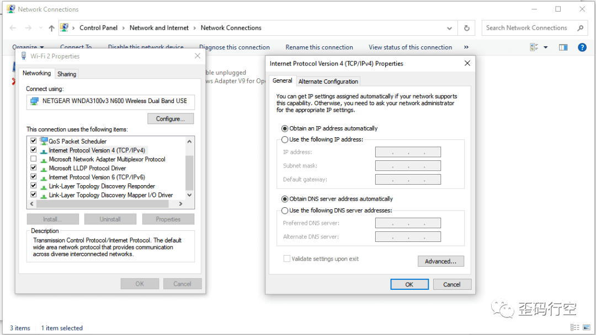

Windows 上修改 DNS 服务器

如果使用谷歌开放 DNS，则输入 `8.8.8.8` 和 `8.8.4.4`。输入完成后，关闭窗口，重启浏览器访问页面后查看效果。如果不行，也可以尝试一下 Cloudflare DNS，输入 `1.1.1.1` 和 `1.0.0.1`。

如果用的是 mac 电脑，过程类似，以下几点稍有不同。

首先，打开`系统偏好设置`，点击`网络`。

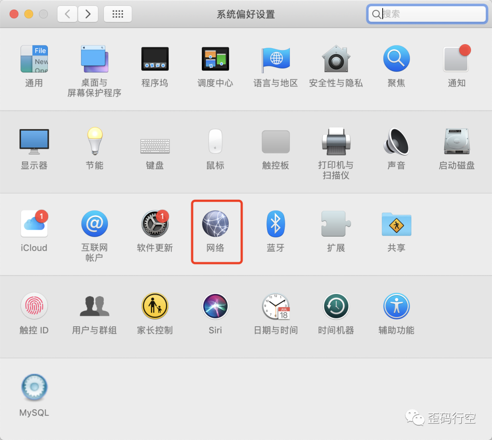

mac 上网络设置

在网络连接中点击`高级`按钮，然后切换到`DNS`标签。点击`IPv4 或 IPv6 地址`旁边的`(+)号按钮`。

然后输入 DNS 服务器，点击`好`，再点击`应用`即可。

如果你原本就是使用的谷歌开放 DNS，那么你也可以尝试使用网络供应商的 DNS 服务器。只需移除谷歌 DNS，然后选择`自动获取 DNS 服务器`即可。

### insecure content was loaded over HTTPS, but requested an insecure resource

当要求 HTTPS 页面通过 HTTP 加载资源时，会出现“混合内容”警告。

这是很危险的，因为不安全的资源很容易被主动攻击者篡改或被被动攻击者窃听，这违反了用户对 HTTPS 页面安全性的期望。

https://developers.google.com/web/fundamentals/security/prevent-mixed-content/fixing-mixed-content?hl=en