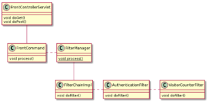
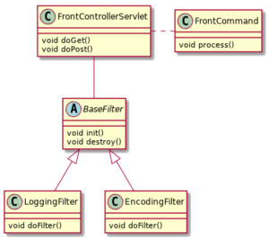
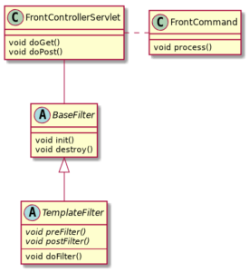
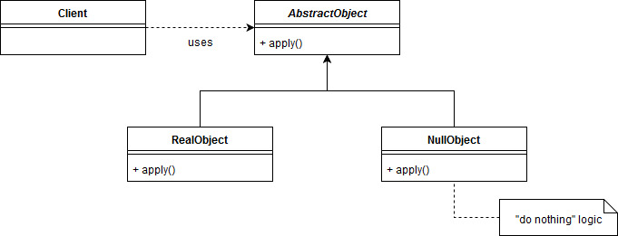

# **其他架构模式**


## 服务定位器模式

**服务定位器模式的目的是按需返回服务实例。**这对于将服务消费者与具体类解耦很有用。

一个实现将由以下组件组成：

- 客户端——客户端对象是服务消费者。它负责调用来自服务定位器的请求

- 服务定位器——是从缓存返回服务的通信入口点

- 缓存——用于存储服务引用以供以后重用的对象

- Initializer – 在缓存中创建和注册对服务的引用

- 服务——服务组件代表原始服务或其实现

定位器查找原始服务对象并按需返回。


### 示例

首先，我们将创建一个*MessagingService* 接口，用于以不同方式发送消息：

```java
public interface MessagingService {

    String getMessageBody();
    String getServiceName();
}
```

接下来，我们将定义上述接口的两个实现，通过电子邮件和 SMS 发送消息：

```java
public class EmailService implements MessagingService {

    public String getMessageBody() {
        return "email message";
    }

    public String getServiceName() {
        return "EmailService";
    }
}
```

*SMSService*类定义类似于EmailService*类*。

在定义了这两个服务之后，我们必须定义初始化它们的逻辑：

```java
public class InitialContext {
    public Object lookup(String serviceName) {
        if (serviceName.equalsIgnoreCase("EmailService")) {
            return new EmailService();
        } else if (serviceName.equalsIgnoreCase("SMSService")) {
            return new SMSService();
        }
        return null;
    }
}
```

在将服务定位器对象放在一起之前，我们需要的最后一个组件是缓存。

在我们的示例中，这是一个带有*List*属性的简单类：

```java
public class Cache {
    private List<MessagingService> services = new ArrayList<>();

    public MessagingService getService(String serviceName) {
        // retrieve from the list
    }

    public void addService(MessagingService newService) {
        // add to the list
    }
}
```

最后，我们可以实现我们的服务定位器类：

```java
public class ServiceLocator {

    private static Cache cache = new Cache();

    public static MessagingService getService(String serviceName) {

        MessagingService service = cache.getService(serviceName);

        if (service != null) {
            return service;
        }

        InitialContext context = new InitialContext();
        MessagingService service1 = (MessagingService) context
          .lookup(serviceName);
        cache.addService(service1);
        return service1;
    }
}
```

这里的逻辑相当简单。

该类拥有*缓存的一个实例。*然后，在*getService()*方法中，它将首先检查缓存中的服务实例。

然后，如果它为*空，*它将调用初始化逻辑并将新对象添加到缓存中。

### **测试**

现在让我们看看如何获取实例：

```java
MessagingService service 
  = ServiceLocator.getService("EmailService");
String email = service.getMessageBody();

MessagingService smsService 
  = ServiceLocator.getService("SMSService");
String sms = smsService.getMessageBody();

MessagingService emailService 
  = ServiceLocator.getService("EmailService");
String newEmail = emailService.getMessageBody();
```

**我们第一次从ServiceLocator获取EmailService时，会创建并返回一个新实例**。然后，在下次调用它之后，将从缓存中返回*EmailService 。*


### **服务定位器与依赖注入**

乍一看，Service Locator 模式可能看起来类似于另一种众所周知的模式——即依赖注入。

首先，重要的是要注意**依赖注入和服务定位器模式都是控制反转概念的实现**。

[在继续之前，请在这篇文章](https://www.baeldung.com/inversion-control-and-dependency-injection-in-spring)中了解有关依赖注入的更多信息。

**这里的关键区别在于客户端对象仍然创建它的依赖项**。它只是为此使用定位器，这意味着它需要对定位器对象的引用。

相比之下，当使用依赖注入时，类被赋予了依赖项。注入器仅在启动时调用一次，以将依赖项注入到类中。

**最后，让我们考虑一些避免使用服务定位器模式的原因。**

反对它的一个论点是它使单元测试变得困难。通过依赖注入，我们可以将依赖类的模拟对象传递给被测实例。另一方面，这是服务定位器模式的瓶颈。

另一个问题是使用基于这种模式的 API 会比较棘手。这样做的原因是依赖项隐藏在类中，并且仅在运行时进行验证。

尽管如此，服务定位器模式易于编码和理解，对于小型应用程序来说是一个不错的选择。


##  Intercepting Filter Pattern 

*拦截过滤器*是在处理程序处理传入请求之前或之后触发操作的过滤器。

拦截过滤器代表 Web 应用程序中的集中式组件，对所有请求都是通用的，并且可以在不影响现有处理程序的情况下进行扩展。

### **用例**

让我们扩展上一个指南中的[示例](https://github.com/eugenp/tutorials/tree/master/patterns/front-controller)并实现**身份验证机制、请求日志记录和访问者计数器**。此外，我们希望能够以**各种不同的****编码**交付我们的页面。

所有这些都是拦截过滤器的用例，因为它们对所有请求都是通用的，并且应该独立于处理程序。


### **过滤策略**

让我们介绍不同的过滤策略和示例用例。要使用 Jetty Servlet 容器运行代码，只需执行：

```
$> mvn install jetty:run
```

### **自定义过滤策略**

自定义过滤器策略用于每个需要有序处理请求的用例，意思是一个过滤器基于执行链中前一个过滤器的结果。

这些链将通过实现[*FilterChain*](https://tomcat.apache.org/tomcat-7.0-doc/servletapi/javax/servlet/FilterChain.html)接口并使用它注册各种*Filter*类来创建。

当使用具有不同关注点的多个过滤器链时，您可以在过滤器管理器中将它们连接在一起：



在我们的示例中，访问者计数器通过计算来自登录用户的唯一用户名来工作，这意味着它基于身份验证过滤器的结果，因此，必须将两个过滤器链接起来。

让我们实现这个过滤器链。

首先，我们将创建一个身份验证过滤器，它检查会话是否存在设置“用户名”属性，如果不存在则发出登录过程：

```java
public class AuthenticationFilter implements Filter {
    ...
    @Override
    public void doFilter(
      ServletRequest request,
      ServletResponse response, 
      FilterChain chain) {
        HttpServletRequest httpServletRequest = (HttpServletRequest) request;
        HttpServletResponse httpServletResponse = (HttpServletResponse) response;
        
        HttpSession session = httpServletRequest.getSession(false);
        if (session == null || session.getAttribute("username") == null) {
            FrontCommand command = new LoginCommand();
            command.init(httpServletRequest, httpServletResponse);
            command.process();
        } else {
            chain.doFilter(request, response);
        }
    }
    
    ...
}
```

现在让我们创建访客计数器。此过滤器维护一个唯一用户名的*HashSet*，并向请求添加一个“计数器”属性：

```java
public class VisitorCounterFilter implements Filter {
    private static Set<String> users = new HashSet<>();

    ...
    @Override
    public void doFilter(ServletRequest request, ServletResponse response,
      FilterChain chain) {
        HttpSession session = ((HttpServletRequest) request).getSession(false);
        Optional.ofNullable(session.getAttribute("username"))
          .map(Object::toString)
          .ifPresent(users::add);
        request.setAttribute("counter", users.size());
        chain.doFilter(request, response);
    }

    ...
}
```

接下来，我们将实现一个*FilterChain*迭代注册的过滤器并执行*doFilter*方法：

```java
public class FilterChainImpl implements FilterChain {
    private Iterator<Filter> filters;

    public FilterChainImpl(Filter... filters) {
        this.filters = Arrays.asList(filters).iterator();
    }

    @Override
    public void doFilter(ServletRequest request, ServletResponse response) {
        if (filters.hasNext()) {
            Filter filter = filters.next();
            filter.doFilter(request, response, this);
        }
    }
}
```

为了将我们的组件连接在一起，让我们创建一个简单的静态管理器，它负责实例化过滤器链、注册过滤器并启动它：

```java
public class FilterManager {
    public static void process(HttpServletRequest request,
      HttpServletResponse response, OnIntercept callback) {
        FilterChain filterChain = new FilterChainImpl(
          new AuthenticationFilter(callback), new VisitorCounterFilter());
        filterChain.doFilter(request, response);
    }
}
```

作为最后一步，我们必须在*FrontCommand中调用**FilterManager*作为请求处理序列的公共部分：

```java
public abstract class FrontCommand {
    ...

    public void process() {
        FilterManager.process(request, response);
    }

    ...
}
```


### **基础过滤策略**

在本节中，我们将介绍基础过滤器策略，所有实现的过滤器都使用一个共同的超类。

此策略与上一节中的自定义策略或我们将在下一节中介绍的标准过滤器策略很好地结合使用。

这个抽象的基类可以用来应用属于过滤器链的自定义行为。我们将在我们的例子中使用它来减少与过滤器配置和调试日志有关的模板代码。

```java
public abstract class BaseFilter implements Filter {
    private Logger log = LoggerFactory.getLogger(BaseFilter.class);

    protected FilterConfig filterConfig;

    @Override
    public void init(FilterConfig filterConfig) throws ServletException {
        log.info("Initialize filter: {}", getClass().getSimpleName());
        this.filterConfig = filterConfig;
    }

    @Override
    public void destroy() {
        log.info("Destroy filter: {}", getClass().getSimpleName());
    }
}
```

让我们扩展这个基类来创建一个请求日志过滤器，它将被集成到下一节中：

```java
public class LoggingFilter extends BaseFilter {
    private static final Logger log = LoggerFactory.getLogger(LoggingFilter.class);

    @Override
    public void doFilter(
      ServletRequest request, 
      ServletResponse response,
      FilterChain chain) {
        chain.doFilter(request, response);
        HttpServletRequest httpServletRequest = (HttpServletRequest) request;
        
        String username = Optional
          .ofNullable(httpServletRequest.getAttribute("username"))
          .map(Object::toString)
          .orElse("guest");
        
        log.info(
          "Request from '{}@{}': {}?{}", 
          username, 
          request.getRemoteAddr(),
          httpServletRequest.getRequestURI(), 
          request.getParameterMap());
    }
}
```

### **标准过滤策略**

应用过滤器的一种更灵活的方法是实现*标准过滤器策略*。这可以通过在部署描述符中声明过滤器来完成，或者从 Servlet 规范 3.0 开始，通过注解来完成。

标准过滤器策略 允许将新过滤器插入默认链中，而无需明确定义过滤器管理器：



请注意，应用过滤器的顺序不能通过注释指定。如果您需要有序执行，则必须坚持使用部署描述符或实施自定义过滤策略。

让我们实现一个注解驱动的编码过滤器，它也使用基本过滤器策略：

```java
@WebFilter(servletNames = {"intercepting-filter"}, 
  initParams = {@WebInitParam(name = "encoding", value = "UTF-8")})
public class EncodingFilter extends BaseFilter {
    private String encoding;

    @Override
    public void init(FilterConfig filterConfig) throws ServletException {
        super.init(filterConfig);
        this.encoding = filterConfig.getInitParameter("encoding");
    }

    @Override
    public void doFilter(ServletRequest request,
      ServletResponse response, FilterChain chain) {
        String encoding = Optional
          .ofNullable(request.getParameter("encoding"))
          .orElse(this.encoding);
        response.setCharacterEncoding(encoding); 
        
        chain.doFilter(request, response);
    }
}
```

在具有部署描述符的 Servlet 场景中，我们的*web.xml*将包含这些额外的声明：

```java
<filter>
    <filter-name>encoding-filter</filter-name>
    <filter-class>
      com.baeldung.patterns.intercepting.filter.filters.EncodingFilter
    </filter-class>
</filter>
<filter-mapping>
    <filter-name>encoding-filter</filter-name>
    <servlet-name>intercepting-filter</servlet-name>
</filter-mapping>
```

让我们拿起我们的日志过滤器并对其进行注释，以便被 Servlet 使用：

```java
@WebFilter(servletNames = "intercepting-filter")
public class LoggingFilter extends BaseFilter {
    ...
}
```


### **模板过滤策略**

*模板过滤策略*与基本过滤策略几乎相同，只是它使用在基类中声明的模板方法，这些方法必须在实现中被覆盖：



让我们创建一个带有两个抽象过滤器方法的基本过滤器类，它们在进一步处理之前和之后被调用。

由于这种策略不太常见，并且我们在示例中没有使用它，因此具体的实现和用例取决于您的想象：

```java
public abstract class TemplateFilter extends BaseFilter {
    protected abstract void preFilter(HttpServletRequest request,
      HttpServletResponse response);

    protected abstract void postFilter(HttpServletRequest request,
      HttpServletResponse response);

    @Override
    public void doFilter(ServletRequest request,
      ServletResponse response, FilterChain chain) {
        HttpServletRequest httpServletRequest = (HttpServletRequest) request;
        HttpServletResponse httpServletResponse = (HttpServletResponse) response;
        
        preFilter(httpServletRequest, httpServletResponse);
        chain.doFilter(request, response);
        postFilter(httpServletRequest, httpServletResponse);
    }
}
```

### **结论**

拦截过滤器模式捕获可以独立于[在这个快速教程中，我们将了解空对象模式，它是策略模式](https://www.baeldung.com/java-strategy-pattern)的一个特例。我们将描述它的用途以及我们应该何时真正考虑使用它。

像往常一样，我们还将提供一个简单的代码示例。业务逻辑发展的横切关注点。从业务运营的角度来看，过滤器作为一系列前置或后置操作执行。


## 空对象

[在这个快速教程中，我们将了解空对象模式，它是策略模式](https://www.baeldung.com/java-strategy-pattern)的一个特例。我们将描述它的用途以及我们应该何时真正考虑使用它。

像往常一样，我们还将提供一个简单的代码示例。


### 空对象模式

在大多数面向对象的编程语言中，我们不允许使用*空*引用。这就是为什么我们经常被迫编写*空*检查：

```java
Command cmd = getCommand();
if (cmd != null) {
    cmd.execute();
}
```

有时，如果此类*if*语句的数量变多，代码可能会变得丑陋、难以阅读且容易出错。这时空对象模式可能会派上用场。

**空对象模式的目的是尽量减少这种空检查。**相反，我们可以识别空行为并将其封装在客户端代码所期望的类型中。通常情况下，这种中性逻辑非常简单——什么都不做。这样我们就不再需要处理*空*引用的特殊处理。

我们可以简单地对待空对象，就像对待给定类型的任何其他实例实际上包含一些更复杂的业务逻辑一样。因此，客户端代码保持清洁。

由于 null 对象不应有任何状态，因此无需多次创建相同的实例。因此，我们经常将**空对象****实现为单例


### 空对象模式的UML图

让我们直观地看一下模式：



如我们所见，我们可以识别以下参与者：

- 客户端需要一个 AbstractObject 的实例
- AbstractObject定义了客户期望的契约--它也可能包含实现类的共享逻辑。
- *RealObject*实现*AbstractObject*并提供真实的行为
- *NullObject*实现*AbstractObject*并提供中性行为


### 示例

现在我们对理论有了清晰的认识，让我们看一个例子。

假设我们有一个消息路由器应用程序。每条消息都应该分配一个有效的优先级。我们的系统应该将高优先级的消息路由到 SMS 网关，而中等优先级的消息应该路由到 JMS 队列。

然而，有时，**具有“未定义”或空优先级的消息可能会出现**在我们的应用程序中。此类消息应从进一步处理中丢弃。

首先，我们将创建*路由器*接口：

```java
public interface Router {
    void route(Message msg);
}
```

接下来，让我们创建上述接口的两个实现——一个负责路由到 SMS 网关，另一个将消息路由到 JMS 队列：

```java
public class SmsRouter implements Router {
    @Override
    public void route(Message msg) {
        // implementation details
    }
}
```

```java
public class JmsRouter implements Router {
    @Override
    public void route(Message msg) {
        // implementation details
    }
}
```

最后，**让我们实现我们的空对象：**

```java
public class NullRouter implements Router {
    @Override
    public void route(Message msg) {
        // do nothing
    }
}
```

我们现在准备把所有的部分放在一起。让我们看看示例客户端代码的样子：

```java
public class RoutingHandler {
    public void handle(Iterable<Message> messages) {
        for (Message msg : messages) {
            Router router = RouterFactory.getRouterForMessage(msg);
            router.route(msg);
        }
    }
}
```

正如我们所见，我们**以同样的方式****对待所有路由器**对象，无论*RouterFactory 返回什么实现。*这使我们能够保持代码的清洁和可读性。


### 何时使用空对象模式

**当客户端为了跳过执行或执行默认操作而检查null时，我们应该使用 Null 对象模式。**在这种情况下，我们可以将中性逻辑封装在一个空对象中，并将其返回给客户端而不是*空*值。这样，客户端的代码不再需要知道给定实例是否为*空* 。

这种方法遵循一般的面向对象原则，例如[Tell-Don't-Ask](https://martinfowler.com/bliki/TellDontAsk.html)。

为了更好地理解何时应该使用 Null 对象模式，假设我们必须实现*CustomerDao*接口，定义如下：

```java
public interface CustomerDao {
    Collection<Customer> findByNameAndLastname(String name, String lastname);
    Customer getById(Long id);
}
```

大多数开发人员会**从**findByNameAndLastname()****返回Collections.emptyList( ) ，以防没有客户符合**提供的搜索条件。这是遵循空对象模式的一个很好的例子。

相反，*get* *ById()*应该返回具有给定 ID 的客户。调用此方法的人期望获得特定的客户实体。**如果不存在这样的客户，我们应该显式返回null以表明提供的 id 有问题。** 

与所有其他模式一样，**我们需要在盲目实施空对象模式之前考虑我们的特定用例**。否则，我们可能会无意中在我们的代码中引入一些难以发现的错误。


## **Spring Cloud 系列——网关模式**

[到目前为止](https://www.baeldung.com/spring-cloud-series)，在我们的云应用程序中，我们使用网关模式来支持两个主要功能。

首先，我们将客户与每项服务隔离开来，消除了对跨域支持的需求。接下来，我们使用 Eureka 实现了定位服务实例。

在本文中，我们将了解如何使用网关模式**通过单个请求从多个服务中检索数据**。为此，我们将在网关中引入 Feign，以帮助编写对我们服务的 API 调用。

要了解如何使用 Feign 客户端，请查看[这篇文章](https://www.baeldung.com/spring-cloud-netflix-eureka)。

Spring Cloud 现在还提供了实现此模式的[Spring Cloud Gateway项目。](https://www.baeldung.com/spring-cloud-gateway)


### 依赖

```xml
<dependency>
    <groupId>org.springframework.cloud</groupId>
    <artifactId>spring-cloud-starter-feign</artifactId>
</dependency>
```

现在我们已经支持构建 Feign 客户端，让我们在*GatewayApplication.java*中启用它：

```jav
@EnableFeignClients
public class GatewayApplication { ... }
```

现在让我们为图书和评级服务设置 Feign 客户端。


### **Feign Clients** 


#### **Book Client** 

让我们创建一个名为*BooksClient.java*的新接口：

```java
@FeignClient("book-service")
public interface BooksClient {
 
    @RequestMapping(value = "/books/{bookId}", method = RequestMethod.GET)
    Book getBookById(@PathVariable("bookId") Long bookId);
}
```

通过这个接口，我们指示 Spring 创建一个 Feign 客户端，该客户端将访问“ */books/{bookId* }”端点。调用时，*getBookById*方法将对端点进行 HTTP 调用，并使用*bookId*参数。

为了完成这项工作，我们需要添加一个*Book.java* DTO：

```java
@JsonIgnoreProperties(ignoreUnknown = true)
public class Book {
 
    private Long id;
    private String author;
    private String title;
    private List<Rating> ratings;
    
    // getters and setters
}
```

让我们继续*看 RatingsClient*。

#### **Ratings Client** 

让我们创建一个名为*RatingsClient*的接口：

```java
@FeignClient("rating-service")
public interface RatingsClient {
 
    @RequestMapping(value = "/ratings", method = RequestMethod.GET)
    List<Rating> getRatingsByBookId(
      @RequestParam("bookId") Long bookId, 
      @RequestHeader("Cookie") String session);
    
}
```

与*BookClient*一样，这里公开的方法将对我们的评级服务进行rest调用并返回一本书的评级列表。

然而，此端点是安全的。为了能够正确访问此端点，我们需要将用户的会话传递给请求。

在我们的例子中，我们正在写入*Cookie*标头，因为 Spring Session 将在 cookie 中查找我们的会话。

最后，让我们添加一个*Rating.java* DTO：

```java
@JsonIgnoreProperties(ignoreUnknown = true)
public class Rating {
    private Long id;
    private Long bookId;
    private int stars;
}
```

现在，两个客户端都完成了。让我们使用它们吧！


###  **Combined Request**

网关模式的一个常见用例是拥有封装常用服务的端点。这可以通过减少客户端请求的数量来提高性能。

要做到这一点，让我们创建一个控制器，并将其称为CombinedController.java。

```java
@RestController
@RequestMapping("/combined")
public class CombinedController { ... }
```

接下来，让我们连接我们新创建的 feign 客户端：

```java
private BooksClient booksClient;
private RatingsClient ratingsClient;

@Autowired
public CombinedController(
  BooksClient booksClient, 
  RatingsClient ratingsClient) {
 
    this.booksClient = booksClient;
    this.ratingsClient = ratingsClient;
}
```

后，让我们创建一个 GET 请求，将这两个端点结合起来，并返回一本书并加载其评分：

```java
@GetMapping
public Book getCombinedResponse(
  @RequestParam Long bookId,
  @CookieValue("SESSION") String session) {
 
    Book book = booksClient.getBookById(bookId);
    List<Rating> ratings = ratingsClient.getRatingsByBookId(bookId, "SESSION="+session);
    book.setRatings(ratings);
    return book;
}
```

请注意，我们使用从请求中提取会话值的*@CookieValue*注释来设置会话值。

就在那里！我们的网关中有一个组合端点，可以减少客户端和系统之间的网络调用！


### **测试**

让我们确保我们的新端点正常工作。

导航到*LiveTest.java*并为我们的组合端点添加一个测试：

```java
@Test
public void accessCombinedEndpoint() {
    Response response = RestAssured.given()
      .auth()
      .form("user", "password", formConfig)
      .get(ROOT_URI + "/combined?bookId=1");
 
    assertEquals(HttpStatus.OK.value(), response.getStatusCode());
    assertNotNull(response.getBody());
 
    Book result = response.as(Book.class);
 
    assertEquals(new Long(1), result.getId());
    assertNotNull(result.getRatings());
    assertTrue(result.getRatings().size() > 0);
```

启动 Redis，然后在我们的应用程序中运行每个服务：*config、discovery、zipkin、* *gateway*、*book*和*rating*服务。

一切就绪后，运行新测试以确认其正常工作。