# 创建型模式

**创建型设计模式关注对象的创建方式。**它们通过以受控方式创建对象来降低复杂性和不稳定性。

*new*运算符通常被认为是有害的，因为它会将对象分散到整个应用程序中。随着时间的推移，由于类变得紧密耦合，因此更改实现变得具有挑战性。

1. 单例——确保在整个应用程序中最多只存在一个对象实例
2. 工厂方法——创建几个相关类的对象，而不指定要创建的确切对象
3. 抽象工厂——创建相关依赖对象的族
4. Builder **-**使用逐步方法构建复杂对象

## 单例

单例设计模式旨在通过**确保整个 Java 虚拟机中仅存在一个对象实例来检查特定类的对象的初始化。**

Singleton 类还为对象提供了一个唯一的全局访问点，以便对访问点的每个后续调用都只返回该特定对象。

### 单例模式示例(静态内部类)

尽管Singleton模式是由GoF引入的，但众所周知，最初的实现在多线程的情况下是有问题的。

所以在这里，我们将采用更优化的方法，利用静态内部类：

```java
public class Singleton  {    
    private Singleton() {}
    
    private static class SingletonHolder {    
        public static final Singleton instance = new Singleton();
    }

    public static Singleton getInstance() {    
        return SingletonHolder.instance;    
    }
}
```

在这里，我们已经创建了一个静态的内层类，它持有Singleton类的实例。它只在有人调用getInstance()方法时创建实例，而不是在加载外类时创建。

这是一个被广泛使用的Singleton类的方法，因为它不需要同步，是线程安全的，强制执行懒惰的初始化，并且相对来说有较少的模板。
  另外，请注意，构造函数有私人访问修饰符。这是创建Singleton的一个要求，因为一个公开的构造函数意味着任何人都可以访问它并开始创建新的实例。

请记住，这并不是原始的GoF实现。关于原始版本，请访问Baeldung关于Java中的Singletons的链接文章。


### 懒汉式：懒加载，线程不安全

```java
public class Singleton
{
    private static Singleton singleton;

    private Singleton()
    {
    }

    public static Singleton getInstance()
    {
        if (singleton == null)
            singleton = new Singleton();
        return singleton;
    }
}
```

虽然这是一种常见的方法，但重要的是要注意它在多线程场景中可能会出现问题，这是使用单例的主要原因。

简单地说，它可能导致一个以上的实例，破坏了模式的核心原则。虽然这个问题有锁的解决方案，但我们接下来的方法(**Enum Singleton**)从根本上解决了这些问题。

### 懒汉式线程安全版：同步效率低

```java
public class Singleton
{
    private static Singleton singleton;

    private Singleton()
    {
    }

    public synchronized static Singleton getInstance()
    {
        if (singleton == null)
            singleton = new Singleton();
        return singleton;
    }
}
```

**Synchronization**

同步化可能会大大影响性能。如果这段代码经常被调用，我们应该使用各种技术来加快它的速度，如懒惰初始化或双重检查锁定（注意，由于编译器的优化，这可能无法达到预期的效果）。

**Multiple Instances**

与 JVM 本身相关的单例还有其他几个问题，这些问题可能导致我们最终得到一个单例的多个实例。这些问题非常微妙，我们将对每个问题进行简要说明：

每个 JVM 的单例应该是唯一的。这可能是分布式系统或内部基于分布式技术的系统的问题。

每个类加载器都可能加载它的单例版本。

一旦没有人持有对它的引用，单例可能会被垃圾收集。此问题不会导致一次存在多个单例实例，但在重新创建时，该实例可能与其以前的版本不同。


### 双重校验锁

我们将讨论双重检查锁定设计模式。

在本教程中，我们将讨论双重检查锁定的设计模式。这种模式通过简单地事先检查锁定条件来减少锁的获取次数。这样做的结果是，通常会有一个性能提升。然而，应该注意的是，双重检查锁是一个破损的声明。

首先，让我们考虑一个具有严格synchronization的简单单例：

```java 
public class DraconianSingleton {
    private static DraconianSingleton instance;
    public static synchronized DraconianSingleton getInstance() {
        if (instance == null) {
            instance = new DraconianSingleton();
        }
        return instance;
    }

    // private constructor and other methods ...
}
```

尽管这个类是线程安全的，但我们可以看到有一个明显的性能缺陷：每次我们想要获取单例的实例时，我们都需要获取一个可能不必要的锁。

为了解决这个问题，**我们可以先验证是否需要首先创建对象，只有在这种情况下，我们才会获得锁。**

更进一步，我们希望在进入同步块后再次执行相同的检查，以保持操作的原子性：

```java
public class DclSingleton {
    private static volatile DclSingleton instance;
    public static DclSingleton getInstance() {
        if (instance == null) {
            synchronized (DclSingleton .class) {
                if (instance == null) {
                    instance = new DclSingleton();
                }
            }
        }
        return instance;
    }

    // private constructor and other methods...
}
```

One thing to keep in mind with this pattern is that **the field needs to be volatile** to prevent cache incoherence issues. In fact, the Java memory model allows the publication of partially initialized objects and this may lead in turn to subtle bugs.

#### 替代

尽管双重检查锁定可能会加快速度，但它至少有两个问题：

- 因为它需要*volatile*关键字才能正常工作，所以它与 Java 1.4 及更低版本不兼容
- 它非常冗长，并且使代码难以阅读

出于这些原因，让我们研究一些没有这些缺陷的其他选项。以下所有方法都将同步任务委托给 JVM。


##### **Early Initialization**

实现线程安全的最简单方法是内联对象创建或使用等效的静态块。这利用了静态字段和块依次初始化的事实（Java 语言规范 12.4.2）

```java
public class EarlyInitSingleton {
    private static final EarlyInitSingleton INSTANCE = new EarlyInitSingleton();
    public static EarlyInitSingleton getInstance() {
        return INSTANCE;
    }
    
     // private constructor and other methods...
}
```


##### **Initialization on Demand**

此外，由于我们从上一段中的 Java 语言规范参考中知道，类初始化在我们第一次使用其方法或字段时发生，我们可以使用嵌套静态类来实现延迟初始化：

```java
public class InitOnDemandSingleton {
    private static class InstanceHolder {
        private static final InitOnDemandSingleton INSTANCE = new InitOnDemandSingleton();
    }
    public static InitOnDemandSingleton getInstance() {
        return InstanceHolder.INSTANCE;
    }

     // private constructor and other methods...
}
```

在这种情况下，*InstanceHolder*类将在我们第一次通过调用*getInstance 访问它时分配该字段。*


##### **Enum Singleton**

最后一个解决方案来自 Joshua Block 的*Effective Java* book (Item 3)，它使用*enum*而不是*class*。在撰写本文时，这被认为是编写单例最简洁和安全的方式：

```java
public enum EnumSingleton {
    INSTANCE;

    // other methods...
}
```


#### **结论**

总而言之，这篇快速文章介绍了双重检查锁定模式、它的限制和一些替代方案。

在实践中，过多的冗长和缺乏向后兼容性使得这种模式容易出错，因此我们应该避免它。相反，我们应该使用让 JVM 进行同步的替代方法。


### **Enum Singleton**

```java
public enum EnumSingleton {
    
    INSTANCE("Initial class info"); 
 
    private String info;
 
    private EnumSingleton(String info) {
        this.info = info;
    }
 
    public EnumSingleton getInstance() {
        return INSTANCE;
    }
    
    // getters and setters
}
```

这种方法具有由枚举实现本身保证的序列化和线程安全，这在内部确保只有单个实例可用，从而纠正了基于类的实现中指出的问题。

test:

```java
EnumSingleton enumSingleton1 = EnumSingleton.INSTANCE.getInstance();

System.out.println(enumSingleton1.getInfo()); //Initial enum info

EnumSingleton enumSingleton2 = EnumSingleton.INSTANCE.getInstance();
enumSingleton2.setInfo("New enum info");

System.out.println(enumSingleton1.getInfo()); // New enum info
System.out.println(enumSingleton2.getInfo()); // New enum info
```


### 单例陷阱

从概念上讲，单例是一种全局变量。一般来说，我们知道应该避免使用全局变量——尤其是当它们的状态是可变的时候。

**我们并不是说我们永远不应该使用单例。但是，我们说可能有更有效的方法来组织我们的代码。**

如果一个方法的实现依赖于一个单例对象，为什么不将它作为参数传递呢？在这种情况下，我们明确地展示了该方法所依赖的内容。因此，我们可以在执行测试时轻松地模拟这些依赖项（如果需要）。

例如，单例通常用于包含应用程序的配置数据（即与存储库的连接）。如果将它们用作全局对象，则很难为测试环境选择配置。

因此，当我们运行测试时，生产数据库会被测试数据破坏，这是难以接受的。

如果我们需要一个单例，我们可能会考虑将其实例化委托给另一个类（一种工厂）的可能性，该类应该确保只有一个单例实例在起作用。


###  **何时使用单例设计模式**

- 对于创建成本高的资源（如数据库连接对象）
- It's good practice to keep all loggers as Singletons which increases performance
- 提供对应用程序的配置设置的访问的类
- 包含以共享模式访问的资源的类


## 工厂

工厂设计模式或工厂方法设计模式是 Java 中最常用的设计模式之一。

根据 GoF 的说法，这种模式**“定义了一个用于创建对象的接口，但让子类决定实例化哪个类。**Factory 方法允许类将实例化推迟到子类”。

此模式通过创建一种虚拟构造函数将初始化类的责任从客户端委托给特定的工厂类。

为了实现这一点，我们依赖于为我们提供对象的工厂，隐藏了实际的实现细节。使用通用接口访问创建的对象。


### 抽象工厂

In the previous section, we saw how the Factory Method design pattern could be used to create objects related to a single family.

By contrast, the Abstract Factory Design Pattern is used to create families of related or dependent objects. It's also sometimes called a factory of factories.

The book [Design Patterns: Elements of Reusable Object-Oriented Software ](https://books.google.co.in/books?id=K4qv1D-LKhoC&lpg=PP1&dq=Design Patterns%3A Elements of Reusable Object-Oriented Software&pg=PP1#v=onepage&q=Design Patterns: Elements of Reusable Object-Oriented Software&f=false)states that an Abstract Factory **“provides an interface for creating families of related or dependent objects without specifying their concrete classes”.** In other words, this model allows us to create objects that follow a general pattern.

An example of the Abstract Factory design pattern in the JDK is the *newInstance()* of *javax.xml.parsers.DocumentBuilderFactory* class.


#### **抽象工厂设计模式示例**

在本例中，我们将创建工厂方法设计模式的两个实现：*AnimalFactory*和*Color* *Factory。*

之后，我们将使用抽象工厂*AbstractFactory 管理对它们的访问：*

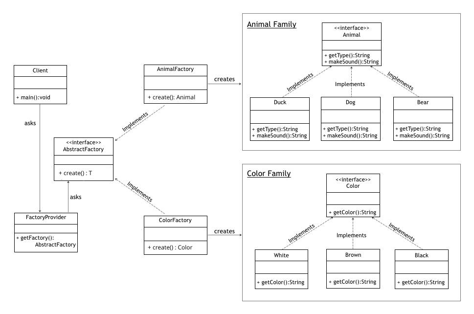

First, we'll create a family of *Animal* class and will, later on, use it in our Abstract Factory.

Here's the *Animal* interface:

```java
public interface Animal {
    String getAnimal();
    String makeSound();
}
```

and a concrete implementation *Duck*:

```java
public class Duck implements Animal {

    @Override
    public String getAnimal() {
        return "Duck";
    }

    @Override
    public String makeSound() {
        return "Squeks";
    }
}
```

此外，我们可以完全以这种方式创建 Animal 接口（如 Dog、Bear 等）的更具体的实现。

The Abstract Factory deals with families of dependent objects. With that in mind, we're going to introduce one more family *Color* as an interface with a few implementations (*White, Brown,…*).

We'll skip the actual code for now, but it can be found [here](https://github.com/eugenp/tutorials/tree/master/core-java-modules/core-java).

**Now that we've got multiple families ready, we can create an *AbstractFactory* interface for them:**

```java
public interface AbstractFactory<T> {
    T create(String animalType) ;
}
```

接下来，我们将使用我们在上一节中讨论的工厂方法设计模式来实现 AnimalFactory：

```java
public class AnimalFactory implements AbstractFactory<Animal> {

    @Override
    public Animal create(String animalType) {
        if ("Dog".equalsIgnoreCase(animalType)) {
            return new Dog();
        } else if ("Duck".equalsIgnoreCase(animalType)) {
            return new Duck();
        }

        return null;
    }

}
```

同样，我们可以使用相同的设计模式为 Color 接口实现一个工厂。

设置完所有这些后，我们将创建一个 FactoryProvider 类，该类将为我们提供 AnimalFactory 或 ColorFactory 的实现，具体取决于我们提供给 getFactory() 方法的参数：

```java
public class FactoryProvider {
    public static AbstractFactory getFactory(String choice){
        
        if("Animal".equalsIgnoreCase(choice)){
            return new AnimalFactory();
        }
        else if("Color".equalsIgnoreCase(choice)){
            return new ColorFactory();
        }
        
        return null;
    }
}
```

#### **何时使用抽象工厂模式：**

- The client is independent of how we create and compose the objects in the system
- The system consists of multiple families of objects, and these families are designed to be used together
- We need a run-time value to construct a particular dependency

**While the pattern is great when creating predefined objects, adding the new ones might be challenging**. To support the new type of objects will require changing the *AbstractFactory* class and all of its subclasses.


### 工厂方法

在此示例中，我们将创建一个*Polygon*接口，该接口将由多个具体类实现。*PolygonFactory*将用于从该系列中获取对象：

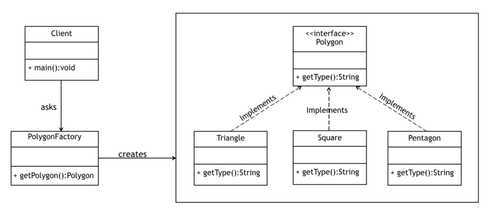

让我们首先创建*Polygon*接口：

```java
public interface Polygon {
    String getType();
}
```

接下来，我们将创建一些实现，例如*Square*、*Triangle*等，它们实现了这个接口并返回一个*Polygon*类型的对象。

现在我们可以创建一个工厂，将边数作为参数并返回此接口的适当实现：

```java
public class PolygonFactory {
    public Polygon getPolygon(int numberOfSides) {
        if(numberOfSides == 3) {
            return new Triangle();
        }
        if(numberOfSides == 4) {
            return new Square();
        }
        if(numberOfSides == 5) {
            return new Pentagon();
        }
        if(numberOfSides == 7) {
            return new Heptagon();
        }
        else if(numberOfSides == 8) {
            return new Octagon();
        }
        return null;
    }
}
```

注意客户端如何依赖这个工厂来给我们一个合适的*Polygon*，而不必直接初始化对象。


**我们通过一段较为通用的代码来解释如何使用工厂模式：**

```java

//抽象的产品
public abstract class Product {
    public abstract void method();
}
//定义一个具体的产品 (可以定义多个具体的产品)
class ProductA extends Product {
    @Override
    public void method() {}  //具体的执行逻辑
}
//抽象的工厂
abstract class Factory<T> {
    abstract Product createProduct(Class<T> c);
}
//具体的工厂可以生产出相应的产品
class FactoryA extends Factory{
    @Override
    Product createProduct(Class c) {
        Product product = (Product) Class.forName(c.getName()).newInstance();
        return product;
    }
}

```

#### **何时使用工厂方法设计模式**

- 当接口或抽象类的实现预计会频繁更改时
- 当当前的实现不能舒适地适应新的变化时
- 当初始化过程比较简单，构造函数只需要少量参数时


## Builder

Builder 设计模式是另一种创建模式，旨在处理相对复杂的对象的构造。

当创建对象的复杂性增加时，Builder 模式可以通过使用另一个对象（builder）来构造对象，从而分离出实例化过程。

然后，这个构建器可用于使用简单的逐步方法创建许多其他类似的表示。

### **构建器模式示例**

GoF 引入的原始 Builder 设计模式侧重于抽象，在处理复杂对象时非常好，但是设计有点复杂。

Joshua Bloch 在他的《Effective Java》一书中介绍了构建器模式的改进版本，它干净、易读（因为它使用了[流畅的设计](https://en.wikipedia.org/wiki/Fluent_interface)）并且从客户的角度来看易于使用。在本例中，我们将讨论该版本。

此示例只有一个类*BankAccount*，其中包含一个构建器作为*静态*内部类：

```java
public class BankAccount {
    
    private String name;
    private String accountNumber;
    private String email;
    private boolean newsletter;

    // constructors/getters
    
    public static class BankAccountBuilder {
        // builder code
    }
}
```

请注意，字段上的所有访问修饰符都被声明为*私有*，因为我们不希望外部对象直接访问它们。

构造函数也是私有的，所以只有分配给这个类的构建器可以访问它。在构造函数中设置的所有属性都是从我们作为参数提供的构建器对象中提取的

我们在静态内部类中定义了 **BankAccountBuilder**：

```java
public class BankAccount {
    private String name;
    private String accountNumber;
    private String email;
    private boolean newsletter;

    //The constructor that takes a builder from which it will create object
    //the access to this is only provided to builder
    private BankAccount(BankAccountBuilder builder) {
        this.name = builder.name;
        this.accountNumber = builder.accountNumber;
        this.email = builder.email;
        this.newsletter = builder.newsletter;
    }
    
    public static class BankAccountBuilder {
        private String name;
        private String accountNumber;
        private String email;
        private boolean newsletter;
        
        //All Mandatory parameters goes with this constructor
        public BankAccountBuilder(String name, String accountNumber) {
            this.name = name;
            this.accountNumber = accountNumber;
        }

        //setters for optional parameters which returns this same builder
        //to support fluent design
        public BankAccountBuilder withEmail(String email) {
            this.email = email;
            return this;
        }

        public BankAccountBuilder wantNewsletter(boolean newsletter) {
            this.newsletter = newsletter;
            return this;
        }
        
        //the actual build method that prepares and returns a BankAccount object
        public BankAccount build() {
            return new BankAccount(this);
        }
    }

    //getters
    public String getName() {
        return name;
    }

    public String getAccountNumber() {
        return accountNumber;
    }

    public String getEmail() {
        return email;
    }

    public boolean isNewsletter() {
        return newsletter;
    }
}
```

请注意，我们已经声明了**外部类包含的相同字段集**。**任何必填字段都需要作为内部类构造函数的参数**，**而剩余的可选字段可以使用 setter 方法指定**。

此实现还通过让 setter 方法返回构建器对象来支持流畅的设计方法。

最后，build 方法调用外部类的私有构造函数，并将自身作为参数传递。返回的 BankAccount 将使用 BankAccountBuilder 设置的参数进行实例化。

让我们看一个构建器模式的快速示例：

```java
BankAccount newAccount = new BankAccount
  .BankAccountBuilder("Jon", "22738022275")
  .withEmail("jon@example.com")
  .wantNewsletter(true)
  .build();
```


### **何时使用构建器模式**

- 当创建对象的过程非常复杂，有很多强制和可选参数时
- 当构造函数参数数量增加导致构造函数列表很大时
- 当客户端期望构造的对象有不同的表示时


# **结构模式**

## 代理

代理模式(Proxy Design Pattern)的原理和代码实现都不难掌握。它在不改变原始类（或叫被代理类）代码的情况下，通过引入代理类来给原始类附加功能。

使用这种模式，我们创建了一个中介，它充当另一个资源的接口，例如文件、连接。这种辅助访问为真实组件提供了替代品，并保护它免受底层复杂性的影响

### **代理模式示例**

考虑到一个沉重的Java对象（如JDBC连接或SessionFactory），需要一些初始配置。

我们只想让这样的对象在需要时被初始化，一旦被初始化，我们就想在所有的调用中重复使用它们。


现在让我们为这个对象创建一个简单的接口和配置：

  ```java
public interface ExpensiveObject {
    void process();
}
  ```

而这个接口的实现，有一个很大的初始配置。

```java
public class ExpensiveObjectImpl implements ExpensiveObject {

    public ExpensiveObjectImpl() {
        heavyInitialConfiguration();
    }
    
    @Override
    public void process() {
        LOG.info("processing complete.");
    }
    
    private void heavyInitialConfiguration() {
        LOG.info("Loading initial configuration...");
    }
    
}
```

我们现在将利用代理模式并按需初始化我们的对象：

```java
public class ExpensiveObjectProxy implements ExpensiveObject {
    private static ExpensiveObject object;

    @Override
    public void process() {
        if (object == null) {
            object = new ExpensiveObjectImpl();
        }
        object.process();
    }
}
```

每当我们的客户端调用*process()*方法时，他们只会看到处理过程，并且初始配置将始终保持隐藏：

```java
public static void main(String[] args) {
    ExpensiveObject object = new ExpensiveObjectProxy();
    object.process();
    object.process();
}
```

请注意，我们调用了*process()*方法两次。在幕后，设置部分只会发生一次——当对象第一次初始化时。

对于每个其他后续调用，此模式将跳过初始配置，并且只会进行处理：

```java\
Loading initial configuration...
processing complete.
processing complete.
```


### **差异化的关键点：**

- 代理提供与其持有引用的对象相同的接口，并且它不会以任何方式修改数据；它与分别改变和装饰预先存在的实例的功能的适配器和装饰器模式形成对比
- 代理通常在编译时拥有关于真实主题的信息，而装饰器和适配器在运行时被注入，只知道实际对象的接口


### **何时使用代理**

- 当我们想要一个复杂或沉重对象的简化版本时。在这种情况下，我们可以用一个骨架对象来表示它，它可以按需加载原始对象，也被称为懒惰初始化。这被称为 "虚拟代理"

- 当原始对象存在于不同的地址空间时，我们希望在本地表示它。我们可以创建一个代理来完成所有必要的样板工作，例如创建和维护连接、编码、解码等，同时客户端访问它，因为它存在于本地地址空间中。这称为远程代理

- 当我们想在原来的底层对象上增加一层安全，以提供基于客户访问权限的受控访问。这就是所谓的保护代理

  


## 装饰器

**此模式对于增强对象的行为很有用。**

**装饰器模式可用于静态或动态地将附加职责附加到对象。**装饰器为原始对象提供了增强的接口。

在这种模式的实现中，我们更喜欢组合而不是继承——这样我们就可以减少每个装饰元素一次又一次的子类化开销。这种设计所涉及的递归可用于根据需要多次装饰我们的对象。


### **装饰器模式示例**

假设我们有一个圣诞树对象，我们想要装饰它。装饰不会改变物体本身；只是除了圣诞树之外，我们还添加了一些装饰物品，如花环、金属丝、树顶、泡泡灯等：


**对于这种情况，我们将遵循最初的 Gang of Four 设计和命名约定。**首先，我们将创建一个*ChristmasTree*接口及其实现：

```java
public interface ChristmasTree {
    String decorate();
}
```

该接口的实现如下所示：

```java
public class ChristmasTreeImpl implements ChristmasTree {

    @Override
    public String decorate() {
        return "Christmas tree";
    }
}
```

我们现在要为这棵树创建一个抽象的TreeDecorator类。这个装饰器将实现ChristmasTree接口，同时也持有相同的对象。来自同一接口的实现方法将简单地调用我们接口中的decorate()方法。

```java
public abstract class TreeDecorator implements ChristmasTree {
    private ChristmasTree tree;
    
    // standard constructors
    @Override
    public String decorate() {
        return tree.decorate();
    }
}
```

我们现在将创建一些装饰元素。这些装饰器将扩展我们的抽象*TreeDecorator*类，并根据我们的要求修改其*decorate()方法：*

```java
public class BubbleLights extends TreeDecorator {

    public BubbleLights(ChristmasTree tree) {
        super(tree);
    }
    
    public String decorate() {
        return super.decorate() + decorateWithBubbleLights();
    }
    
    private String decorateWithBubbleLights() {
        return " with Bubble Lights";
    }
}
```

对于这种情况，以下情况属实：

```java
@Test
public void whenDecoratorsInjectedAtRuntime_thenConfigSuccess() {
    ChristmasTree tree1 = new Garland(new ChristmasTreeImpl());
    assertEquals(tree1.decorate(), 
      "Christmas tree with Garland");
     
    ChristmasTree tree2 = new BubbleLights(
      new Garland(new Garland(new ChristmasTreeImpl())));
    assertEquals(tree2.decorate(), 
      "Christmas tree with Garland with Garland with Bubble Lights");
}
```

请注意，在第一个*tree1*对象中，我们只用一个*Garland*来装饰它，而另一个*tree2*对象我们用一个*BubbleLights*和两个*Garlands*来装饰。这种模式为我们提供了在运行时添加任意数量的装饰器的灵活性。


### **结论**

我们了解了装饰器设计模式。在以下情况下这是一个不错的选择：

- 当我们希望添加、增强甚至删除对象的行为或状态时
- 当我们只想修改类的单个对象的功能而让其他对象保持不变时


### **区分要点：**

- **尽管Proxy和Decorator模式有类似的结构，但它们的意图不同；Proxy的主要目的是为了方便使用或控制访问，而Decorator则附加了额外的责任。**
- 代理模式和适配器模式都持有对原始对象的引用。
- 该模式中的所有装饰器都可以无限次递归使用，这是其他模型无法实现的。


## 适配器

**适配器模式用于连接两个不兼容的接口，否则无法直接连接。**适配器使用新接口包装现有类，使其与所需接口兼容。

使用此模式的主要动机是将现有接口转换为客户期望的另一个接口。它通常在设计应用程序后实施。


### **适配器模式示例**

假设有一个在美国开发的应用程序，它以英里/小时 (MPH) 为单位返回豪华车的最高速度。现在我们需要为我们在英国的客户使用相同的应用程序，该应用程序需要相同的结果，但以公里/小时 (km/h) 为单位。

为了解决这个问题，我们将创建一个适配器来转换值并为我们提供所需的结果：

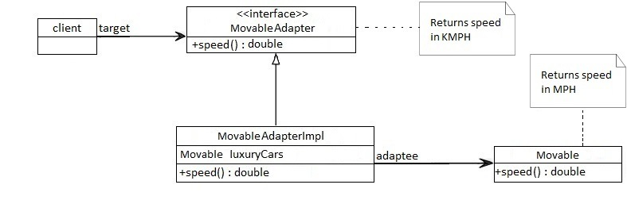


  首先，我们将创建原始界面*Movable*，它应该以英里/小时返回一些豪华汽车的速度：

```java
public interface Movable {
    // returns speed in MPH 
    double getSpeed();
}
```

我们现在将创建此接口的一个具体实现：

```java
public class BugattiVeyron implements Movable {
 
    @Override
    public double getSpeed() {
        return 268;
    }
}
```

现在我们将创建一个基于相同*Movable*类的适配器接口*MovableAdapter 。*它可能会稍作修改，以在不同的场景下产生不同的结果：

```java
public interface MovableAdapter {
    // returns speed in KM/H 
    double getSpeed();
}
```

此接口的实现将包含用于转换的私有方法*convertMPHtoKMPH() ：*

```java
public class MovableAdapterImpl implements MovableAdapter {
    private Movable luxuryCars;
    
    // standard constructors

    @Override
    public double getSpeed() {
        return convertMPHtoKMPH(luxuryCars.getSpeed());
    }
    
    private double convertMPHtoKMPH(double mph) {
        return mph * 1.60934;
    }
}
```

现在我们将只使用适配器中定义的方法，我们将获得转换后的速度。在这种情况下，以下断言将成立：

```java
@Test
public void whenConvertingMPHToKMPH_thenSuccessfullyConverted() {
    Movable bugattiVeyron = new BugattiVeyron();
    MovableAdapter bugattiVeyronAdapter = new MovableAdapterImpl(bugattiVeyron);
 
    assertEquals(bugattiVeyronAdapter.getSpeed(), 431.30312, 0.00001);
}
```

正如我们在这里可以注意到的，对于这种特殊情况，我们的适配器将*268 mph*转换为*431 km/h 。*


### **何时使用适配器模式**

- **当外部组件提供了我们想要重用的迷人功能，但它与我们当前的应用程序不兼容时**。可以开发合适的Adapter，让它们相互兼容
- 当我们的应用程序与客户期望的接口不兼容时
- 当我们想在我们的应用程序中重用遗留代码而不对原始代码进行任何修改时


### **适配器和代理模式之间的主要区别是：**

- 代理提供相同的接口，而适配器提供与其客户端兼容的不同接口
- 在设计应用程序组件之后使用适配器模式，以便我们可以在不修改源代码的情况下使用它们。这与在设计组件之前使用的桥接模式形成对比。


## **桥接模式**

**桥接模式用于将抽象与其实现分离，**以便两者可以独立变化。

这意味着创建一个桥接接口，该接口使用 OOP 原则将职责分离到不同的抽象类中。

### **桥接模式示例**

对于桥梁图案，我们将考虑两个抽象层；一个是几何形状（如三角形和方形），它被不同的颜色填充（我们的第二个抽象层）。

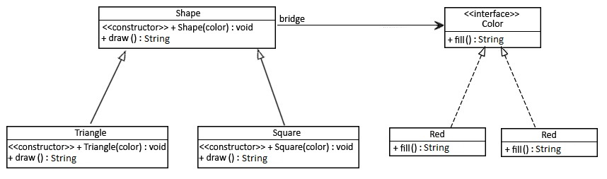


首先，我们将定义一个颜色界面：

```java
public interface Color {
    String fill();
}
```

现在我们将为这个接口创建一个具体的类：

```java
public class Blue implements Color {
    @Override
    public String fill() {
        return "Color is Blue";
    }
}
```

现在让我们创建一个抽象的*Shape*类，它包含对*Color*对象的引用（桥）：

```java
public abstract class Shape {
    protected Color color;
    
    //standard constructors
    
    abstract public String draw();
}
```

我们现在将创建一个*Shape*接口的具体类，它也将利用*Color*接口中的方法：

```java
public class Square extends Shape {

    public Square(Color color) {
        super(color);
    }

    @Override
    public String draw() {
        return "Square drawn. " + color.fill();
    }
}
```

对于此模式，以下断言将成立：

```java
@Test
public void whenBridgePatternInvoked_thenConfigSuccess() {
    //a square with red color
    Shape square = new Square(new Red());
 
    assertEquals(square.draw(), "Square drawn. Color is Red");
}
```

在这里，我们使用 Bridge 模式并传递所需的颜色对象。正如我们在输出中注意到的那样，形状被绘制成所需的颜色：

```java
Square drawn. Color: Red
Triangle drawn. Color: Blue
```


### **结论**

我们了解了桥接设计模式。在以下情况下这是一个不错的选择：

- 当我们希望父抽象类定义基本规则集，并在具体类中添加附加规则时
- 当我们有一个引用对象的抽象类，并且它具有将在每个具体类中定义的抽象方法时

### **差异化的关键点**

桥接模式只能在设计应用程序之前实现

允许抽象和实现独立变化，而适配器模式使不兼容的类可以一起工作。


## **复合设计模式**

**复合模式旨在允许以相同的方式处理单个对象和对象的组合，或“组合”。** 

它可以被看作是一个由继承基础类型的类型组成的树状结构，它可以代表单个部分或整个对象的层次结构。

我们可以将模式分解为：

component – 是合成中所有对象的基本接口。它应该是接口或抽象类，具有管理子组合的常用方法。

leaf - 实现基础组件的默认行为。它不包含对其他对象的引用。

composite - 有叶子元素。它实现了基础组件的方法并定义了与子元素相关的操作。

客户端——可以通过使用基础组件对象来访问组合元素。


### 示例  

假设**我们要在公司中建立部门的层次结构**。

**The Base Component**

作为一个组件对象，我们将定义一个简单的部门接口：

```java
public interface Department {
    void printDepartmentName();
}
```


**Leafs**

对于叶子组件，让我们为财务和销售部门定义类。

```java
public class FinancialDepartment implements Department {

    private Integer id;
    private String name;

    public void printDepartmentName() {
        System.out.println(getClass().getSimpleName());
    }

    // standard constructor, getters, setters
}
```

第二个叶子类，SalesDepartment，是类似的。

```java
public class SalesDepartment implements Department {

    private Integer id;
    private String name;

    public void printDepartmentName() {
        System.out.println(getClass().getSimpleName());
    }

    // standard constructor, getters, setters
}
```

这两个类都实现了 基础组件的*printDepartmentName()*方法，它们在其中打印每个类的类名。

此外，由于它们是叶类，它们不包含其他*Department*对象。

接下来，让我们看看一个复合类。

**Composite** **(复合)**

作为一个复合类，让我们创建一个 HeadDepartment 类：

```java
public class HeadDepartment implements Department {
    private Integer id;
    private String name;

    private List<Department> childDepartments;

    public HeadDepartment(Integer id, String name) {
        this.id = id;
        this.name = name;
        this.childDepartments = new ArrayList<>();
    }

    public void printDepartmentName() {
        childDepartments.forEach(Department::printDepartmentName);
    }

    public void addDepartment(Department department) {
        childDepartments.add(department);
    }

    public void removeDepartment(Department department) {
        childDepartments.remove(department);
    }
}
```

**这是一个复合类，因为它包含一个部门组件**的集合，以及从列表中添加和删除元素的方法。

复合*printDepartmentName()*方法是通过遍历叶元素列表并为每个元素调用适当的方法来实现的。

**测试**

出于测试目的，让我们看一下 *CompositeDemo*类：

```java
public class CompositeDemo {
    public static void main(String args[]) {
        Department salesDepartment = new SalesDepartment(
          1, "Sales department");
        Department financialDepartment = new FinancialDepartment(
          2, "Financial department");

        HeadDepartment headDepartment = new HeadDepartment(
          3, "Head department");

        headDepartment.addDepartment(salesDepartment);
        headDepartment.addDepartment(financialDepartment);

        headDepartment.printDepartmentName();
    }
}
```

首先，我们为财务和销售部门创建两个实例。之后，我们实例化总部并将之前创建的实例添加到它。

最后，我们可以测试*printDepartmentName()*组合方法。正如我们所料，**输出包含每个叶组件的类名**：

```plaintext
SalesDepartment
FinancialDepartmen
```


## 外观设计模式

简单地说，外观将复杂的子系统封装在一个简单的接口后面。**它隐藏了很多复杂性并使子系统易于使用。**

另外，如果我们需要直接使用复杂的子系统，我们仍然可以这样做；我们不必一直使用外观。

除了更简单的界面外，使用这种设计模式还有一个好处。**它将客户端实现与复杂的子系统分离。** 多亏了这一点，我们可以对现有子系统进行更改而不会影响客户端。

### 示例

假设我们要启动汽车。下图表示遗留系统，它允许我们这样做：

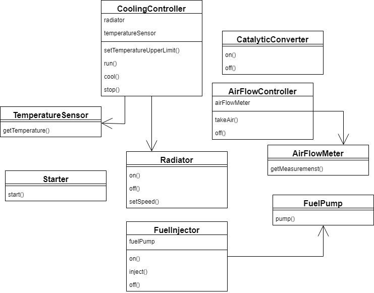

如您所见，**它可能非常复杂，并且确实需要一些努力才能正确启动引擎**：

```java
airFlowController.takeAir()
fuelInjector.on()
fuelInjector.inject()
starter.start()
coolingController.setTemperatureUpperLimit(DEFAULT_COOLING_TEMP)
coolingController.run()
catalyticConverter.on()
```

同样，停止引擎也需要相当多的步骤：

```java
fuelInjector.off()
catalyticConverter.off()
coolingController.cool(MAX_ALLOWED_TEMP)
coolingController.stop()
airFlowController.off()
```

门面正是我们在这里所需要的。**我们将在两种方法中隐藏所有复杂性：startEngine()和stopEngine()**。

让我们看看我们如何实现它：

```java
public class CarEngineFacade {
    private static int DEFAULT_COOLING_TEMP = 90;
    private static int MAX_ALLOWED_TEMP = 50;
    private FuelInjector fuelInjector = new FuelInjector();
    private AirFlowController airFlowController = new AirFlowController();
    private Starter starter = new Starter();
    private CoolingController coolingController = new CoolingController();
    private CatalyticConverter catalyticConverter = new CatalyticConverter();

    public void startEngine() {
        fuelInjector.on();
        airFlowController.takeAir();
        fuelInjector.on();
        fuelInjector.inject();
        starter.start();
        coolingController.setTemperatureUpperLimit(DEFAULT_COOLING_TEMP);
        coolingController.run();
        catalyticConverter.on();
    }

    public void stopEngine() {
        fuelInjector.off();
        catalyticConverter.off();
        coolingController.cool(MAX_ALLOWED_TEMP);
        coolingController.stop();
        airFlowController.off();
    }
```

现在，**要启动和停止汽车，我们只需要 2 行代码，而不是 13 行：**

```java
facade.startEngine();
// ...
facade.stopEngine();
```

 缺点

外观模式不会强迫我们进行不必要的权衡，因为它只是增加了额外的抽象层。

有时该模式可能在简单的场景中被过度使用，这将导致冗余实现。


## 享元模式

在本文中，我们将了解享元设计模式。此模式用于较少内存占用。此模式用于减少内存占用。它还可以提高对象实例化成本高昂的应用程序的性能。

简而言之，享元模式基于一个工厂，该工厂通过在创建后存储对象来回收创建的对象。每次请求一个对象时，工厂都会查找该对象以检查它是否已经被创建。如果有，则返回现有对象——否则，创建、存储并返回一个新对象。

享元对象的状态由与其他类似对象共享的不变组件（**内在**）和可由客户端代码操作的变体组件（**外在**）组成。

**享元对象是不可变的，这一点非常重要：对状态的任何操作都必须由工厂执行。**


### 实现

该模式的主要元素是：

- 定义客户端代码可以对享元对象执行的操作的接口
- 我们接口的一个或多个具体实现
- 处理对象实例化和缓存的工厂

车辆接口

首先，我们将创建一个*Vehicle*接口。由于此接口将是工厂方法的返回类型，我们需要确保公开所有相关方法：

```java
public void start();
public void stop();
public Color getColor();
```

混凝土车辆

接下来，让我们将*Car*类作为具体的*Vehicle。*我们的汽车将实现车辆接口的所有方法。至于它的状态，它将有一个引擎和一个颜色字段：

  ```java
private Engine engine;
private Color color;
  ```


车辆厂

最后但同样重要的是，我们将创建*VehicleFactory*。制造一辆新车是一项非常昂贵的操作，因此工厂只会为每种颜色制造一辆汽车。

为此，我们使用map作为简单缓存来跟踪创建的车辆

```java
private static Map<Color, Vehicle> vehiclesCache
  = new HashMap<>();

public static Vehicle createVehicle(Color color) {
    Vehicle newVehicle = vehiclesCache.computeIfAbsent(color, newColor -> { 
        Engine newEngine = new Engine();
        return new Car(newEngine, newColor);
    });
    return newVehicle;
}
```

请注意客户端代码如何仅影响对象的外部状态（我们车辆的颜色），将其作为参数传递给*createVehicle*方法。

**享元模式的目标是通过共享尽可能多的数据来减少内存使用，因此，它是无损压缩算法的良好基础。在这种情况下，每个享元对象充当指针，其外部状态是上下文相关信息。**

**这种用法的一个典型例子是在文字处理器中。在这里，每个角色都是一个享元对象，它共享渲染所需的数据。结果，只有字符在文档中的位置占用了额外的内存。**

**许多现代应用程序使用缓存来提高响应时间。享元模式类似于缓存的核心概念，可以很好地满足这个目的。**

**当然，这种模式与典型的通用缓存在复杂性和实现方面存在一些关键差异。**


# **行为模式**


## 策略

### 案例一

策略设计模式是行为设计模式的一种。当我们针对特定任务有多种算法并且客户端决定在运行时使用的实际实现时，将使用策略模式。

策略模式也称为策略模式。我们定义了多个算法，并让客户端应用程序传递要用作参数的算法。

策略模式的最佳示例之一是采用 Comparator 参数的 Collections.sort() 方法。基于 Comparator 接口的不同实现，对象以不同的方式进行排序。

对于我们的示例，我们将尝试实现一个简单的购物车，其中有两种付款策略——使用信用卡或使用 PayPal。


**首先，我们将为我们的策略模式示例创建接口，在我们的例子中支付作为参数传递的金额。**

```java
//支付策略接口
public interface PaymentStrategy {

	public void pay(int amount);
}

```

**现在，我们将不得不创建具体的算法实现，以使用信用卡/借记卡或通过Paypal付款。**

```java
// 信用卡支付
public class CreditCardStrategy implements PaymentStrategy {

	private String name;
	private String cardNumber;
	private String cvv;
	private String dateOfExpiry;
	
	public CreditCardStrategy(String nm, String ccNum, String cvv, String expiryDate){
		this.name=nm;
		this.cardNumber=ccNum;
		this.cvv=cvv;
		this.dateOfExpiry=expiryDate;
	}
	@Override
	public void pay(int amount) {
		System.out.println(amount +" paid with credit/debit card");
	}

}
```

​	

```java
// Paypal 支付
public class PaypalStrategy implements PaymentStrategy {

	private String emailId;
	private String password;
	
	public PaypalStrategy(String email, String pwd){
		this.emailId=email;
		this.password=pwd;
	}
	
	@Override
	public void pay(int amount) {
		System.out.println(amount + " paid using Paypal.");
	}

}
```


**现在我们的策略模式实例算法已经准备好了。我们可以实现购物车，支付方式需要输入支付策略**

```java
// 商品类
public class Item {

	private String upcCode;
	private int price;
	
	public Item(String upc, int cost){
		this.upcCode=upc;
		this.price=cost;
	}

	public String getUpcCode() {
		return upcCode;
	}

	public int getPrice() {
		return price;
	}
	
}
```

```java
// 购物车
public class ShoppingCart {

	//List of items
	List<Item> items;
	
	public ShoppingCart(){
		this.items=new ArrayList<Item>();
	}
	
	public void addItem(Item item){
		this.items.add(item);
	}
	
	public void removeItem(Item item){
		this.items.remove(item);
	}
	
	public int calculateTotal(){
		int sum = 0;
		for(Item item : items){
			sum += item.getPrice();
		}
		return sum;
	}
	
	public void pay(PaymentStrategy paymentMethod){
		int amount = calculateTotal();
		paymentMethod.pay(amount);
	}
}
```

请注意，购物车的支付方式需要支付算法作为参数，并且不会将其作为实例变量存储在任何地方。

让我们用一个简单的程序测试我们的策略模式示例设置。

```java
// 测试类
public class ShoppingCartTest {

	public static void main(String[] args) {
		ShoppingCart cart = new ShoppingCart();
		
		Item item1 = new Item("1234",10);
		Item item2 = new Item("5678",40);
		
		cart.addItem(item1);
		cart.addItem(item2);
		
		//pay by paypal
		cart.pay(new PaypalStrategy("myemail@example.com", "mypwd"));
		
		//pay by credit card
		cart.pay(new CreditCardStrategy("Pankaj Kumar", "1234567890123456", "786", "12/15"));
	}
}
```

上述程序的输出是：

```java

50 paid using Paypal.
50 paid with credit/debit card
```

策略设计模式类图

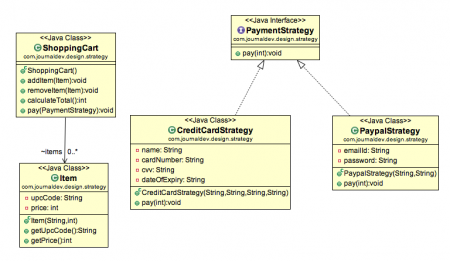

### 策略设计模式要点

我们本可以使用组合来为策略创建实例变量，但我们应该避免这样做，因为我们希望特定的策略能够应用于某个特定的任务。在Collections.sort()和Arrays.sort()方法中也是如此，它们以比较器作为参数。

策略模式与状态模式非常相似。其中一个区别是，Context包含作为实例变量的状态，并且可以有多个任务的实现依赖于状态，而在策略模式中，策略是作为参数传递给方法的，Context对象没有任何变量来存储它。

当我们有多种算法用于特定的任务，并且我们希望我们的应用程序能够灵活地在运行时为特定的任务选择任何一种算法时，策略模式就非常有用。

### 案例二

模式定义：定义一系列算法，将每个算法都封装起来，并且它们可以互换。策略模式是一种对象行为模式。

策略模式通用类图如下:


我们通过一段比较通用的代码来解释怎么使用策略模式：

```java
//定义一个策略接口
public interface Strategy {
    void strategyImplementation();
}

//具体的策略实现(可以定义多个具体的策略实现)
public class StrategyA implements Strategy{
    @Override
    public void strategyImplementation() {
        System.out.println("正在执行策略A");
    }
}

//封装策略，屏蔽高层模块对策略、算法的直接访问，屏蔽可能存在的策略变化
public class Context {
    private Strategy strategy = null;

    public Context(Strategy strategy) {
        this.strategy = strategy;
    }
  
    public void doStrategy() {
        strategy.strategyImplementation();
    }
}
```


### 案例三

我们将了解如何在 Java 8 中实现策略设计模式。

首先，我们将概述该模式，并解释传统上它是如何在旧版本的 Java 中实现的。

接下来，我们将再次尝试该模式，只是这次使用 Java 8 lambda，减少了代码的冗长。

**本质上，策略模式允许我们在运行时改变算法的行为。**

通常，我们会从一个用于应用算法的接口开始，然后为每个可能的算法多次实现它。

假设我们需要根据是圣诞节、复活节还是新年，对购买应用不同类型的折扣。首先，让我们创建一个*Discounter*接口，它将由我们的每个策略实现：

```java
public interface Discounter {
    BigDecimal applyDiscount(BigDecimal amount);
}
```

然后假设我们想在复活节应用 50% 的折扣，在圣诞节应用 10% 的折扣。让我们为这些策略中的每一个实现我们的接口：

```java
public static class EasterDiscounter implements Discounter {
    @Override
    public BigDecimal applyDiscount(final BigDecimal amount) {
        return amount.multiply(BigDecimal.valueOf(0.5));
    }
}

public static class ChristmasDiscounter implements Discounter {
   @Override
   public BigDecimal applyDiscount(final BigDecimal amount) {
       return amount.multiply(BigDecimal.valueOf(0.9));
   }
}
```

最后，让我们在测试中尝试一个策略：

```java
Discounter easterDiscounter = new EasterDiscounter();

BigDecimal discountedValue = easterDiscounter
  .applyDiscount(BigDecimal.valueOf(100));

assertThat(discountedValue)
  .isEqualByComparingTo(BigDecimal.valueOf(50));
```

这很有效，但问题是必须为每个策略创建一个具体的类可能有点痛苦。另一种方法是使用匿名内部类型，但这仍然非常冗长，并且比以前的解决方案更方便：

```java
Discounter easterDiscounter = new Discounter() {
    @Override
    public BigDecimal applyDiscount(final BigDecimal amount) {
        return amount.multiply(BigDecimal.valueOf(0.5));
    }
};
```

#### 利用 Java 8

自 Java 8 发布以来，lambdas 的引入使匿名内部类型或多或少变得多余。这意味着创建在线策略现在变得更加简洁和容易。

此外，函数式编程的声明式风格让我们能够实现以前不可能的模式。

减少代码冗长

让我们尝试创建一个内联*EasterDiscounter，*只是这次使用 lambda 表达式：

```java
Discounter easterDiscounter = amount -> amount.multiply(BigDecimal.valueOf(0.5));
```

正如我们所看到的，我们的代码现在变得更简洁、更易于维护，实现了与以前相同的效果，但只需一行代码。本质上，**可以将 lambda 视为匿名内部类型的替代品**。

当我们想要在行中声明更多的*Discounter*时，这种优势变得更加明显：

```java
List<Discounter> discounters = newArrayList(
  amount -> amount.multiply(BigDecimal.valueOf(0.9)),
  amount -> amount.multiply(BigDecimal.valueOf(0.8)),
  amount -> amount.multiply(BigDecimal.valueOf(0.5))
);
```

当我们想要定义很多*Discounter 时，*我们可以在一个地方静态地声明它们。如果我们愿意，Java 8 甚至允许我们在接口中定义静态方法。

因此，与其在具体类或匿名内部类型之间进行选择，不如尝试在单个类中创建 lambda：

```java
public interface Discounter {
    BigDecimal applyDiscount(BigDecimal amount);

    static Discounter christmasDiscounter() {
        return amount -> amount.multiply(BigDecimal.valueOf(0.9));
    }

    static Discounter newYearDiscounter() {
        return amount -> amount.multiply(BigDecimal.valueOf(0.8));
    }

    static Discounter easterDiscounter() {
        return amount -> amount.multiply(BigDecimal.valueOf(0.5));
    }
}
```

正如我们所看到的，我们在不多的代码中实现了很多。


## 状态模式(?)

### 案例一

状态设计模式是行为设计模式的一种。当对象根据其内部状态改变其行为时，将使用状态设计模式

如果我们必须根据一个对象的状态来改变它的行为，我们可以在对象中设置一个状态变量。然后使用if-else条件块，根据状态执行不同的动作。状态设计模式被用来提供一种系统的、松散耦合的方式，通过Context和State的实现来实现这一目标。

状态模式的Context是拥有State引用的类，它是State的一个具体实现。Context将请求转发给state对象进行处理。让我们通过一个简单的例子来理解这一点。

假设我们想实现一个带有简单按钮的电视遥控器来执行动作。如果状态是ON，它将打开电视，如果状态是OFF，它将关闭电视。

我们可以使用下面的if-else条件来实现它。

```java
public class TVRemoteBasic {

	private String state="";
	
	public void setState(String state){
		this.state=state;
	}
	
	public void doAction(){
		if(state.equalsIgnoreCase("ON")){
			System.out.println("TV is turned ON");
		}else if(state.equalsIgnoreCase("OFF")){
			System.out.println("TV is turned OFF");
		}
	}

	public static void main(String args[]){
		TVRemoteBasic remote = new TVRemoteBasic();
		
		remote.setState("ON");
		remote.doAction();
		
		remote.setState("OFF");
		remote.doAction();
	}

}
```

请注意，客户端代码应该知道用于设置远程状态的具体数值。此外，如果状态的数量增加，那么实现和客户端代码之间的紧密耦合将很难维护和扩展。

##### 状态设计模式接口

首先，我们将创建State接口，它将定义不同的具体状态和上下文类应该实现的方法。

```java
// State接口
public interface State {
    
	public void doAction();
}
```

##### 状态设计模式具体状态实现

在我们的示例中，我们可以有两种状态——一种用于打开电视，另一种用于关闭电视。因此，我们将为这些行为创建两个具体的状态实现。

```java
public class TVStartState implements State {

	@Override
	public void doAction() {
		System.out.println("TV is turned ON");
	}

}
```

```java
public class TVStopState implements State {

	@Override
	public void doAction() {
		System.out.println("TV is turned OFF");
	}

}
```

现在我们准备实现我们的 Context 对象，它将根据其内部状态改变其行为。

##### 状态设计模式上下文实现

```java
public class TVContext implements State {

	private State tvState;

	public void setState(State state) {
		this.tvState=state;
	}

	public State getState() {
		return this.tvState;
	}

	@Override
	public void doAction() {
		this.tvState.doAction();
	}

}
```

请注意，Context也实现了State，并保持其当前状态的引用，并将请求转发给state的实现

##### 状态设计模式测试程序

现在让我们编写一个简单的程序来测试 TV Remote 的状态模式实现。

```java
public class TVRemote {

	public static void main(String[] args) {
		TVContext context = new TVContext();
		State tvStartState = new TVStartState();
		State tvStopState = new TVStopState();
		
		context.setState(tvStartState);
		context.doAction();
		
		
		context.setState(tvStopState);
		context.doAction();
		
	}

}
```

上述程序的输出与不使用状态模式的 TV Remote 的基本实现相同。

##### 状态设计模式的好处

使用状态模式实现多态行为的好处显而易见。出错的机会更少，而且很容易为额外的行为添加更多的状态。从而使我们的代码更加健壮、易于维护和灵活。在这种情况下，状态模式也有助于避免 if-else 或 switch-case 条件逻辑。

状态模式与策略模式非常相似，请查看 Java 中的策略模式。

### 案例二

**模式定义**：当一个对象内在状态改变时允许其改变行为，这个对象看起来像改变了其类。

状态模式的通用类图如下图所示：


对比策略模式的类型会发现和状态模式的类图很类似，但实际上有很大的区别，具体体现在concrete class上。策略模式通过Context产生唯一一个ConcreteStrategy作用于代码中，而状态模式则是通过context组织多个ConcreteState形成一个状态转换图来实现业务逻辑。接下来，我们通过一段通用代码来解释怎么使用状态模式：

```java
//定义一个抽象的状态类
public abstract class State {
    Context context;
    public void setContext(Context context) {
        this.context = context;
    }
    public abstract void handle1();
    public abstract void handle2();
}
//定义状态A
public class ConcreteStateA extends State {
    @Override
    public void handle1() {}  //本状态下必须要处理的事情

    @Override
    public void handle2() {
        super.context.setCurrentState(Context.contreteStateB);  //切换到状态B        
        super.context.handle2();  //执行状态B的任务
    }
}
//定义状态B
public class ConcreteStateB extends State {
    @Override
    public void handle2() {}  //本状态下必须要处理的事情，...
  
    @Override
    public void handle1() {
        super.context.setCurrentState(Context.contreteStateA);  //切换到状态A
        super.context.handle1();  //执行状态A的任务
    }
}
//定义一个上下文管理环境
public class Context {
    public final static ConcreteStateA contreteStateA = new ConcreteStateA();
    public final static ConcreteStateB contreteStateB = new ConcreteStateB();

    private State CurrentState;
    public State getCurrentState() {return CurrentState;}

    public void setCurrentState(State currentState) {
        this.CurrentState = currentState;
        this.CurrentState.setContext(this);
    }
    public void handle1() {this.CurrentState.handle1();}
    public void handle2() {this.CurrentState.handle2();}
}
//定义client执行
public class client {
    public static void main(String[] args) {
        Context context = new Context();
        context.setCurrentState(new ContreteStateA());
        context.handle1();
        context.handle2();
    }
}
```


## 观察者

### 示例

观察者是一种行为设计模式。他指定对象之间的通信：*observable*和*observers*。**可观察对象是通知观察者其状态变化的对象。**

例如，新闻机构可以在收到新闻时通知频道。接收新闻会改变通讯社的状态，并导致频道得到通知。

让我们看看我们如何自己实现它。

首先，让我们定义*NewsAgency*类：

```java
public class NewsAgency {
    private String news;
    private List<Channel> channels = new ArrayList<>();

    public void addObserver(Channel channel) {
        this.channels.add(channel);
    }

    public void removeObserver(Channel channel) {
        this.channels.remove(channel);
    }

    public void setNews(String news) {
        this.news = news;
        for (Channel channel : this.channels) {
            channel.update(this.news);
        }
    }
}
```

*NewsAgency*是可观察的对象，当*新闻*更新时，*NewsAgency*的状态会发生变化。当发生变化时，*NewsAgency通过调用他们的**update()*方法来通知观察者这一事实。

为了能够做到这一点，可观察对象需要保持对观察者的引用，在我们的例子中，它就是*channels* 变量。

现在让我们看看观察者（Channel*类）的样子。它应该具有*update()*方法，当*NewsAgency的状态发生变化时会调用该方法：

```java
public class NewsChannel implements Channel {
    private String news;

    @Override
    public void update(Object news) {
        this.setNews((String) news);
    } 
}
```

Channel 接口只有一种方法：

```java
public interface Channel {
    public void update(Object o);
}
```

现在，如果我们将*NewsChannel*的实例添加到观察者列表中*，*并更改*NewsAgency的状态，则**NewsChannel*的实例将被更新：

```java
NewsAgency observable = new NewsAgency();
NewsChannel observer = new NewsChannel();

observable.addObserver(observer);
observable.setNews("news");
assertEquals(observer.getNews(), "news");
```

Java 核心库中有一个预定义的*Observer*接口，这使得观察者模式的实现更加简单。让我们看看它。


###  使用观察者实现

[*java.util.Observer*](https://docs.oracle.com/en/java/javase/11/docs/api/java.base/java/util/Observer.html)接口定义了*update()*方法，所以我们不需要像上一节那样自己定义它。

让我们看看如何在我们的实现中使用它：

```java
public class ONewsChannel implements Observer {

    private String news;

    @Override
    public void update(Observable o, Object news) {
        this.setNews((String) news);
    }
}
```

在这里，第二个参数来自*Observable*，我们将在下面看到。

要定义 observable *，*我们需要扩展 Java 的*Observable*类：

```java
public class ONewsAgency extends Observable {
    private String news;

    public void setNews(String news) {
        this.news = news;
        setChanged();
        notifyObservers(news);
    }
}
```

请注意，我们不需要直接调用观察者的*update()*方法。我们只需调用*setChanged()*和*notifyObservers()*，*Observable*类会为我们完成剩下的工作。

此外，它包含一个观察者列表并公开了维护该列表的方法*——addObserver()*和*deleteObserver()。*

要测试结果，我们只需将观察者添加到此列表并设置新闻：

````java
ONewsAgency observable = new ONewsAgency();
ONewsChannel observer = new ONewsChannel();

observable.addObserver(observer);
observable.setNews("news");
assertEquals(observer.getNews(), "news");
````

*Observer*接口并不完美，自 Java 9 以来已被弃用。它的一个缺点是*Observable*不是接口而是类，这就是为什么子类不能用作可观察对象的原因。

此外，开发人员可以覆盖某些*Observable*的同步方法并破坏它们的线程安全。

让我们看一下[*ProperyChangeListener*](https://docs.oracle.com/en/java/javase/11/docs/api/java.desktop/java/beans/PropertyChangeListener.html)接口，建议不要使用*Observer*。


####  **使用PropertyChangeListener实现**

**在此实现中，可观察对象必须保留对PropertyChangeSupport实例的引用。**当类的属性发生更改时，它有助于将通知发送给观察者。

让我们定义可观察对象：

```java
public class PCLNewsAgency {
    private String news;

    private PropertyChangeSupport support;

    public PCLNewsAgency() {
        support = new PropertyChangeSupport(this);
    }

    public void addPropertyChangeListener(PropertyChangeListener pcl) {
        support.addPropertyChangeListener(pcl);
    }

    public void removePropertyChangeListener(PropertyChangeListener pcl) {
        support.removePropertyChangeListener(pcl);
    }

    public void setNews(String value) {
        support.firePropertyChange("news", this.news, value);
        this.news = value;
    }
}
```

使用这种*支持*，我们可以添加和删除观察者，并在可观察对象的状态发生变化时通知他们：

```java
support.firePropertyChange("news", this.news, value);
```

这里，第一个参数是观察到的属性的名称。第二个和第三个参数相应地是它的旧值和新值。

观察者应该实现*PropertyChangeListener*：

```java
public class PCLNewsChannel implements PropertyChangeListener {

    private String news;

    public void propertyChange(PropertyChangeEvent evt) {
        this.setNews((String) evt.getNewValue());
    }
}
```

由于*PropertyChangeSupport*类正在为我们接线，我们可以从事件中恢复新的属性值。

让我们测试实现以确保它也可以工作：

```java
PCLNewsAgency observable = new PCLNewsAgency();
PCLNewsChannel observer = new PCLNewsChannel();

observable.addPropertyChangeListener(observer);
observable.setNews("news");

assertEquals(observer.getNews(), "news");
```


## 模板

**通过将逻辑封装在单个方法中，可以更轻松地实现复杂的算法。**

### 示例

为了演示模板方法模式的工作原理，让我们创建一个表示构建计算机站的简单示例。

给定模式的定义，**算法的结构将在定义模板build()方法**的基类中定义：

```java
public abstract class ComputerBuilder {

    protected Map<String, String> computerParts = new HashMap<>();
    protected List<String> motherboardSetupStatus = new ArrayList<>();
    
    public final Computer buildComputer() {
        addMotherboard();
        setupMotherboard();
        addProcessor();
        return getComputer();
    }
    
    public abstract void addMotherboard();

    public abstract void setupMotherboard();
    
    public abstract void addProcessor();

    public List<String> getMotherboardSetupStatus() {
        return motherboardSetupStatus;
    }
    
    public Map<String, String> getComputerParts() {
        return computerParts;
    }
    
    private Computer getComputer() {
        return new Computer(computerParts);
    }
}

public class Computer {
    
    private Map<String, String> computerParts = new HashMap<>();
    
    public Computer(Map<String, String> computerParts) {
        this.computerParts = computerParts;
    }
    
    public Map<String, String> getComputerParts() {
        return computerParts;
    }
}
```

**ComputerBuilder类负责通过声明添加和设置不同组件**（例如主板和处理器）的方法来概述构建计算机所需**的步骤。

这里**的build()方法是模板方法**，它定义了组装计算机部件的算法步骤，并返回完全初始化的*计算机*实例。

请注意，它被**声明为final以防止它被覆盖。**

已经设置了基类，让我们尝试通过创建两个子类来使用它。一个构建“标准”计算机，另一个构建“高端”计算机：

```java
public class StandardComputerBuilder extends ComputerBuilder {

    @Override
    public void addMotherboard() {
        computerParts.put("Motherboard", "Standard Motherboard");
    }
    
    @Override
    public void setupMotherboard() {
        motherboardSetupStatus.add(
          "Screwing the standard motherboard to the case.");
        motherboardSetupStatus.add(
          "Pluging in the power supply connectors.");
        motherboardSetupStatus.forEach(
          step -> System.out.println(step));
    }
    
    @Override
    public void addProcessor() {
        computerParts.put("Processor", "Standard Processor");
    }
}
```

这是*HighEndComputerBuilder*变体：

```java
public class HighEndComputerBuilder extends ComputerBuilder {

    @Override
    public void addMotherboard() {
        computerParts.put("Motherboard", "High-end Motherboard");
    }
    
    @Override
    public void setupMotherboard() {
        motherboardSetupStatus.add(
          "Screwing the high-end motherboard to the case.");
        motherboardSetupStatus.add(
          "Pluging in the power supply connectors.");
        motherboardSetupStatus.forEach(
          step -> System.out.println(step));
    }
    
    @Override
    public void addProcessor() {
         computerParts.put("Processor", "High-end Processor");
    }
}
```

正如我们所看到的，我们不需要担心整个组装过程，而只需为单独的方法提供实现即可。

现在，让我们看看它的实际效果：

```java
new StandardComputerBuilder()
  .buildComputer();
  .getComputerParts()
  .forEach((k, v) -> System.out.println("Part : " + k + " Value : " + v));
        
new HighEndComputerBuilder()
  .buildComputer();
  .getComputerParts()
  .forEach((k, v) -> System.out.println("Part : " + k + " Value : " + v));
```


### **Java核心库中的模板方法**

这种模式在 Java 核心库中被广泛使用，例如[java.util.AbstractList](https://docs.oracle.com/en/java/javase/11/docs/api/java.base/java/util/AbstractList.html)或[java.util.AbstractSet。](https://docs.oracle.com/en/java/javase/11/docs/api/java.base/java/util/AbstractSet.html)

例如，*Abstract List*提供了[*List*](https://docs.oracle.com/en/java/javase/11/docs/api/java.base/java/util/List.html)接口的骨架实现。

模板方法的一个示例可以是*addAll()*方法，尽管它没有明确定义为*final：*

```java
public boolean addAll(int index, Collection<? extends E> c) {
    rangeCheckForAdd(index);
    boolean modified = false;
    for (E e : c) {
        add(index++, e);
        modified = true;
    }
    return modified;
}
```

用户只需要实现*add()*方法：

在这里，程序员有责任提供一种实现，用于在给定索引处将元素添加到列表（列表算法的变体部分）。


###  **结论**

模板方法模式促进了代码重用和解耦，但以使用继承为代价。


## 命令模式

该模式旨在将 **执行给定操作（命令）所需的所有数据封装在一个对象中，**包括要调用的方法、方法的参数以及方法所属的对象。

该模型允许我们将产生命令的对象与其消费者解耦，这就是该模式通常被称为**生产者--消费者模式的原因。**

### 面向对象的实现

在经典实现中，命令模式需要实现四个组件：命令、接受者、调用者和客户端。

要了解该模式的工作原理以及每个组件所扮演的角色，让我们创建一个基本示例。

假设我们要开发一个文本文件应用程序。在这种情况下，我们应该实现执行某些与文本文件相关的操作所需的所有功能，例如打开、写入、保存文本文件等。

因此，我们应该将应用程序分解为上述四个组件。


### 命令类

命令是一个对象，其作用是**存储执行操作所需的所有信息**，包括要调用的方法、方法参数以及实现该方法的对象（称为接收者）。

为了更准确地了解命令对象的工作原理，让我们开始开发一个简单的命令层，它只包含一个接口和两个实现：

```java
@FunctionalInterface
public interface TextFileOperation {
    String execute();
}
```

```java
public class OpenTextFileOperation implements TextFileOperation {

    private TextFile textFile;
    
    // constructors
    
    @Override
    public String execute() {
        return textFile.open();
    }
}
```

```java
public class SaveTextFileOperation implements TextFileOperation {
    
    // same field and constructor as above
        
    @Override
    public String execute() {
        return textFile.save();
    }
}
```

在这种情况下，*TextFileOperation*接口定义了命令对象的 API，*OpenTextFileOperation*和*SaveTextFileOperation*这两个实现执行具体操作。前者打开一个文本文件，而后者保存一个文本文件。

可以清楚地看到命令对象的功能：*TextFileOperation*命令**封装了**打开和保存文本文件所需的所有信息，包括接收者对象、要调用的方法和参数（在这种情况下，不需要参数，但他们可能是）。

值得强调的是**，执行文件操作的组件是接收者（TextFile实例）**。


###  **接收类**

接收器是**执行一组内聚动作**的对象。*它是在调用命令的execute()*方法时执行实际操作的组件。

在这种情况下，我们需要定义一个接收器类，它的作用是为*TextFile*对象建模：

```java
public class TextFile {
    
    private String name;
    
    // constructor
    
    public String open() {
        return "Opening file " + name;
    }
    
    public String save() {  
        return "Saving file " + name;
    }
    
    // additional text file methods (editing, writing, copying, pasting)
}
```


### **调用者类**

调用者是一个**知道如何执行给定命令但不知道该命令是如何实现的对象。**它只知道命令的接口。

在某些情况下，调用者除了执行命令外，还存储和排队。这对于实现一些额外的功能是很有用的，如宏记录或撤销和重做功能。

在我们的示例中，很明显必须有一个额外的组件负责调用命令对象并通过命令的*execute()*方法执行它们。**这正是调用程序类发挥作用的地方**。

让我们看一下调用程序的基本实现：

```java
public class TextFileOperationExecutor {
    
    private final List<TextFileOperation> textFileOperations
     = new ArrayList<>();
    
    public String executeOperation(TextFileOperation textFileOperation) {
        textFileOperations.add(textFileOperation);
        return textFileOperation.execute();
    }
}
```

*TextFileOperationExecutor*类只是一个抽象的**薄层，它将命令对象与其消费者分离，** 并调用封装在*TextFileOperation*命令对象中的方法。

在这种情况下，该类还将命令对象存储在*List*中。当然，这在模式实现中不是强制性的，除非我们需要对操作的执行过程添加一些进一步的控制。


###  **客户端类**

客户端是一个对象，它 通过指定要执行的命令以及在流程的哪个阶段执行它们来**控制命令执行过程。**

所以，如果我们想要正统地使用模式的正式定义，我们必须使用典型的*main*方法创建一个客户端类：

```java
public static void main(String[] args) {
    TextFileOperationExecutor textFileOperationExecutor
      = new TextFileOperationExecutor();
    textFileOperationExecutor.executeOperation(
      new OpenTextFileOperation(new TextFile("file1.txt"))));
    textFileOperationExecutor.executeOperation(
      new SaveTextFileOperation(new TextFile("file2.txt"))));
}
```


###  **对象功能实现**

到目前为止，我们已经使用面向对象的方法来实现命令模式，这一切都很好。

从 Java 8 开始，我们可以使用基于 lambda 表达式和方法引用的对象函数方法，**使代码更紧凑、更简洁**。

**使用 Lambda 表达式**

由于*TextFileOperation*接口是一个[函数式接口](https://docs.oracle.com/en/java/javase/11/docs/api/java.base/java/util/function/package-summary.html)，我们可以**将命令对象以 lambda 表达式的形式传递给调用者**，而无需显式创建*TextFileOperation*实例：

```java
TextFileOperationExecutor textFileOperationExecutor
 = new TextFileOperationExecutor();
textFileOperationExecutor.executeOperation(() -> "Opening file file1.txt");
textFileOperationExecutor.executeOperation(() -> "Saving file file1.txt");
```

由于我们**减少了样板代码的数量，**现在的实现看起来更加精简和简洁。

即便如此，问题仍然存在：与面向对象的方法相比，这种方法是否更好？

嗯，这很棘手。如果我们假设在大多数情况下更紧凑的代码意味着更好的代码，那么确实如此。

**根据经验，我们应该根据每个用例评估何时使用 lambda 表达式**。


**使用方法引用**

同样，我们可以使用方法引用**将命令对象传递给调用者：**

```java
TextFileOperationExecutor textFileOperationExecutor
 = new TextFileOperationExecutor();
TextFile textFile = new TextFile("file1.txt");
textFileOperationExecutor.executeOperation(textFile::open);
textFileOperationExecutor.executeOperation(textFile::save);
```

在这种情况下，实现**比使用 lambdas 的实现要冗长一些**，因为我们仍然必须创建*TextFile*实例。


## 职责链(?)

### 案例一：

责任链模式用于在软件设计中实现松散耦合，其中来自客户端的请求被传递到对象链以处理它们。稍后，链中的对象将自行决定由谁来处理请求，以及是否需要将请求发送到链中的下一个对象。

#### **JDK 中的责任链模式示例**

让我们看看 JDK 中责任链模式的例子，然后我们将继续实现这个模式的真实例子。我们知道在一个 try-catch 块代码中可以有多个 catch 块。这里的每个 catch 块都是处理该特定异常的处理器。

因此，当 try 块中发生任何异常时，将其发送到第一个 catch 块进行处理。如果 catch 块无法处理它，它将请求转发到链中的下一个对象，即下一个 catch 块。如果即使是最后一个 catch 块也无法处理它，则异常会被抛出到调用程序的链外。

#### **责任链设计模式示例**

责任链模式的一个很好的例子是ATM机出钞机。用户输入要发放的金额，机器就会按规定的货币票据发放金额，如50元、20元、10元等。

如果用户输入的金额不是10的倍数，就会出错。我们将使用责任链模式来实现这个解决方案。该链将按照以下图片的顺序处理请求

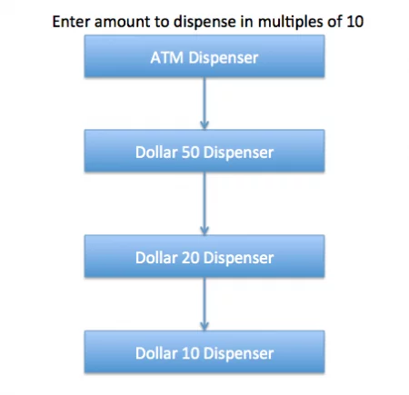

请注意，我们可以很容易地在一个程序本身中实现这个解决方案，但这样一来，复杂性就会增加，解决方案就会被紧密地耦合起来。因此，我们将创建一个分配系统链，分配50元、20元和10元的钞票。

#### 责任链设计模式——基类和接口

```java
public class Currency {

	private int amount;
	
	public Currency(int amt){
		this.amount=amt;
	}
	
	public int getAmount(){
		return this.amount;
	}
}
```

基础接口应该有一个方法来定义链上的下一个处理器，以及处理请求的方法。我们的ATM配给接口将看起来像下面这样

```java
public interface DispenseChain {

	void setNextChain(DispenseChain nextChain);
	
	void dispense(Currency cur);
}
```


##### 责任链模式--链式实现

我们需要创建不同的处理器类，它们将实现DispenseChain接口并提供dispense方法的实现。由于我们开发的系统要处理三种类型的货币钞票--50美元、20美元和10美元，我们将创建三个具体的实现。

```java
public class Dollar50Dispenser implements DispenseChain {

	private DispenseChain chain;
	
	@Override
	public void setNextChain(DispenseChain nextChain) {
		this.chain=nextChain;
	}

	@Override
	public void dispense(Currency cur) {
		if(cur.getAmount() >= 50){
			int num = cur.getAmount()/50;
			int remainder = cur.getAmount() % 50;
			System.out.println("Dispensing "+num+" 50$ note");
			if(remainder !=0) this.chain.dispense(new Currency(remainder));
		}else{
			this.chain.dispense(cur);
		}
	}

}
```

```java
public class Dollar20Dispenser implements DispenseChain{

	private DispenseChain chain;
	
	@Override
	public void setNextChain(DispenseChain nextChain) {
		this.chain=nextChain;
	}

	@Override
	public void dispense(Currency cur) {
		if(cur.getAmount() >= 20){
			int num = cur.getAmount()/20;
			int remainder = cur.getAmount() % 20;
			System.out.println("Dispensing "+num+" 20$ note");
			if(remainder !=0) this.chain.dispense(new Currency(remainder));
		}else{
			this.chain.dispense(cur);
		}
	}

}
```

```java
public class Dollar10Dispenser implements DispenseChain {

	private DispenseChain chain;
	
	@Override
	public void setNextChain(DispenseChain nextChain) {
		this.chain=nextChain;
	}

	@Override
	public void dispense(Currency cur) {
		if(cur.getAmount() >= 10){
			int num = cur.getAmount()/10;
			int remainder = cur.getAmount() % 10;
			System.out.println("Dispensing "+num+" 10$ note");
			if(remainder !=0) this.chain.dispense(new Currency(remainder));
		}else{
			this.chain.dispense(cur);
		}
	}

}
```

这里需要注意的重要一点是dispense方法的实现。你会注意到，每一个实现都在试图处理请求，根据金额，它可能会处理部分或全部的请求。

如果其中一个链不能完全处理它，它将请求发送到链上的下一个处理器来处理剩余的请求。如果该处理器不能处理任何东西，它只是将相同的请求转发给下一个链。

责任链设计模式——创建链

这是一个非常重要的步骤，我们应该仔细地创建链，否则一个处理器可能根本就得不到任何请求。例如，在我们的实现中，如果我们将第一个处理器链保持为Dollar10Dispenser，然后是Dollar20Dispenser，那么请求将永远不会被转发到第二个处理器，这个链将变得毫无意义。

下面是我们处理用户请求金额的ATM机的实现。

```java
public class ATMDispenseChain {

	private DispenseChain c1;

	public ATMDispenseChain() {
		// initialize the chain
		this.c1 = new Dollar50Dispenser();
		DispenseChain c2 = new Dollar20Dispenser();
		DispenseChain c3 = new Dollar10Dispenser();

		// set the chain of responsibility
		c1.setNextChain(c2);
		c2.setNextChain(c3);
	}

	public static void main(String[] args) {
		ATMDispenseChain atmDispenser = new ATMDispenseChain();
		while (true) {
			int amount = 0;
			System.out.println("Enter amount to dispense");
			Scanner input = new Scanner(System.in);
			amount = input.nextInt();
			if (amount % 10 != 0) {
				System.out.println("Amount should be in multiple of 10s.");
				return;
			}
			// process the request
			atmDispenser.c1.dispense(new Currency(amount));
		}

	}

}
```

我们运行上面的应用程序时，我们得到如下输出。

```java

Enter amount to dispense
530
Dispensing 10 50$ note
Dispensing 1 20$ note
Dispensing 1 10$ note
Enter amount to dispense
100
Dispensing 2 50$ note
Enter amount to dispense
120
Dispensing 2 50$ note
Dispensing 1 20$ note
Enter amount to dispense
15
Amount should be in multiple of 10s.
```

##### 责任链设计模式类图

我们的责任链设计模式实现的 ATM 分配示例如下图所示。

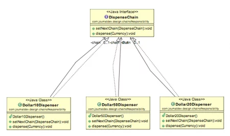

责任链设计模式要点

客户端不知道链的哪一部分将处理请求，它将把请求发送给链中的第一个对象。例如，在我们的程序中，ATMDispenseChain不知道谁在处理发放输入金额的请求。

链上的每个对象都有自己的实现来处理请求，可以是全部或部分，也可以是将其发送到链上的下一个对象。

链中的每个对象都应该有对链中下一个对象的引用来转发请求，这是由java组合实现的。

仔细创建链是非常重要的，否则可能会出现这样的情况：请求永远不会被转发到某个特定的处理器，或者链中没有能够处理该请求的对象。在我的实现中，我已经添加了对用户输入的金额的检查，以确保它被所有的处理器完全处理，但如果请求到达最后一个对象，而链中没有其他对象可以转发请求，我们可能不会检查它并抛出异常。这是一个设计决定。

责任链设计模式对于实现无耦合性是很好的，但它也有一个代价，那就是有很多实现类，如果大部分代码在所有的实现中都是通用的，就会出现维护问题。


#### **责任链模式何时何地适用：** 


- 当您想解耦请求的发送者和接收者时
- 在运行时确定的多个对象是处理请求的候选对象
- 当您不想在代码中显式指定处理程序时
- 当您想向多个对象之一发出请求而不明确指定接收者时。

当多个对象可以处理一个请求并且处理程序不必是特定对象时，建议使用此模式。此外，处理程序是在运行时确定的。请注意，任何处理程序根本没有处理的请求是一个有效的用例。


 

- **处理程序：**这可以是一个接口，主要接收请求并将请求分派到处理程序链。它仅引用链中的第一个处理程序，并且对其余处理程序一无所知。
- **具体处理程序：**这些是按某种顺序链接的请求的实际处理程序。
- **Client :**请求的发起者，这将访问处理程序来处理它。

**如何使用责任链在应用程序中发送请求**

需要处理请求的客户端将其发送到处理程序链，这些处理程序是扩展 Handler 类的类。 
链中的每个处理程序都轮流尝试处理从客户端收到的请求。 
如果 ConcreteHandler1 可以处理它，则处理该请求，如果不能，则将其发送到处理程序 ConcreteHandler2，即链中的下一个处理程序。

### 案例二

#### **让我们看一个责任链设计模式的例子：**

我们通过一段比较通用的代码来解释如何使用责任链模式：

```java
//定义一个抽象的handle
public abstract class Handler {
    private Handler nextHandler;  //指向下一个处理者
    private int level;  //处理者能够处理的级别

    public Handler(int level) {
        this.level = level;
    }

    public void setNextHandler(Handler handler) {
        this.nextHandler = handler;
    }

    // 处理请求传递，注意final，子类不可重写
    public final void handleMessage(Request request) {
        if (level == request.getRequstLevel()) {
            this.echo(request);
        } else {
            if (this.nextHandler != null) {
                this.nextHandler.handleMessage(request);
            } else {
                System.out.println("已经到最尽头了");
            }
        }
    }
    // 抽象方法，子类实现
    public abstract void echo(Request request);
}

// 定义一个具体的handleA
public class HandleRuleA extends Handler {
    public HandleRuleA(int level) {
        super(level);
    }
    @Override
    public void echo(Request request) {
        System.out.println("我是处理者1,我正在处理A规则");
    }
}

//定义一个具体的handleB
public class HandleRuleB extends Handler {}  //...

//客户端实现
class Client {
    public static void main(String[] args) {
        HandleRuleA handleRuleA = new HandleRuleA(1);
        HandleRuleB handleRuleB = new HandleRuleB(2);
        handleRuleA.setNextHandler(handleRuleB);  //这是重点，将handleA和handleB串起来
        handleRuleA.echo(new Request());
    }
}
```

示例2：

在实际开发中，经常避免不了会与其他公司进行接口对接，绝大部分请求参数都是经过加密处理再发送到互联网上，下面我们以对请求参数进行验证、封装处理为例，来诠释责任链模式的玩法，实现过程如下！

- 我们先编写一个加密工具类，采用AES加密算法

```java
public class AESUtil {

    private static Logger log = LoggerFactory.getLogger(AESUtil.class);

    private static final String AES = "AES";

    private static final String AES_CVC_PKC = "AES/CBC/PKCS7Padding";

    static {
        Security.addProvider(new BouncyCastleProvider());
    }

    /**
     * 加密
     * @param content
     * @param key
     * @return
     * @throws Exception
     */
    public static String encrypt(String content, String key) {
        try {
            SecretKeySpec secretKeySpec = new SecretKeySpec(key.getBytes(), AES);
            Cipher cipher = Cipher.getInstance(AES_CVC_PKC);
            IvParameterSpec iv = new IvParameterSpec(new byte[16]);
            cipher.init(Cipher.ENCRYPT_MODE, secretKeySpec, iv);
            byte[] encrypted = cipher.doFinal(content.getBytes());
            return Base64.getEncoder().encodeToString(encrypted);
        }  catch (Exception e) {
            log.warn("AES加密失败,参数:{}，错误信息:{}", content, ExceptionUtils.getStackTrace(e));
            return "";
        }
    }

    /**
     * 解密
     * @param content
     * @param key
     * @return
     * @throws Exception
     */
    public static String decrypt(String content, String key) {
        try {
            SecretKeySpec secretKeySpec = new SecretKeySpec(key.getBytes(), AES);
            Cipher cipher = Cipher.getInstance(AES_CVC_PKC);
            IvParameterSpec iv = new IvParameterSpec(new byte[16]);
            cipher.init(Cipher.DECRYPT_MODE, secretKeySpec, iv);
            byte[] encrypted = Base64.getDecoder().decode(content);
            byte[] original = cipher.doFinal(encrypted);
            return new String(original, "UTF-8");
        } catch (Exception e) {
            log.warn("AES解密失败,参数:{}，错误信息:{}", content, ExceptionUtils.getStackTrace(e));
            return "";
        }
    }

​```java
public class Chain
{
Processor chain;
  
public Chain(){
    buildChain();
}
  
private void buildChain(){
    chain = new NegativeProcessor(new ZeroProcessor(new PositiveProcessor(null)));
}
  
public void process(Number request) {
    chain.process(request);
}
  
}
  
abstract class Processor 
{ 
    private Processor processor;
  
    public Processor(Processor processor){
        this.processor = processor;
    };
      
    public void process(Number request){
        if(processor != null)
            processor.process(request);
    }; 
} 
  
class Number 
{ 
    private int number; 
  
    public Number(int number) 
    { 
        this.number = number; 
    } 
  
    public int getNumber() 
    { 
        return number; 
    } 
  
} 
  
class NegativeProcessor extends Processor 
{ 
    public NegativeProcessor(Processor processor){
        super(processor);
          
    }
  
    public void process(Number request) 
    { 
        if (request.getNumber() < 0) 
        { 
            System.out.println("NegativeProcessor : " + request.getNumber()); 
        } 
        else
        { 
            super.process(request); 
        } 
    } 
} 
  
class ZeroProcessor extends Processor 
{ 
    public ZeroProcessor(Processor processor){
        super(processor);
    }
  
    public void process(Number request) 
    { 
        if (request.getNumber() == 0) 
        { 
            System.out.println("ZeroProcessor : " + request.getNumber()); 
        } 
        else
        { 
            super.process(request); 
        } 
    } 
} 
  
class PositiveProcessor extends Processor 
{ 
  
    public PositiveProcessor(Processor processor){
        super(processor);
    }
  
    public void process(Number request) 
    { 
        if (request.getNumber() > 0) 
        { 
            System.out.println("PositiveProcessor : " + request.getNumber()); 
        } 
        else
        { 
            super.process(request); 
        } 
    } 
} 
  
class TestChain 
{ 
    public static void main(String[] args) { 
        Chain chain = new Chain();
          
        //Calling chain of responsibility 
        chain.process(new Number(90)); 
        chain.process(new Number(-50)); 
        chain.process(new Number(0)); 
        chain.process(new Number(91)); 
    } 
} 
```

输出：

```
正处理器：90
负处理器：-50
零处理器：0
正处理器：91
```


- 降低耦合度。解耦它将请求发送方和接收方。
- 简化的对象。对象不需要知道链结构。
- 增强对象分配职责的灵活性。通过更改链内成员或更改其顺序，允许动态添加或删除职责。
- 增加非常方便的请求处理新类。

**责任链设计模式的缺点**


- 必须收到请求而不是保证。
- 系统的性能会受到影响，而且在代码调试不方便可能会造成循环调用。
- 由于调试，可能不容易观察操作特性。

    public static void main(String[] args) throws Exception {
        String key = "1234567890123456";
        String content = "{\"userCode\":\"zhangsan\",\"userPwd\":\"123456\"}";
        String encryptContext = encrypt(content, "1234567890123456");
        System.out.println("加密后的内容：" + encryptContext);
        String decryptContext = decrypt(encryptContext, key);
        System.out.println("解密后的内容：" + decryptContext);
    }

}
```

执行结果如下：

​```java
加密后的内容：5ELORDsYKxCz6Ec377udct7dBMI74ZtJDCFL4B3cpoBsPC8ILH/aiaRFnZa/oTC5
解密后的内容：{"userCode":"zhangsan","userPwd":"123456"}
```

其中加密后的内容可以看作为请求者传过来的参数！

- 同时，再创建一个上下文实体类`ServiceContext`，用于数据记录

```java
/**
 * 上下文
 */
public class ServiceContext {

    /**
     * 请求参数
     */
    private String requestParam;

    /**
     * 解密后的数据
     */
    private String jsonData;

    /**
     * 用户账号
     */
    private String userCode;

    /**
     * 用户密码
     */
    private String userPwd;

    //省略set\get

    public ServiceContext() {
    }

    public ServiceContext(String requestParam) {
        this.requestParam = requestParam;
    }
}
```

- 然后，创建一个处理器接口`HandleIntercept`

```java
public interface HandleIntercept {

    /**
     * 对参数进行处理
     * @param context
     * @return
     */
    ServiceContext handle(ServiceContext context);

}
```

- 紧接着，创建两个处理器实现类，用于参数解密、业务数据验证

```java
/**
 * 解密请求数据
 */
public class DecodeDataHandle implements HandleIntercept {

    private String key = "1234567890123456";

    @Override
    public ServiceContext handle(ServiceContext context) {
        String jsonData = AESUtil.decrypt(context.getRequestParam(), key);
        if(StringUtils.isEmpty(jsonData)){
            throw new IllegalArgumentException("解密失败");
        }
        context.setJsonData(jsonData);
        return context;
    }
}
/**
 * 验证业务数据并封装
 */
public class ValidDataHandle implements HandleIntercept {

    @Override
    public ServiceContext handle(ServiceContext context) {
        String jsonData = context.getJsonData();
        JSONObject jsonObject = JSONObject.parseObject(jsonData);
        if(!jsonObject.containsKey("userCode")){
            throw new IllegalArgumentException("userCode不能为空");
        }
        context.setUserCode(jsonObject.getString("userCode"));
        if(!jsonObject.containsKey("userPwd")){
            throw new IllegalArgumentException("userPwd不能为空");
        }
        context.setUserPwd(jsonObject.getString("userPwd"));
        return context;
    }
}
```

- 最后创建一个处理链路管理器`HandleChain`

```java
/**
 * 请求处理链路管理器
 */
public class HandleChain {
    
    private List<HandleIntercept> handleInterceptList = new ArrayList<>();

    /**
     * 添加处理器
     * @param handleIntercept
     */
    public void addHandle(HandleIntercept handleIntercept){
        handleInterceptList.add(handleIntercept);
    }

    /**
     * 执行处理
     * @param context
     * @return
     */
    public ServiceContext execute(ServiceContext context){
        if(!handleInterceptList.isEmpty()){
            for (HandleIntercept handleIntercept : handleInterceptList) {
                context =handleIntercept.handle(context);
            }
        }
        return context;
    }
}
```

- 写完之后，我们编写一个测试类`ChainClientTest`

```java
public class ChainClientTest {

    public static void main(String[] args) {
        //获取请求参数
        String requestParam = "5ELORDsYKxCz6Ec377udct7dBMI74ZtJDCFL4B3cpoBsPC8ILH/aiaRFnZa/oTC5";
        //封装请求参数
        ServiceContext serviceContext = new ServiceContext(requestParam);

        //添加处理链路
        HandleChain handleChain = new HandleChain();
        handleChain.addHandle(new DecodeDataHandle());//解密处理
        handleChain.addHandle(new ValidDataHandle());//数据验证处理

        //执行处理链,获取处理结果
        serviceContext = handleChain.execute(serviceContext);
        System.out.println("处理结果：" + JSONObject.toJSONString(serviceContext));
    }
}
```

执行之后结果如下：

```json
处理结果：{"jsonData":"{\"userCode\":\"zhangsan\",\"userPwd\":\"123456\"}","requestParam":"5ELORDsYKxCz6Ec377udct7dBMI74ZtJDCFL4B3cpoBsPC8ILH/aiaRFnZa/oTC5","userCode":"zhangsan","userPwd":"123456"}
```

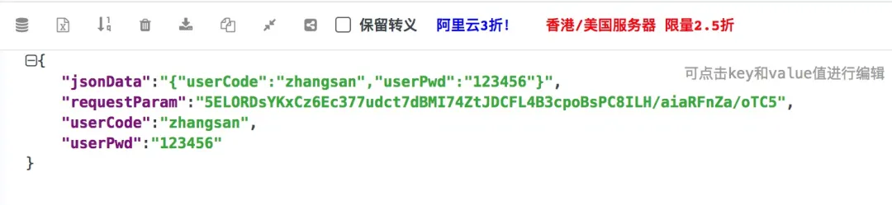

可以很清晰的看到，从请求者发送数据经过处理器链路之后，数据都封装到上下文中去了！

如果想继续验证用户和密码是否合法，可以继续添加新的处理器，即可完成数据的处理验证！

如果是传统的方法，可能就是多个`if`，进行嵌套，类似如下：

```java
if(condition){
    if(condition){
        if(condition){
   //业务处理
        }
    }
}
```

这种模式，最大的弊端就是可读性非常差，而且代码不好维护！

而责任链是从接口层进行封装处理和判断，可扩展性非常强！

### 三、应用

责任链模式的使用场景，这个就不多说了，最典型的就是 Servlet 中的 Filter，有了上面的分析，大家应该也可以理解 Servlet 中责任链模式的工作原理了，然后为什么一个一个的 Filter 需要配置在 web.xml 中，其实本质就是将 filter 注册到处理器中。

```java
public class TestFilter implements Filter{

    public void doFilter(ServletRequest request, ServletResponse response,
            FilterChain chain) throws IOException, ServletException {
        chain.doFilter(request, response);
    }

    public void destroy() {}
    public void init(FilterConfig filterConfig) throws ServletException {}
}
```


## **Apache Commons Chain**

[Apache Commons Chain](https://commons.apache.org/proper/commons-chain/)是一个使用责任链[模式](https://en.wikipedia.org/wiki/Chain-of-responsibility_pattern)的库——通常用于组织复杂的处理流程，其中多个接收者可以处理一个请求。

在这篇快速文章中，我们将通过一个表示从 ATM 取款的示例。

**依赖**

```xml
<dependency>
    <groupId>commons-chain</groupId>
    <artifactId>commons-chain</artifactId>
    <version>1.2</version>
</dependency>
```

ATM 将一个数字作为输入并将其传递给负责执行不同操作的处理程序。这些包括计算要分发的钞票数量，并向银行和客户发送有关交易的通知。

**上下文表示应用程序的当前状态，存储有关事务的信息。**

对于我们的 ATM 取款请求，我们需要的信息是：

- 提款总额
- 100面额纸币数量
- 50面额纸币数量
- 10面额纸币数量
- 剩余金额

此状态在一个类中定义：

```java
public class AtmRequestContext extends ContextBase {
    int totalAmountToBeWithdrawn;
    int noOfHundredsDispensed;
    int noOfFiftiesDispensed;
    int noOfTensDispensed;
    int amountLeftToBeWithdrawn;

    // standard setters & getters
}
```

The *Command* takes the *C**ontext* as an input and processes it.

我们将把上面提到的每个步骤作为一个命令来实现：

```java
public class HundredDenominationDispenser implements Command {

    @Override
    public boolean execute(Context context) throws Exception {
        intamountLeftToBeWithdrawn = (int) context.get("amountLeftToBeWithdrawn);
        if (amountLeftToBeWithdrawn >= 100) {
            context.put("noOfHundredsDispensed", amountLeftToBeWithdrawn / 100);
            context.put("amountLeftToBeWithdrawn", amountLeftToBeWithdrawn % 100);
        }
        return false;
    }
}
```

*FiftyDenominationDispenser*和TenDenominationDispenser的*Command**类似*。

*chain是按指定顺序执行的命令的集合。我们的*Chain*将由上述*Command*和最后的*AuditFilter 组成*：

```java
public class AtmWithdrawalChain extends ChainBase {

    public AtmWithdrawalChain() {
        super();
        addCommand(new HundredDenominationDispenser());
        addCommand(new FiftyDenominationDispenser());
        addCommand(new TenDenominationDispenser());
        addCommand(new AuditFilter());
    }
}
```

*当链*中的任何*命令*返回 true 时，它会强制*链*结束。

过滤器也是一个*命令*，但具有在*链*执行后调用的*postProcess方法。*

我们的*过滤器*将向客户和银行发送通知：

```java
public class AuditFilter implements Filter {

    @Override
    public boolean postprocess(Context context, Exception exception) {
        // send notification to bank and user
        return false;
    }

    @Override
    public boolean execute(Context context) throws Exception {
        return false;
    }
}
```

**Chain** **Catalog**

它是具有逻辑名称的*链*和*命令的集合。*

在我们的例子中，我们的*目录*将包含*AtmWithdrawalChain。*

```java
public class AtmCatalog extends CatalogBase {

    public AtmCatalog() {
        super();
        addCommand("atmWithdrawalChain", new AtmWithdrawalChain());
    }
}
```

使用 **Chain**

让我们看看我们如何使用上述*链*来处理提款请求。我们将首先创建一个*上下文*，然后将其传递给*链。**链*将处理*上下文。*

我们将编写一个测试用例来演示我们的*AtmWithdrawalChain：*

```java
public class AtmChainTest {

    @Test
    public void givenInputsToContext_whenAppliedChain_thenExpectedContext() throws Exception {
        Context context = new AtmRequestContext();
        context.put("totalAmountToBeWithdrawn", 460);
        context.put("amountLeftToBeWithdrawn", 460);
        
        Catalog catalog = new AtmCatalog();
        Command atmWithdrawalChain = catalog.getCommand("atmWithdrawalChain");
        
        atmWithdrawalChain.execute(context);
        
        assertEquals(460, (int) context.get("totalAmountToBeWithdrawn"));
        assertEquals(0, (int) context.get("amountLeftToBeWithdrawn"));
        assertEquals(4, (int) context.get("noOfHundredsDispensed"));
        assertEquals(1, (int) context.get("noOfFiftiesDispensed"));
        assertEquals(1, (int) context.get("noOfTensDispensed"));
    }
}
```


## 访问者

访问者模式的目的是定义一个新的操作而不引入对现有对象结构的修改。

想象一下，我们有一个由组件组成的[**复合**](https://www.baeldung.com/java-composite-pattern) 对象。对象的结构是固定的——我们要么不能改变它，要么不打算在结构中添加新类型的元素。

现在，我们如何在不修改现有类的情况下为代码添加新功能？

访问者设计模式可能是一个答案。简单地说， **我们要做的就是为结构的每个元素添加一个接受访问者类的函数。**

这样，我们的组件将允许访问者实现“访问”它们并对该元素执行任何所需的操作。

换句话说，我们将从类中提取将应用于对象结构的算法。

因此，**我们将充分利用 Open/Closed 原则** ，因为我们不会修改代码，但我们仍然可以通过提供新的*Visitor* 实现来扩展功能。

### UML图

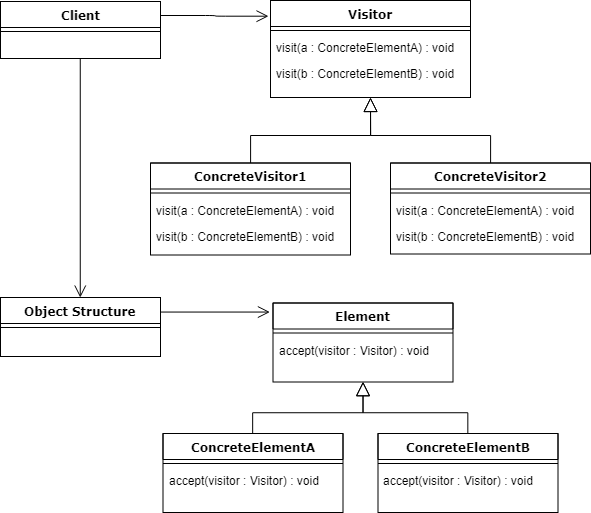


在上面的 UML 图中，我们有两个实现层次结构，专门的访问者和具体元素。

首先，客户端使用一个访问者实现并将其应用于对象结构。复合对象迭代其组件并将访问者应用于每个组件。

现在，特别相关的是**具体元素（ConcreteElementA 和ConcreteElementB） 正在接受一个访问者， 只是允许它访问 它们。**

最后，这个方法对于结构中的所有元素都是相同的，它 通过将自身（通过 *this*关键字）传递给访问者的访问方法来执行[双重调度。](https://en.wikipedia.org/wiki/Double_dispatch)

### 示例

我们的例子将是由JSON和XML具体元素组成的自定义Document对象；这些元素有一个共同的抽象超类，即Element。

The *Document* class:

```java
public class Document extends Element {

    List<Element> elements = new ArrayList<>();

    // ...

    @Override
    public void accept(Visitor v) {
        for (Element e : this.elements) {
            e.accept(v);
        }
    }
}
```

元素类有一个抽象的方法，接受Visitor接口。

```java
public abstract void accept(Visitor v);
```

因此，在创建新元素时，将其命名为JsonElement，我们必须提供这个方法的实现。

然而，由于访问者模式的性质，实现是相同的，所以在大多数情况下，它需要我们从其他已经存在的元素中复制粘贴样板代码。

```java
public class JsonElement extends Element {

    // ...

    public void accept(Visitor v) {
        v.visit(this);
    }
}
```

由于我们的元素允许任何访问者访问它们，假设我们想要处理我们的 *Document* 元素，但它们中的每一个都以不同的方式，取决于它的类类型。

因此，我们的访问者将对给定类型有一个单独的方法：

```java
public class ElementVisitor implements Visitor {

    @Override
    public void visit(XmlElement xe) {
        System.out.println(
          "processing an XML element with uuid: " + xe.uuid);
    }

    @Override
    public void visit(JsonElement je) {
        System.out.println(
          "processing a JSON element with uuid: " + je.uuid);
    }
}
```

在这里，我们的具体访问者实现了两种方法，每种*Element*对应一种。

这使我们可以访问结构的特定对象，我们可以在其上执行必要的操作。


### 测试

```java
public class VisitorDemo {

    public static void main(String[] args) {

        Visitor v = new ElementVisitor();

        Document d = new Document(generateUuid());
        d.elements.add(new JsonElement(generateUuid()));
        d.elements.add(new JsonElement(generateUuid()));
        d.elements.add(new XmlElement(generateUuid()));

        d.accept(v);
    }

    // ...
}
```

首先，我们创建一个 *元素*访问者，它包含我们将应用于元素的算法。

接下来，我们使用适当的组件设置 *Document* 并应用访问者，该访问者将被对象结构的每个元素接受。

输出将是这样的：

```java
processing a JSON element with uuid: fdbc75d0-5067-49df-9567-239f38f01b04
processing a JSON element with uuid: 81e6c856-ddaf-43d5-aec5-8ef977d3745e
processing an XML element with uuid: 091bfcb8-2c68-491a-9308-4ada2687e203
```

它表明访问者已经访问了我们结构的每个元素，这取决于 *元素* 类型，它将处理分派给适当的方法，并且可以从每个底层对象中检索数据。

### 缺点

作为每种设计模式，即使是访问者也有其缺点，特别是 **如果我们需要向对象的结构中添加新元素，它的使用会使代码维护变得更加困难。**

例如，如果我们添加新的*YamlElement，* 则需要使用处理此元素所需的新方法更新所有现有访问者。再进一步，如果我们有十个或更多的具体访问者，更新所有访问者可能会很麻烦。

除此之外，当使用这种模式时，与一个特定对象相关的业务逻辑会分布在所有访问者实现中。


## 解释器

简而言之，该模式以面向对象的方式**定义了特定语言的语法，解释器本身可以对其进行评估。**

考虑到这一点，从技术上讲，我们可以构建自定义正则表达式、自定义 DSL 解释器，或者我们可以解析任何人类语言，**构建抽象语法树，然后运行解释。**

这些只是一些潜在的用例，但如果我们想一想，我们会发现它的更多用途，例如在我们的 IDE 中，因为它们不断解释我们正在编写的代码，从而为我们提供无价的提示。

当语法比较简单时，一般应该使用解释器模式。

否则，它可能会变得难以维护。


### UML图

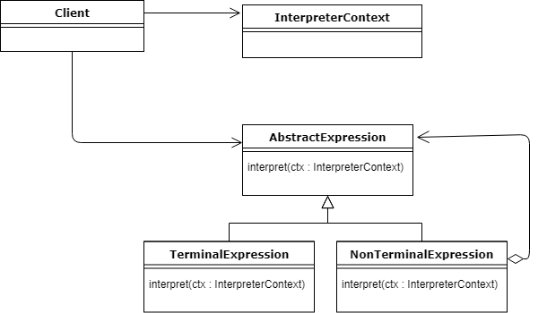


上图显示了两个主要实体：*Context*和*Expression*。

现在，任何语言都需要以某种方式表达，并且单词（表达）将根据给定的上下文具有某种含义。

*AbstractExpression* 定义了一种将上下文 作为参数的抽象方法。多亏了这一点，**每个表达式都会影响上下文**，改变它的状态，要么继续解释，要么返回结果本身。

因此，上下文将成为全局处理状态的持有者，并且将在整个解释过程中被重用。

那么 *TerminalExpression*和 *NonTerminalExpression 有*什么区别呢？

一个*NonTerminalExpression* 可能有一个或多个与之关联的其他*AbstractExpression*，因此它可以被递归解释。最后，**解释过程必须以 一个 返回结果的 TerminalExpression结束。**

值得注意的是*NonTerminalExpression*是一个**组合。**

最后，客户端的作用是创建或使用已经创建的**抽象语法树**，它只不过是**用创建的语言定义的一个句子。**


### 示例

为了展示实际的模式，我们将以面向对象的方式构建一个简单的类似 SQL 的语法，然后将其解释并返回给我们结果。

首先，我们将定义 *Select、From*和*Where* 表达式，在客户端类中构建语法树并运行解释。

*Expression*接口将具有解释方法： 

```java
List<String> interpret(Context ctx);
```

接下来，我们定义第一个表达式，  *Select*类：

```java
class Select implements Expression {

    private String column;
    private From from;

    // constructor

    @Override
    public List<String> interpret(Context ctx) {
        ctx.setColumn(column);
        return from.interpret(ctx);
    }
}
```

它获取要选择的列名和另一个 *From* 类型的具体*表达式* 作为构造函数中的参数。

注意，在重载的interpret()方法中，它设置了上下文的状态，并将解释与上下文一起进一步传递给另一个表达式。

这样，我们看到它是一个 *NonTerminalExpression。*

另一个表达式是*From*类：

```java
class From implements Expression {

    private String table;
    private Where where;

    // constructors

    @Override
    public List<String> interpret(Context ctx) {
        ctx.setTable(table);
        if (where == null) {
            return ctx.search();
        }
        return where.interpret(ctx);
    }
}
```

现在，在 SQL 中 where 子句是可选的，因此此类是终端或非终端表达式。

如果用户决定不使用 where 子句，*From*表达式将被 *ctx.search()* 调用终止并返回结果。否则，它将被进一步解释。

*Where* 表达式再次通过设置必要的过滤器来修改上下文，并通过搜索调用终止解释：

```java
class Where implements Expression {

    private Predicate<String> filter;

    // constructor

    @Override
    public List<String> interpret(Context ctx) {
        ctx.setFilter(filter);
        return ctx.search();
    }
}
```

例如，*Context* 类保存模拟数据库表的数据。

请注意，它具有三个关键字段，由*Expression*的每个子类和搜索方法修改：

```java
class Context {

    private static Map<String, List<Row>> tables = new HashMap<>();

    static {
        List<Row> list = new ArrayList<>();
        list.add(new Row("John", "Doe"));
        list.add(new Row("Jan", "Kowalski"));
        list.add(new Row("Dominic", "Doom"));

        tables.put("people", list);
    }

    private String table;
    private String column;

    /**
     * Index of column to be shown in result.
     * Calculated in {@link #setColumnMapper()}
     */
    private int colIndex = -1;

    /**
     * Default setup, used for clearing the context for next queries.
     * See {@link Context#clear()}
     */
    private static final Predicate<String> matchAnyString = s -> s.length() > 0;
    private static final Function<String, Stream<? extends String>> matchAllColumns = Stream::of;
    /**
     * Varies based on setup in subclasses of {@link Expression}
     */
    private Predicate<String> whereFilter = matchAnyString;
    private Function<String, Stream<? extends String>> columnMapper = matchAllColumns;

    void setColumn(String column) {
        this.column = column;
        setColumnMapper();
    }

    void setTable(String table) {
        this.table = table;
    }

    void setFilter(Predicate<String> filter) {
        whereFilter = filter;
    }

    /**
     * Clears the context to defaults.
     * No filters, match all columns.
     */
    void clear() {
        column = "";
        columnMapper = matchAllColumns;
        whereFilter = matchAnyString;
    }

    List<String> search() {

        List<String> result = tables.entrySet()
                .stream()
                .filter(entry -> entry.getKey().equalsIgnoreCase(table))
                .flatMap(entry -> Stream.of(entry.getValue()))
                .flatMap(Collection::stream)
                .map(Row::toString)
                .flatMap(columnMapper)
                .filter(whereFilter)
                .collect(Collectors.toList());

        clear();

        return result;
    }

    /**
     * Sets column mapper based on {@link #column} attribute.
     * Note: If column is unknown, will remain to look for all columns.
     */
    private void setColumnMapper() {
        switch (column) {
            case "*":
                colIndex = -1;
                break;
            case "name":
                colIndex = 0;
                break;
            case "surname":
                colIndex = 1;
                break;
        }
        if (colIndex != -1) {
            columnMapper = s -> Stream.of(s.split(" ")[colIndex]);
        }
    }
}
```

搜索完成后，上下文会自行清除，因此列、表和过滤器设置为默认值。

这样每个解释都不会影响另一个。

### 测试

```java
public class InterpreterDemo {
    public static void main(String[] args) {

        Expression query = new Select("name", new From("people"));
        Context ctx = new Context();
        List<String> result = query.interpret(ctx);
        System.out.println(result);

        Expression query2 = new Select("*", new From("people"));
        List<String> result2 = query2.interpret(ctx);
        System.out.println(result2);

        Expression query3 = new Select("name", 
          new From("people", 
            new Where(name -> name.toLowerCase().startsWith("d"))));
        List<String> result3 = query3.interpret(ctx);
        System.out.println(result3);
    }
}
```

首先，我们用创建的表达式构建一个语法树，初始化上下文，然后运行解释。上下文被重用，但正如我们上面所展示的，它会在每次搜索调用后自行清理。

通过运行程序，输出应如下所示：

```plaintext
[John, Jan, Dominic]
[John Doe, Jan Kowalski, Dominic Doom]
[Dominic]
```

###  缺点

可以在给出的示例中看到。添加另一个表达式会相当容易，例如 *Limit*，但是如果我们决定继续使用所有其他表达式扩展它，维护起来就不太容易了。

解释器设计模式非常**适合相对简单的语法解释**，不需要太多的发展和扩展。

在上面的示例中，我们展示了在解释器模式的帮助下以面向对象的方式构建类似 SQL 的查询是可能的。

最后，您可以在 JDK 中找到这种模式的用法，特别是在 *java.util.Pattern*、  *java.text.Format*或 *java.text.Normalizer*中。


## 中介者模式

在面向对象编程中，我们应该始终尝试以**组件松散耦合和可重用的方式设计系统**。这种方法使我们的代码更易于维护和测试。

然而，在现实生活中，我们经常需要处理一组复杂的依赖对象。这时中介者模式可能会派上用场。

**中介者模式的目的是减少紧密耦合的对象之间直接相互通信的复杂性和依赖性**。这是通过创建一个处理依赖对象之间交互的中介对象来实现的。因此，所有的通信都通过中介。

这促进了松散耦合，因为一组一起工作的组件不再需要直接交互。相反，它们只引用单个中介对象。这样，也更容易在系统的其他部分重用这些对象。


### UML图


在上面的 UML 图中，我们可以识别出以下参与者：

- Mediator定义了Colleague对象用来通信的接口。
- Colleague定义了一个抽象类，持有对Mediator的单一引用
- *ConcreteMediator*封装了*Colleague*对象之间的交互逻辑
- *ConcreteColleague1*和*ConcreteColleague2*仅通过*Mediator进行通信*

正如我们所见，**Colleague对象并不直接相互引用。相反，所有的通信都是由*****Mediator**执行的。*

因此，*ConcreteColleague1*和*ConcreteColleague2*可以更容易地重用。

此外，如果我们需要改变*Colleague*对象协同工作的方式，我们只需要修改*ConcreteMediator*逻辑。或者我们可以创建*Mediator 的新实现。*


### 实现

想象一下，我们正在构建一个由风扇、电源和按钮组成的简单冷却系统。按下按钮将打开或关闭风扇。在我们打开风扇之前，我们需要打开电源。同样，我们必须在关闭风扇后立即关闭电源。

现在让我们看一下示例实现：

```java
public class Button {
    private Fan fan;

    // constructor, getters and setters

    public void press(){
        if(fan.isOn()){
            fan.turnOff();
        } else {
            fan.turnOn();
        }
    }
}
```

```java
public class Fan {
    private Button button;
    private PowerSupplier powerSupplier;
    private boolean isOn = false;

    // constructor, getters and setters

    public void turnOn() {
        powerSupplier.turnOn();
        isOn = true;
    }

    public void turnOff() {
        isOn = false;
        powerSupplier.turnOff();
    }
}
```

接下来，让我们测试一下功能：

```java
@Test
public void givenTurnedOffFan_whenPressingButtonTwice_fanShouldTurnOnAndOff() {
    assertFalse(fan.isOn());

    button.press();
    assertTrue(fan.isOn());

    button.press();
    assertFalse(fan.isOn());
}
```

一切似乎都很好。但请注意**Button、Fan和PowerSupplier类是如何紧密耦合的**。*Button*直接在*Fan*上运行，*Fan*与*Button*和*PowerSupplier 交互。*

在其他模块中重用*Button*类会很困难。此外，如果我们需要在系统中添加第二个电源，那么我们将不得不修改*Fan*类的逻辑。

### 添加中介者模式

现在，让我们实现中介者模式来减少我们类之间的依赖关系，并使代码更具可重用性。

首先，我们来介绍一下*Mediator*类：

```java
public class Mediator {
    private Button button;
    private Fan fan;
    private PowerSupplier powerSupplier;

    public void setButton(Button button) {
        this.button = button;
        this.button.setMediator(this);
    }

    public void setFan(Fan fan) {
        this.fan = fan;
        this.fan.setMediator(this);
    }

    public void setPowerSupplier(PowerSupplier powerSupplier) {
        this.powerSupplier = powerSupplier;
    }

    public void press() {
        if (fan.isOn()) {
            fan.turnOff();
        } else {
            fan.turnOn();
        }
    }

    public void start() {
        powerSupplier.turnOn();
    }

    public void stop() {
        powerSupplier.turnOff();
    }
}
```

接下来，让我们修改剩下的类：

```java
public class Button {
    private Mediator mediator;

    // constructor, getters and setters

    public void press() {
        mediator.press();
    }
}
```

```java
public class Fan {
    private Mediator mediator;
    private boolean isOn = false;

    // constructor, getters and setters

    public void turnOn() {
        mediator.start();
        isOn = true;
    }

    public void turnOff() {
        isOn = false;
        mediator.stop();
    }
}
```

再次，让我们测试一下功能：

```java
public class MediatorIntegrationTest {

    private Button button;
    private Fan fan;

    @Before
    public void setUp() {
        this.button = new Button();
        this.fan = new Fan();
        PowerSupplier powerSupplier = new PowerSupplier();
        Mediator mediator = new Mediator();

        mediator.setButton(this.button);
        mediator.setFan(fan);
        mediator.setPowerSupplier(powerSupplier);
    }

    @Test
    public void givenTurnedOffFan_whenPressingButtonTwice_fanShouldTurnOnAndOff() {
        assertFalse(fan.isOn());

        button.press();
        assertTrue(fan.isOn());

        button.press();
        assertFalse(fan.isOn());
    }
}
```

我们的冷却系统按预期工作。

**现在我们已经实现了中介者模式，Button、Fan或PowerSupplier类都没有直接通信**。它们只有一个对*调解器的引用。*

如果以后需要添加第二个电源，我们只需要更新*Mediator的*逻辑即可；*Button*和*Fan*类保持不变。

这个例子展示了我们可以多么容易地分离依赖对象并使我们的系统更容易维护。

### 何时使用中介者模式

**如果我们必须处理一组紧密耦合且难以维护的对象，中介者模式是一个不错的选择。**这样我们可以减少对象之间的依赖关系并降低整体复杂性。

此外，通过使用中介对象，我们将通信逻辑提取到单个组件，因此我们遵循[单一责任原则](https://www.baeldung.com/solid-principles#s)。此外，我们可以引入新的中介，而无需更改系统的其余部分。因此，我们遵循开闭原则。

**但是，有时由于系统设计错误，我们可能有太多紧密耦合的对象。如果是这种情况，我们不应该应用中介者模式**。相反，我们应该退后一步，重新思考我们为类建模的方式。

与所有其他模式一样，**我们需要在盲目实施 Mediator Pattern 之前考虑我们的特定用例**。


## 备忘录

**Memento 设计模式提供了一种实现可撤销操作的解决方案。**我们可以通过在给定时刻保存对象的状态并在需要撤消执行的操作时恢复它来做到这一点。

**Practically, the object whose state needs to be saved is called an Originator. The Caretaker is the object triggering the save and restore of the state, which is called the Memento.**

Memento 对象应尽可能少地向看守人公开信息。这是为了确保我们不会将 Originator 的内部状态暴露给外界，因为这会破坏封装原则。但是，发起者应该访问足够的信息以恢复到原始状态。

让我们看一个快速的类图，说明不同的对象如何相互交互：

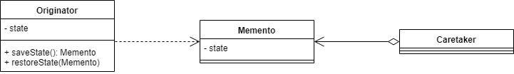

正如我们所见，Originator 可以生产和消费 Memento。同时，看守者只保留恢复之前的状态。Originator 的内部表示对外部世界是隐藏的。

在这里，我们使用单个字段来表示 Originator 的状态，尽管**我们不限于一个字段，并且可以根据需要使用尽可能多的字段**。此外，Memento 对象中的状态不必与 Originator 的完整状态相匹配。只要保留的信息足以恢复 Originator 的状态，我们就可以开始了。

###  何时使用 Memento 设计模式

通常，备忘录设计模式将用于某些操作不可撤销的情况，因此需要回滚到以前的状态。**但是，如果 Originator 的状态很重，使用 Memento 设计模式可能会导致昂贵的创建过程和增加的内存使用。**

### 示例

我们有一个文本编辑器：

```java
public class TextEditor {

    private TextWindow textWindow;
    private TextWindowState savedTextWindow;

    public TextEditor(TextWindow textWindow) {
        this.textWindow = textWindow;
    }

    public void write(String text) {
        textWindow.addText(text);
    }

    public String print() {
        return textWindow.getCurrentText();
    }

    public void hitSave() {
        savedTextWindow = textWindow.save();
    }

    public void hitUndo() {
        textWindow.restore(savedTextWindow);
    }
}
```

它有一个文本窗口，保存着当前输入的文本，并提供了一个添加更多文本的方法。

```java
public class TextWindow {

    private StringBuilder currentText;

    public TextWindow() {
        this.currentText = new StringBuilder();
    }

    public String getCurrentText() {
        return currentText.toString();
    }

    public void addText(String text) {
        currentText.append(text);
    }

    public TextWindowState save() {
        return new TextWindowState(currentText.toString());
    }

    public void restore(TextWindowState save) {
        currentText = new StringBuilder(save.getText());
    }
}
```

---------------------------------------------------------------------------------------------------------------------------------------------------------

 **Memento**

现在，让我们设想一下，我们希望我们的文本编辑器实现一些保存和撤销的功能。当保存时，我们希望我们当前的文本被保存。因此，当撤销后续修改时，我们将恢复我们保存的文本。

为了做到这一点，我们将使用**Memento**设计模式。首先，我们将创建一个保存窗口当前文本的对象

```java
public class TextWindowState {

    private String text;

    public TextWindowState(String text) {
        this.text = text;
    }

    public String getText() {
        return text;
    }
}
```

这个对象就是我们的Memento。正如我们所看到的，我们选择使用String而不是StringBuilder来防止外人对当前文本的任何更新。

**Originator**

  **之后，我们必须为 TextWindow类提供创建和使用 Memento 对象的方法，使TextWindow成为我们的 Originator：**

```java
private StringBuilder currentText;

public TextWindowState save() {
    return new TextWindowState(currentText.toString());
}

public void restore(TextWindowState save) {
    currentText = new StringBuilder(save.getText());
}
```

*save()*方法允许我们创建对象，而 restore  *()*方法使用它来恢复之前的状态。

**Caretaker**

最后，我们必须更新我们的***TextEditor***类。**作为看守者，它将保持 Originator 的状态，并在需要时要求恢复它：**

```java
private TextWindowState savedTextWindow;

public void hitSave() {
    savedTextWindow = textWindow.save();
}

public void hitUndo() {
    textWindow.restore(savedTextWindow);
}
```

### 测试

让我们看看它是否可以通过示例运行。想象一下，我们在编辑器中添加一些文本，保存它，然后再添加一些，最后撤消。为了实现这一点，我们将在*TextEditor上添加一个**print()* 方法， 该方法返回 当前文本的*字符串：*

```java
TextEditor textEditor = new TextEditor(new TextWindow());
textEditor.write("The Memento Design Pattern\n");
textEditor.write("How to implement it in Java?\n");
textEditor.hitSave();
 
textEditor.write("Buy milk and eggs before coming home\n");
 
textEditor.hitUndo();

assertThat(textEditor.print()).isEqualTo("The Memento Design Pattern\nHow to implement it in Java?\n");
```

正如我们所看到的，最后一句话不是当前文本的一部分，因为在添加之前保存了备忘录。


# 设计模式在外卖营销业务中的具体案例

https://tech.meituan.com/2020/03/19/design-pattern-practice-in-marketing.html

### 邀请下单业务中设计模式的实践

#### 业务简介

“邀请下单”是美团外卖用户邀请其他用户下单后给予奖励的平台。即用户A邀请用户B，并且用户B在美团下单后，给予用户A一定的现金奖励（以下简称返奖）。同时为了协调成本与收益的关系，返奖会有多个计算策略。邀请下单后台主要涉及两个技术要点：

1. 返奖金额的计算，涉及到不同的计算规则。
2. 从邀请开始到返奖结束的整个流程。

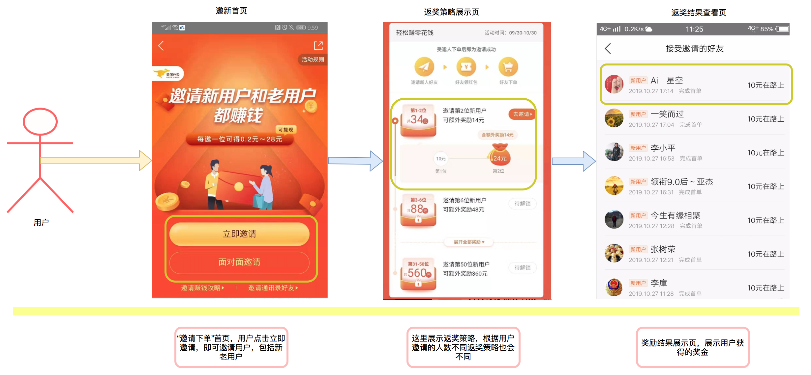

#### 返奖规则与设计模式实践

##### 业务建模

##### 如图是返奖规则计算的业务逻辑视图：

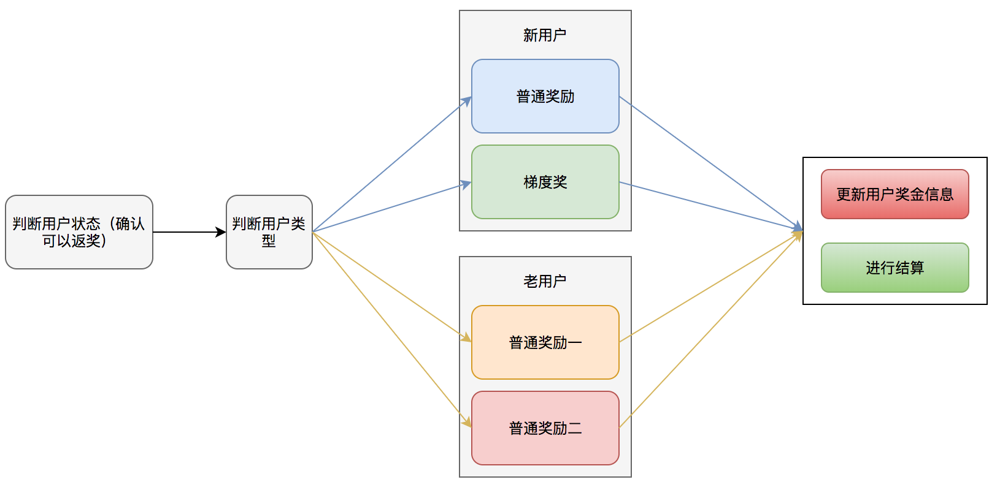

从这份业务逻辑图中可以看到返奖金额计算的规则。首先要根据用户状态确定用户是否满足返奖条件。如果满足返奖条件，则继续判断当前用户属于新用户还是老用户，从而给予不同的奖励方案。一共涉及以下几种不同的奖励方案：

**新用户**

- 普通奖励（给予固定金额的奖励）
- 梯度奖（根据用户邀请的人数给予不同的奖励金额，邀请的人越多，奖励金额越多）

**老用户**

- 根据老用户的用户属性来计算返奖金额。为了评估不同的邀新效果，老用户返奖会存在多种返奖机制。

计算完奖励金额以后，还需要更新用户的奖金信息，以及通知结算服务对用户的金额进行结算。这两个模块对于所有的奖励来说都是一样的。

可以看到，无论是何种用户，对于整体返奖流程是不变的，唯一变化的是返奖规则。此处，我们可参考**开闭原则**，对于返奖流程保持封闭，对于可能扩展的返奖规则进行开放。我们将返奖规则抽象为**返奖策略**，即针对不同用户类型的不同返奖方案，我们视为不同的返奖策略，不同的返奖策略会产生不同的返奖金额结果。

在我们的领域模型里，返奖策略是一个**值对象**，我们通过工厂的方式生产针对不同用户的奖励策略值对象。下文我们将介绍以上领域模型的工程实现，即**工厂模式**和**策略模式**的实际应用。

##### 工程实践

通过上文介绍的返奖业务模型，我们可以看到返奖的主流程就是选择不同的返奖策略的过程，每个返奖策略都包括返奖金额计算、更新用户奖金信息、以及结算这三个步骤。 我们可以使用工厂模式生产出不同的策略，同时使用策略模式来进行不同的策略执行。首先确定我们需要生成出n种不同的返奖策略，其编码如下：

```java
//抽象策略
public abstract class RewardStrategy {
    public abstract void reward(long userId);
  
    public void insertRewardAndSettlement(long userId, int reward) {} ; //更新用户信息以及结算
}

//新用户返奖具体策略A
public class newUserRewardStrategyA extends RewardStrategy {
    @Override
    public void reward(long userId) {}  //具体的计算逻辑，...
}

//老用户返奖具体策略A
public class OldUserRewardStrategyA extends RewardStrategy {
    @Override
    public void reward(long userId) {}  //具体的计算逻辑，...
}

//抽象工厂
public abstract class StrategyFactory<T> {
    abstract RewardStrategy createStrategy(Class<T> c);
}

//具体工厂创建具体的策略
public class FactorRewardStrategyFactory extends StrategyFactory {
    @Override
    RewardStrategy createStrategy(Class c) {
        RewardStrategy product = null;
        try {
            product = (RewardStrategy) Class.forName(c.getName()).newInstance();
        } catch (Exception e) {}
        return product;
    }
}
```

通过工厂模式生产出具体的策略之后，根据我们之前的介绍，很容易就可以想到使用策略模式来执行我们的策略。具体代码如下：

```java
public class RewardContext {
    private RewardStrategy strategy;

    public RewardContext(RewardStrategy strategy) {
        this.strategy = strategy;
    }

    public void doStrategy(long userId) { 
        int rewardMoney = strategy.reward(userId);
        insertRewardAndSettlement(long userId, int reward) {
          insertReward(userId, rewardMoney);
          settlement(userId);
       }  
    }
}
```

接下来我们将工厂模式和策略模式结合在一起，就完成了整个返奖的过程：

```java
public class InviteRewardImpl {
    //返奖主流程
    public void sendReward(long userId) {
        FactorRewardStrategyFactory strategyFactory = new FactorRewardStrategyFactory();  //创建工厂
        Invitee invitee = getInviteeByUserId(userId);  //根据用户id查询用户信息
        if (invitee.userType == UserTypeEnum.NEW_USER) {  //新用户返奖策略
            NewUserBasicReward newUserBasicReward = (NewUserBasicReward) strategyFactory.createStrategy(NewUserBasicReward.class);
            RewardContext rewardContext = new RewardContext(newUserBasicReward);
            rewardContext.doStrategy(userId); //执行返奖策略
        }if(invitee.userType == UserTypeEnum.OLD_USER){}  //老用户返奖策略，... 
    }
}
```

工厂方法模式帮助我们直接产生一个具体的策略对象，策略模式帮助我们保证这些策略对象可以自由地切换而不需要改动其他逻辑，从而达到解耦的目的。通过这两个模式的组合，当我们系统需要增加一种返奖策略时，只需要实现RewardStrategy接口即可，无需考虑其他的改动。当我们需要改变策略时，只要修改策略的类名即可。不仅增强了系统的可扩展性，避免了大量的条件判断，而且从真正意义上达到了高内聚、低耦合的目的。

#### 返奖流程与设计模式实践

##### 业务建模

当受邀人在接受邀请人的邀请并且下单后，返奖后台接收到受邀人的下单记录，此时邀请人也进入返奖流程。首先我们订阅用户订单消息并对订单进行返奖规则校验。例如，是否使用红包下单，是否在红包有效期内下单，订单是否满足一定的优惠金额等等条件。当满足这些条件以后，我们将订单信息放入延迟队列中进行后续处理。经过T+N天之后处理该延迟消息，判断用户是否对该订单进行了退款，如果未退款，对用户进行返奖。若返奖失败，后台还有返奖补偿流程，再次进行返奖。其流程如下图所示

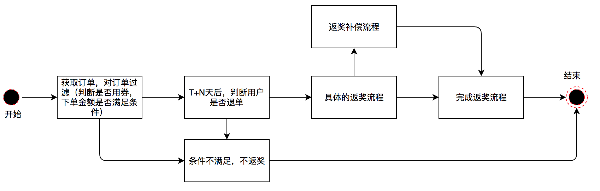

我们对上述业务流程进行领域建模：

1. 在接收到订单消息后，用户进入待校验状态；
2. 在校验后，若校验通过，用户进入预返奖状态，并放入延迟队列。若校验未通过，用户进入不返奖状态，结束流程；
3. T+N天后，处理延迟消息，若用户未退款，进入待返奖状态。若用户退款，进入失败状态，结束流程；
4. 执行返奖，若返奖成功，进入完成状态，结束流程。若返奖不成功，进入待补偿状态；
5. 待补偿状态的用户会由任务定期触发补偿机制，直至返奖成功，进入完成状态，保障流程结束。


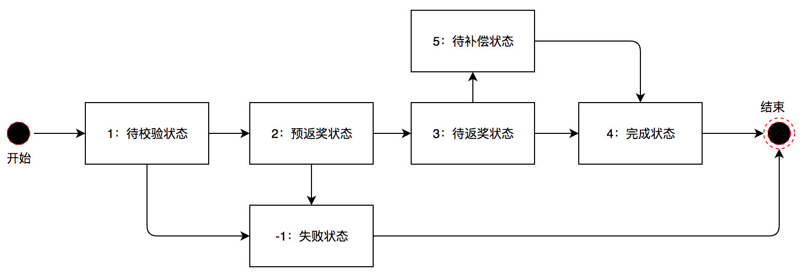

可以看到，我们通过建模将返奖流程的多个步骤映射为系统的状态。对于系统状态的表述，DDD中常用到的概念是领域事件，另外也提及过事件溯源的实践方案。当然，在设计模式中，也有一种能够表述系统状态的代码模型，那就是状态模式。在邀请下单系统中，我们的主要流程是返奖。对于返奖，每一个状态要进行的动作和操作都是不同的。因此，使用状态模式，能够帮助我们对系统状态以及状态间的流转进行统一的管理和扩展。

##### 工程实践

```java
//返奖状态执行的上下文
public class RewardStateContext {

    private RewardState rewardState;
  
    public void setRewardState(RewardState currentState) {this.rewardState = currentState;}
    public RewardState getRewardState() {return rewardState;}
    public void echo(RewardStateContext context, Request request) {
        rewardState.doReward(context, request);
    }
}

public abstract class RewardState {
    abstract void doReward(RewardStateContext context, Request request);
}

//待校验状态
public class OrderCheckState extends RewardState {
    @Override
    public void doReward(RewardStateContext context, Request request) {
        orderCheck(context, request);  //对进来的订单进行校验，判断是否用券，是否满足优惠条件等等
    }
}

//待补偿状态
public class CompensateRewardState extends RewardState {
    @Override
    public void doReward(RewardStateContext context, Request request) {
        compensateReward(context, request);  //返奖失败，需要对用户进行返奖补偿
    }
}
​
//预返奖状态，待返奖状态，成功状态，失败状态(此处逻辑省略)
//..

public class InviteRewardServiceImpl {
    public boolean sendRewardForInvtee(long userId, long orderId) {
        Request request = new Request(userId, orderId);
        RewardStateContext rewardContext = new RewardStateContext();
        rewardContext.setRewardState(new OrderCheckState());
        rewardContext.echo(rewardContext, request);  //开始返奖，订单校验
        //此处的if-else逻辑只是为了表达状态的转换过程，并非实际的业务逻辑
        if (rewardContext.isResultFlag()) {  //如果订单校验成功，进入预返奖状态
            rewardContext.setRewardState(new BeforeRewardCheckState());
            rewardContext.echo(rewardContext, request);
        } else {//如果订单校验失败，进入返奖失败流程，...
            rewardContext.setRewardState(new RewardFailedState());
            rewardContext.echo(rewardContext, request);
            return false;
        }
        if (rewardContext.isResultFlag()) {//预返奖检查成功，进入待返奖流程，...
            rewardContext.setRewardState(new SendRewardState());
            rewardContext.echo(rewardContext, request);
        } else {  //如果预返奖检查失败，进入返奖失败流程，...
            rewardContext.setRewardState(new RewardFailedState());
            rewardContext.echo(rewardContext, request);
            return false;
        }
        if (rewardContext.isResultFlag()) {  //返奖成功，进入返奖结束流程，...
            rewardContext.setRewardState(new RewardSuccessState());
            rewardContext.echo(rewardContext, request);
        } else {  //返奖失败，进入返奖补偿阶段，...
            rewardContext.setRewardState(new CompensateRewardState());
            rewardContext.echo(rewardContext, request);
        }
        if (rewardContext.isResultFlag()) {  //补偿成功，进入返奖完成阶段，...
            rewardContext.setRewardState(new RewardSuccessState());
            rewardContext.echo(rewardContext, request);
        } else {  //补偿失败，仍然停留在当前态，直至补偿成功（或多次补偿失败后人工介入处理）
            rewardContext.setRewardState(new CompensateRewardState());
            rewardContext.echo(rewardContext, request);
        }
        return true;
    }
}
```

状态模式的核心是封装，将状态以及状态转换逻辑封装到类的内部来实现，也很好的体现了“开闭原则”和“单一职责原则”。每一个状态都是一个子类，不管是修改还是增加状态，只需要修改或者增加一个子类即可。在我们的应用场景中，状态数量以及状态转换远比上述例子复杂，通过“状态模式”避免了大量的if-else代码，让我们的逻辑变得更加清晰。同时由于状态模式的良好的封装性以及遵循的设计原则，让我们在复杂的业务场景中，能够游刃有余地管理各个状态。


