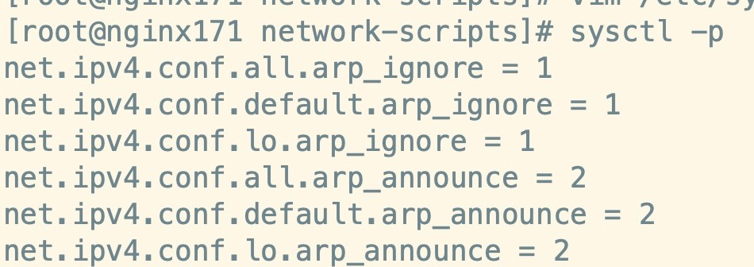

# LVS

## 为什么要使用LVS+Nginx


## 搭建LVS-DR模式


### 配置LVS节点与ipvsadm


#### **前期准备**


#### **创建子接口**

1. 进入到网卡配置目录，找到咱们的ens33：

   

2. 拷贝并且创建子接口：

   ```
   cp ifcfg-ens33 ifcfg-ens33:1 
   注：`数字1`为别名，可以任取其他数字都行 
   ```

3. 修改子接口配置： vim ifcfg-ens33:1

   

4. 配置参考如下：


#### **安装ipvsadm**

直接安装就行。


### 为两台RS节点配置虚拟IP

配置虚拟网络子接口（回环接口）

1. 进入到网卡配置目录，找到lo（本地环回接口，用户构建虚拟网络子接口），拷贝一份新的随后进行修改：

   

2. 修改内容如下：

   

3. 修改内容如下：

   


### 为两台RS配置arp

ARP响应级别与通告行为 的概念

1. arp-ignore：ARP响应级别（处理请求）
   - 0：只要本机配置了ip，就能响应请求
   - 1：请求的目标地址到达对应的网络接口，才会响应请求
2. arp-announce：ARP通告行为（返回响应）
   - 0：本机上任何网络接口都向外通告，所有的网卡都能接受到通告
   - 1：尽可能避免本网卡与不匹配的目标进行通告
   - 2：只在本网卡通告


#### 配置ARP

1. 打开sysctl.conf:

   ```
   vim /etc/sysctl.conf 
   ```

2. 配置 所有网卡 、 默认网卡 以及 虚拟网卡 的arp响应级别和通告行为，分别对应： all ， default ， lo ：

   ```
   # configration for lvs 
   net.ipv4.conf.all.arp_ignore = 1 
   net.ipv4.conf.default.arp_ignore = 1 
   net.ipv4.conf.lo.arp_ignore = 1 
    
   net.ipv4.conf.all.arp_announce = 2 
   net.ipv4.conf.default.arp_announce = 2 
   net.ipv4.conf.lo.arp_announce = 2 
   ```

3. 刷新配置文件：

   

4. 增加一个网关，用于接收数据报文，当有请求到本机后，会交给lo去处理：

   ```
   vim /etc/rc.local
   
   route add -host 192.168.1.150 dev lo:1
   // 目的是接受数据报文，交给lo:1去处理
   ```

   


### 使用ipvsadm配置集群规则

1.  创建LVS节点，用户访问的集群调度者

   ```
   ipvsadm -A -t 192.168.1.150:80 -s rr -p 5 
   -A：添加集群
   -t：tcp协议
   ip地址：设定集群的访问ip，也就是LVS的虚拟ip
   -s：设置负载均衡的算法，rr表示轮询
   -p：设置连接持久化的时间
   ```

2. 创建2台RS真实服务器

   ```
   ipvsadm -a -t 192.168.1.150:80 -r 192.168.1.171:80 -g 
   ipvsadm -a -t 192.168.1.150:80 -r 192.168.1.172:80 -g 
   
   -a：添加真实服务器
   -t：tcp协议
   -r：真实服务器的ip地址
   -g：设定DR模式
   ```

3.  保存到规则库，否则重启失效

   ```
   ipvsadm -S 
   ```

4. 检查集群

   ```
   查看集群列表
   ipvsadm -Ln 
   查看集群状态
   ipvsadm -Ln --stats 
   ```

5. 其他命令

   ```
    # 重启ipvsadm，重启后需要重新配置 
    service ipvsadm restart 
    # 查看持久化连接 
    ipvsadm -Ln --persistent-conn 
    # 查看连接请求过期时间以及请求源ip和目标ip 
    ipvsadm -Lnc 
    
    # 设置tcp tcpfin udp 的过期时间（一般保持默认） 
    ipvsadm --set 1 1 1 
    # 查看过期时间 
    ipvsadm -Ln --timeout 
   ```

6. 更详细的帮助文档

   ```java
   ipvsadm -h 
   man ipvsadm 
   ```

   

### 验证DR模式，探讨LVS的持久化机制


## Keepalived + LVS 高可用


Keepalived  本身就是为了LVS而设计的，他们的匹配度非常的高，通过Keepalived   就能配置LVS与RS的关系，比如负载均衡算法，持久化连接，健康检查配置等等。这也是很多公司采用的高可用高性能的集群负载均衡方案。


### 搭建

```
LVS（master）
DIP: 192.168.1.151
VIP: 192.168.1.150

LVS（back-up）
DIP: 192.168.1.151
VIP: 192.168.1.150


Nginx1
RIP: 192.168.1.171
VIP: 192.168.1.150

Nginx2
RIP: 192.168.1.172
VIP: 192.168.1.150 
```


两台LVS所在的机器都安装Keepalived  

修改Keepalived 的配置文件


全局配置

```
global_defs {
    router_id LVS_151
}
```


vrrp配置


LVS配置


real_server 配置


150，151两台机器Keepalived 的LVS配置相同，当一台LVS挂了，使用ip漂移技术，保证高可用。

