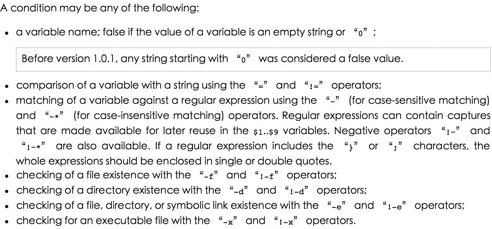
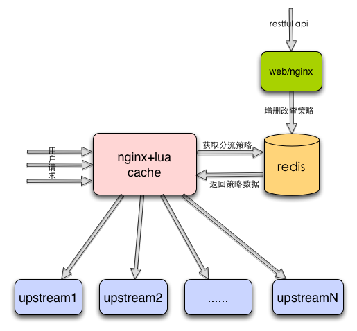

# Oceanus：美团HTTP流量定制化路由的实践


## 背景

Oceanus是美团基础架构部研发的统一HTTP服务治理框架，基于Nginx和ngx_lua扩展，主要提供服务注册与发现、动态负载均衡、可视化管理、定制化路由、安全反扒、session ID复用、熔断降级、一键截流和性能统计等功能。本文主要讲述Oceanus如何通过策略抽象、查询、渲染和分组动态更新，实现HTTP请求的定制化路由。

随着公司业务的高速发展，路由场景也越来越复杂。比如：

- 团购秒杀要灵活控制压测流量，实现线上服务单节点、各机房、各地域等多维度的压测。
- 外卖业务要做流量隔离，把北方地域的流量转发到分组a，南方地域的流量转发到分组b。
- 酒旅业务要对App新版本进行灰度，让千分之一的用户试用新版本，其他用户访问老版本。
- QA部门要通过请求的自定义参数指定转发分组，构建稳定且高可用的测试环境。

由于公司早期的业务场景相对比较简单，所以均通过Nginx if指令支持。比如某业务要把来源IP为10.4.242.16的请求转发到后端节点10.4.232.110，其它请求转发到后端节点10.4.232.111和10.4.232.112，就可以进行如下配置：

```
upstream backend_aaa {
    server 10.4.232.110:8080 weight=10;
}
upstream backend_bbb {
    server 10.4.232.111:8080 weight=10;
    server 10.4.232.112:8080 weight=10;
}
location /abc {
    if($remote_ip = "10.4.242.16") {
        proxy_pass http://backend_aaa; #路由到backend_aaa集群
    }
    proxy_pass http://backend_bbb; #路由到backend_bbb集群
}
```

上述方式虽然不需要额外开发，性能方面也接近原生的Nginx框架，但是使用场景比较受限，因为if指令仅支持比较简单的condition类型，官方描述如下：



如果该业务要把IP段10.4.242.16/34的请求转发到10.4.232.110时，if指令勉强还可以支持。但对于上述的复杂业务场景，if指令均无法支持。除此之外，这种方式还存在以下两点不足：

- 规则调整不支持动态化：如果要把客户端10.4.242.16调整为10.4.242.17，需要对Nginx进行reload，而reload操作会使Nginx的并发能力下降，业务高峰时甚至会导致请求504或502。
- 指令坑太多：if指令和set、rewrite指令等一起使用时，很多时候会出现不符合预期的行为，严重时甚至会导致段错误，最好的方法就是避免使用。

为了解决上述问题，Oceanus开始探索如何实现HTTP流量的定制化路由。

## 业界调研

通过初步调研，发现业界有一套开源的ABTestingGateway（以下简称AB）框架：



由上图所示，AB框架使用Redis存储策略数据，key是Host字段，value是策略对象，包括策略类型、匹配区间和要分发的Upstream。策略的增删改查可以通过基于Nginx搭建的Web服务的API实现，运行时根据请求的Host字段从lua-shared-dict或Redis获取关联的策略，根据策略类型（iprange/uidrange/uidsuffix/uidappoint）选择对应的Lua脚本从请求中获取相关参数（IP、UID）查询是否匹配策略，若匹配，就修改请求的Upstream上下文完成分流的目的。

相比if指令的方式，AB框架有下面两个优点：

- 策略调整动态生效：已有策略类型中的策略变更均可以通过HTTP API进行动态管理。
- 分流策略丰富：支持IP段、UID段等策略，也可以通过新增策略类型对策略库进行扩展。

由于AB框架只支持4种策略类型，对于业务要根据请求Cookie、自定义header控制转发的情况，均需要开发新的策略类型和发布上线。另外，策略类型和业务场景紧密相关，导致AB系统的扩展性极差，很难快速支持新业务的路由需求。

无论是Nginx if指令，还是AB框架，要么需要reload重新加载才能生效，要么无法支持某些业务场景下的分流需求，所以都很难作为解决公司级分流框架的有效手段。针对它们所存在的不足，Oceanus开发了一套应用级、高可扩展的动态分流框架，不仅动态支持各种业务场景的分流需求，而且保证了请求转发的性能，下文将阐述我们如何解决分流机制的几个核心问题。

## Oceanus定制化路由的核心设计&实现

关于分流机制，我们主要从以下四个方面来讲述：

- 策略抽象：合理定义策略结构，适用尽可能多的业务场景。
- 策略的高效查询：接口粒度关联，应用维度管理。
- 运行时策略渲染：渲染策略模板，判断是否匹配策略，实现动态路由。
- 分组动态更新：分组数据增删改，均不需要reload。


.......

## 总结

通过Oceanus分流机制在美团外卖、酒旅、到店餐饮等多个业务线的广泛使用，基础架构部帮助业务同胞解决了多个定制化路由的需求，比如服务set化、链路压测、灰度发布、泳道环境建设等等。目前，Oceanus分流机制只关注了流量转发方向，还不支持更复杂的转发动作，比如根据策略调整请求的Parameter、header、Cookie，也不支持根据请求的URL实现动态路由等，未来我们还将逐一完善这些问题，当然也欢迎大家跟我们一起交流，共同进步。


## 资料

美团HTTP服务治理实践：https://opentalk-blog.b0.upaiyun.com/prod/2019-07-07/bc8ef580e57f5cc1a24a2a197c63e701.pdf