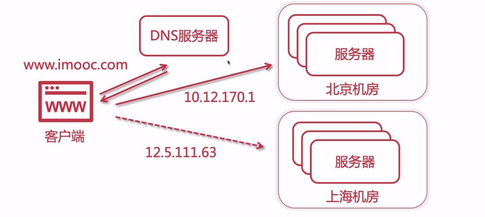
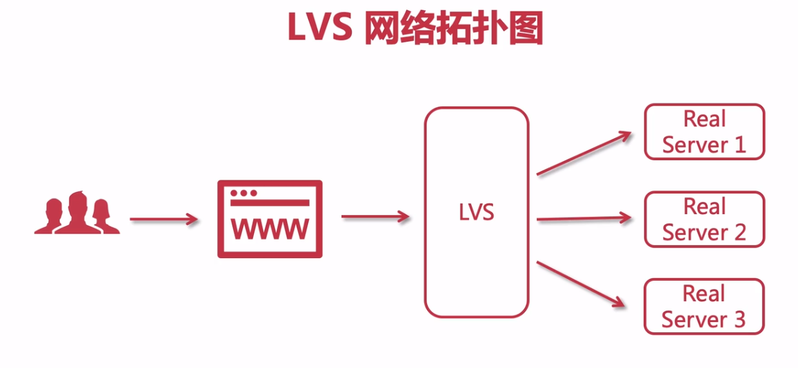
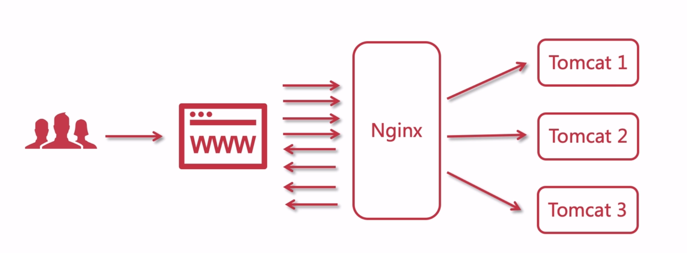
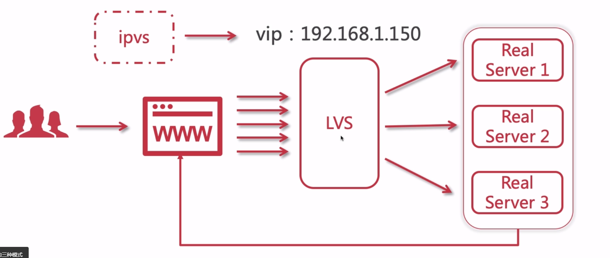
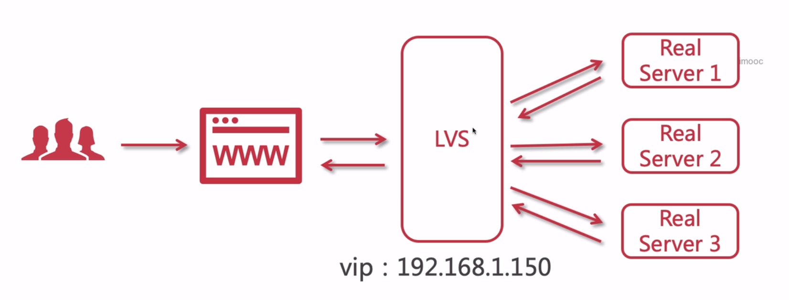
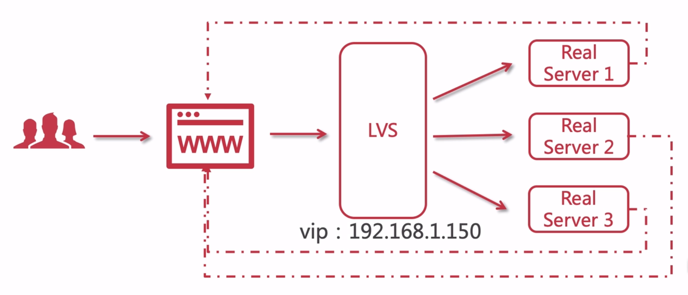
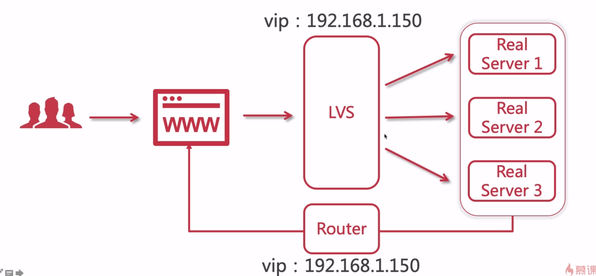

# 负载均衡

## 四层负载均衡

四层负载均衡是基于IP+端口的负载均衡，原理是通过转发请求到后台的服务器，它是只负责转发，并且会记录当前连接是由哪个服务器处理的，后续这个连接的请求就会由同一台服务器去处理。其实也就相当于长连接，这个连接一旦打开，就会一直处于连接的状态，性能就非常的高了。

四层是传输层的，主要基于TCP和UDP。

- F5硬负载均衡
- LVS四层负载均衡
- Haproxy四层负载均衡
- Nginx 四层负载均衡

F5是一个基于硬件的硬负载均衡，本身功能非常强大，性能也是非常的高的，稳定性也非常不错，但是非常贵，因为它是基于硬件的。

LVS 是四层负载均衡，它是Linux内核的一个四层负载。

Haproxy是四层负载均衡，它是支持转发功能，灵活性非常的高。除了四层以外也能做七层的负载均衡。

Nginx 在新版本里面也能够实现四层负载均衡，但是我们一般来说使用nginx做7层负载均衡。

## 七层负载均衡

七层负载均衡是基于url、ip的一个负载均衡，是基于与应用层的，是针对于http协议的一个负载均衡。

- Nginx七层负载均衡
- Haproxy七层负载均衡
- apache 七层负载均衡

七层负载均衡基本上是用于处理http协议的，适用于web服务器，像tomcat、apache  等。
四层负载均衡主要是用于处理基于TCP、UDP协议这种负载均衡。四层的话是用于转发请求，而不是去处理的，它可以把用户的请求转发给其它应用去处理。七层的话会处理请求的，像nginx的话就能够对响应处理js、css等等文本的内容，可以去压缩也可以去缓存，相当于针对我们的请求响应做一个处理。

## DNS 地域负载均衡

## LVS

LVS是一个四层负载均衡，四层负载是基于IP+端口的一个负载均衡，七层负载也叫做内容转换，在应用层对请求报文内容的一个负载均衡。

### 为什么要使用LVS + Nginx

- LVS基于四层，工作效率高
- 单个Nginx 承受不了压力，需要集群
- LVS 充当Nginx集群的调度者
- Nginx 接受请求来回，LVS可以只接受不响应

LVS工作在四层，四层的话性能会更高，接收到请求是可以直接转发的，对于nginx 来说，接受到请求之后，还要对请求进行处理，就会有性能损耗。

### Nginx 网络拓扑图

### LVS网络拓扑图

### LVS的三种模式

#### LVS 模式之NAT

在这张图里我们需要注意，LVS是处于公网的，用户可以访问请求、ping通这个150。而 Real Server集群是处于企业内部私网（内部局域网）里面， 外部用户是访问不了他们的。

#### LVS 模式之TUN

在这张图里我们需要注意，每一个节点都要配备一个网卡， 这就是IP隧道模式。 其实也是他的缺点，有了网卡以后，Real Server 各自返回数据给用户，Real Server 集群是暴露在公网的，显然这种方式并不是很好的。

#### LVS模式之DR

在这张图里我们需要注意，Real Server 不用处于公网了，只不过会经过路由。

用户通过虚拟ip(vip)来请求的lvs,请求完成之后，响应又通过虚拟ip(Router 的vip)返回给我们的用户。

