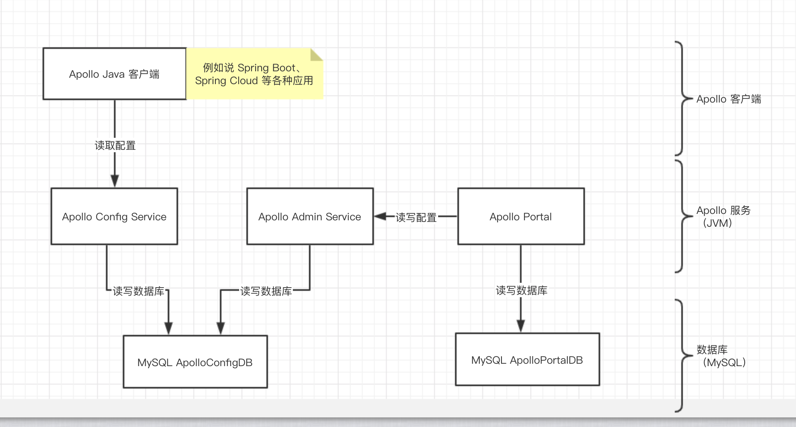
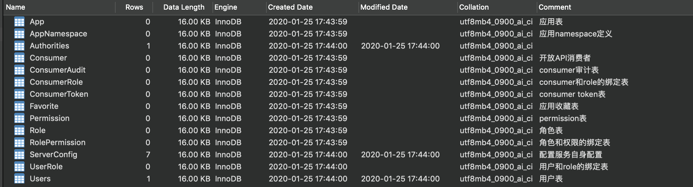
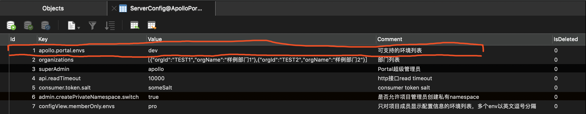
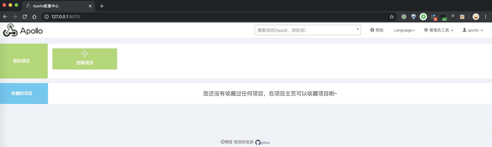

# Apollo 极简入门


## 1. 概述

> Apollo 算国内开源中间件，文档完善程度最好的产品，可能唯一能够比肩的只有 Dubbo 的文档了。

### 1.1 介绍

Apollo 是什么？其官方文档自我介绍如下：

```java
FROM 《Apollo 设计文档 —— Home》

Apollo（阿波罗）是携程框架部门研发的分布式配置中心，能够集中化管理应用不同环境、不同集群的配置，配置修改后能够实时推送到应用端，并且具备规范的权限、流程治理等特性，适用于微服务配置管理场景。

服务端基于 Spring Boot 和 Spring Cloud 开发，打包后可以直接运行，不需要额外安装 Tomcat 等应用容器。

Java 客户端不依赖任何框架，能够运行于所有 Java 运行时环境，同时对 Spring/Spring Boot 环境也有额外支持。

.Net 客户端不依赖任何框架，能够运行于所有 .Net 运行时环境。
```

### 1.2 核心功能

Apollo 有哪些功能？其官方文档自我介绍如下：

- 统一管理不同环境、不同集群的配置
- 配置修改实时生效（热发布）
- 版本发布管理
- 灰度发布
- 权限管理、发布审核、操作审计
- 客户端配置信息监控
- 提供 Java 和 .Net 原生客户端
- 提供开放平台 API
- 部署简单

详细的功能说明，胖友可以访问 [《Apollo 功能列表》](https://github.com/ctripcorp/apollo/wiki#features) 查看。

## 2. 单机部署

操作系统：macOS 10.14

其它系统，基本一致的。

本小节，参考[《Apollo 部署文档 —— 分布式部署指南》](https://github.com/ctripcorp/apollo/wiki/分布式部署指南)和[《Apollo 部署文档 —— Quick Start》](https://github.com/ctripcorp/apollo/wiki/Quick-Start)文章，我们来单机部署一个 Apollo 服务。如下图所示：



- Apollo Config Service：提供配置的读取、推送等功能，服务对象是 Apollo 客户端。

- Apollo Admin Service：提供配置的修改、发布等功能，服务对象是Apollo Portal（管理界面）。

  >为什么 Config Service 和 Admin Service 分离呢？在图中，我们可以看到 Config Service 和 Admin Service 读取的是相同的 `ApolloPortalDB` 数据库，理论上来说可以做成一个服务。
  >
  >不过 Admin Service 因为需要不断开发 API 接口提供给 Apollo Portal，因此可能会不定期重启。而 Config Service 功能比较单纯，基本不会有太多更新，因此基本不太会重启。所以，将 Admin Service 和 Config Service 拆分成两个服务。

- Apollo Portal：Apollo 的管理界面，进行配置想丢该，服务对象是开发者和 开放平台 API。

  >为什么 Admin Service 和 Portal 分离呢？在 Apollo 的设计中，不同的 DEV、FAT、UAT、PROD 环境，会部署在不同的网络环境下，进行隔离。
  >
  >因此，每个环境会部署一套 Admin Service + Config Service。而 Portal 通过调用不同环境部署的 Admin Service 提供的 API 接口，进行不同环境的配置管理。
  >
  >另外，权限管理、开放平台 API 都是由 Portal 统一实现来提供的。

### 2.1 MySQL 安装

相信大家都会，艿艿就不瞎哔哔了。嘿嘿~注意，推荐安装 MySQL 5.6.5 以上版本，因为 Apollo 的表结构 `timestamp` 使用了多个 `default` 声明。例如说，艿艿采用的是 MySQL 8.0.17 版本。


### 2.2 Portal 安装

**① 下载 Apollo**

打开 [Apollo 下载页面](https://github.com/ctripcorp/apollo/releases)，选择想要的 Apollo 版本。这里，我们选择 `1.5.0` 最新版本。

```shell
# 创建目录
$ mkdir -p /Users/yunai/Apollo
$ cd /Users/yunai/Apollo

# 下载
$ wget https://github.com/ctripcorp/apollo/releases/download/v1.5.0/apollo-portal-1.5.0-github.zip
$ wget https://github.com/ctripcorp/apollo/releases/download/v1.5.0/apollo-adminservice-1.5.0-github.zip
$ wget https://github.com/ctripcorp/apollo/releases/download/v1.5.0/apollo-configservice-1.5.0-github.zip

# 先只看 Portal 相关

# 解压到 apollo-portal 目录
$ unzip apollo-portal-1.5.0-github.zip -d apollo-portal
$ cd apollo-portal

# 查看目录
$ ls -ls
 2312 -rwxr-xr-x  1 yunai  staff   1183431 Oct 19 18:17 apollo-portal-1.5.0-sources.jar # 源码
82704 -rwxr-xr-x  1 yunai  staff  42342050 Oct 19 18:17 apollo-portal-1.5.0.jar # jar 包
    8 -rw-r--r--  1 yunai  staff        57 Feb 24  2019 apollo-portal.conf
    0 drwxr-xr-x  5 yunai  staff       160 Jan 25 12:34 config # 配置文件
    0 drwxr-xr-x  4 yunai  staff       128 Mar  1  2019 scripts # 执行脚本
```

**② 初始化数据库**

使用 [apolloportaldb.sql](https://github.com/ctripcorp/apollo/blob/master/scripts/sql/apolloportaldb.sql) 脚本，在 MySQL 中初始化 `ApolloPortalDB` 库。结果如下图：



**③ 配置数据库连接**

修改 `conf/application-github.properties` 配置文件，设置成 `ApolloPortalDB` 数据库的信息。配置内容如下：

```shell
# DataSource
spring.datasource.url = jdbc:mysql://127.0.0.1:3306/ApolloPortalDB?characterEncoding=utf8
spring.datasource.username = root
spring.datasource.password =
```

**④ 配置 Apollo 环境**

在上文中，我们提到过不同环境下，我们会配置不同的 Config Service + Admin Service 服务。所以，我们需要修改 `config/apollo-env.properties`，设置对应服务的地址。配置内容如下：

```shell
local.meta=http://localhost:8080
dev.meta=http://127.0.0.1:8080
fat.meta=http://fill-in-fat-meta-server:8080
uat.meta=http://fill-in-uat-meta-server:8080
lpt.meta=${lpt_meta}
pro.meta=http://fill-in-pro-meta-server:8080

```

默认情况下，我们只需要配置 DEV 环境的，因为在 `ServerConfig` 表中，只配置了 Portal 支持的环境列表为 DEV 环境。如下图所示：



这里，我们只设置了 `dev.meta` 配置项为 `http://127.0.0.1:8080`，也就是我们后续会启动的 DEV 环境的 Config Service 地址。

另外，配置文件中的 `meta` 指的是 Apollo Meta Server，其官方文档解释如下：

>FROM [《系统使用文档 —— Java客户端使用指南》](https://github.com/ctripcorp/apollo/wiki/Java客户端使用指南#122-apollo-meta-server)
>
>Apollo支持应用在不同的环境有不同的配置，所以需要在运行提供给Apollo客户端当前环境的 [Apollo Meta Server](https://github.com/ctripcorp/apollo/wiki/Apollo配置中心设计#133-meta-server) 信息。默认情况下，meta server 和 config service 是部署在同一个 JVM 进程，所以 meta server 的地址就是 config service 的地址。
>
>为了实现 meta server 的高可用，推荐通过 SLB（Software Load Balancer）做动态负载均衡。Meta server 地址也可以填入 IP，如 `http://1.1.1.1:8080,http://2.2.2.2:8080`，不过生产环境还是建议使用域名（走 slb），因为机器扩容、缩容等都可能导致 IP 列表的变化。

- 简单来说，我们可以把 Apollo Meta Server 当成注册中心，通过它可以获得到所有 Admin Service 和 Config Service 的地址。不过要注意哈，Meta Server 也是一个环境对应一个。

**⑤ 启动 Portal 服务**

**⑥ 访问 Portal 服务**

使用浏览器，访问 [http://127.0.0.1:8070](http://127.0.0.1:8070/) 地址，进入 Portal 管理界面的登录页。如下图所示：


使用默认账号「apollo/admin」进行登录。登录完成后，进入首页。如下图所示：



稍后，我们在使用 Portal 进行配置的创建等操作，先继续搭建 Config Service 和 Admin Service 服务。**注意，这里我们是搭建的 DEV 环境的 Config Service + Admin Service 服务噢。**


### 2.3 Config Service 安装

### 2.4 Admin Service 安装

### 2.5 使用指南


## 3. 集群部署

在生产环境下，我们需要搭建 Apollo 集群，确保高可用。因为[《Apollo 部署文档 —— 分布式部署指南》](https://github.com/ctripcorp/apollo/wiki/分布式部署指南)已经编写详细的教程，艿艿就不重复赘述。

不喜欢看文章，想要看视频的胖友，可以访问[分布式配置中心 Apollo 极简入门](https://www.bilibili.com/video/av85042856/)地址，查看视频教程。

相比[「2. 单机部署」](https://www.iocoder.cn/Apollo/install/#)来说，我们需要额外做的事情：

- 搭建 Portal 多个节点，实现 Portal 的高可用。
- 搭建 FAT、UAT、PROD 的 Config Service + Admin Service。并且，每个环境的 Config Service + Admin Service 都需要部署多个节点，保证它们的高可用。另外，在每个环境的 `ApolloConfigDB` 数据库的 `ServerConfig` 表的 `KEY = eureka.service.url` 对应记录的 `Value` 为对应环境的 Config Service 的所有节点的地址。
- 搭建 Nginx 多个节点，实现 Nginx 的高可用。后续，对 Portal 和 Config Service（Meta Server）进行负载均衡。
- 搭建 MySQL 多节点，实现 MySQL 的高可用。

搭建完多环境的 Config Service + Admin Service 之后，需要在 Portal 中进行如下设置，使 Portal 可以对对应环境可以进行配置管理：

- 在 Portal 的 `config/apollo-env.properties` 配置文件，需要 DEV、FAT、UAT、PROD 经过 Nginx 负载均衡后的 Meta Server 高可用的地址。
- 同时，修改 `ApolloPortalDB` 数据库的 `ServerConfig` 表的 `KEY = apollo.portal.envs` 对应记录的 `Value` 为 `dev,fat,uat,prod`，从而开启多环境的支持。


## 4. 集成到 Spring Boot

详细内容，可见[《芋道 Spring Boot 配置中心 Apollo 入门》](http://www.iocoder.cn/Spring-Boot/config-apollo/?self)文章。


## 5. 集成到 Spring Cloud

详细内容，可见[《芋道 Spring Cloud 配置中心 Apollo 入门》](http://www.iocoder.cn/Spring-Cloud/Apollo/?self)文章。


